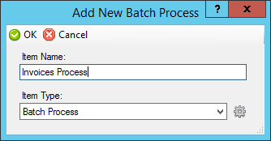
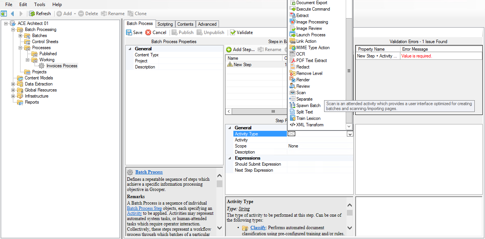
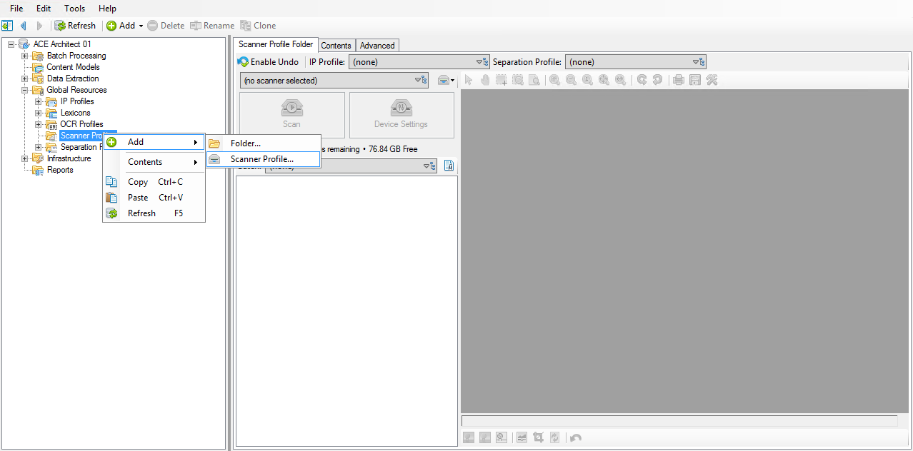
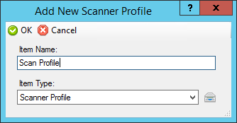
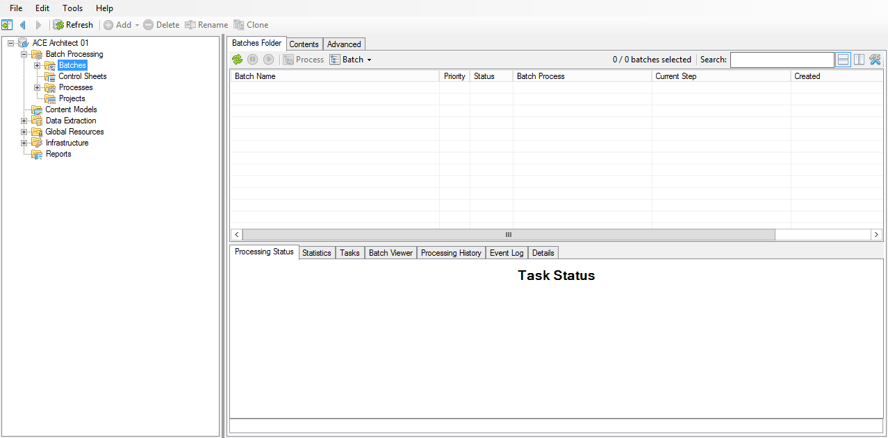
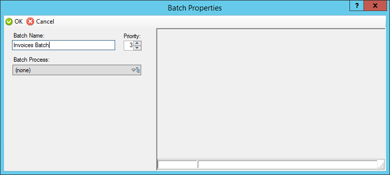
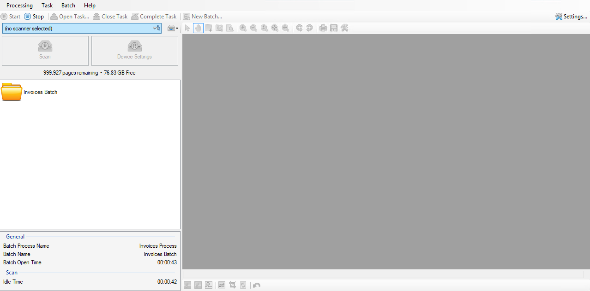
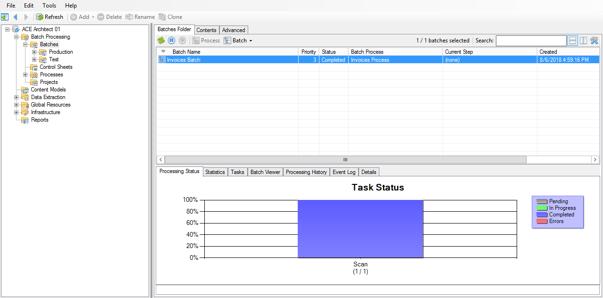

# Acquire

## Overview

We know that we have a bunch of invoice documents that we need to process. In order to do that, we need to first define how they will be brought into Grooper.

In this phase, we will:

- create our first Batch Process,
- add a Scan step to our Batch Process,
- create a Scan Profile that defines how our documents will be brought into Grooper, and
- use these settings to virtually scan pages into a batch.

Let's get started!

## Batch Process

When it comes to processing documents, you typically don't do it only one time and get to forget about it, right? It's usually done on a regular basis.

We want to start building out steps to make that process as automated as possible.

### Creating a Batch Process

The first thing we want to do is create a Batch Process.

!!! abstract "Step 1"
    Open Grooper Design Studio and expand the node tree to **_(root)_ > Batch Processing > Process** and select the **Working** node.
    
!!! abstract "Step 2"
    Create a new Batch Process by either:
    
    1. right-clicking on the **Working** node and selecting **Add > Batch Process...**, or

    2. clicking **Add** in the toolbar and selecting **Batch Process...**.

### Naming the Batch Process

Before our Process can be created, we have to give it a name.

!!! abstract "Step 3"
    Name the Batch Process ==Invoices Process== (or anything that makes you happy) and click **OK**.

### Adding a step

Congratulations! You've just created your first Batch Process. You can see the new process under the **_(root)_ > Batch Processing > Processes > Working** node. Now we can start building it!

By default, a new Process will be empty when we create it. We want to start adding the steps through which our batches are going to run.

We'll start with a simple Scan step for now, and add more steps in later.

!!! abstract "Step 4"
    In the **Steps in Batch Process** panel, click the **Add Step...** button.

!!! abstract "Step 5"
    This will create a blank step in our Process.

### Setting the new step's Activity Type

We've added a step to our Process, but we have an error in our **Validation Errors** panel. This will tell us what issues Grooper found with this Process and where they are located.

If we read the error, it tells us that our **New Step • Activity Type**'s value is required.

We've added a step to our process, but it's currently blank, meaning we haven't specified which activity we want Grooper to perform here. This is like saying, "I want you to do something here, but I haven't told you what it is yet."

!!! abstract "Step 6"
    In the **Step Properties** panel, select the **Activity Type** property and choose **Scan** from the dropdown list.

!!! abstract "Step 7"
    Our validation error should go away now that we've satisfied the requirement.

??? note
    In Grooper, "scanning" doesn't necessarily have to mean that you're using a physical device to scan documents. There are many ways documents can be brought in, including (but not limited to) scanning, file system import, and email import.

### Save and publish the Batch Process

We're done adding our first step, so now we want to test it out.

??? info
    Batch Processes must first be published in order to be used. This is to allow development of a Process without users having access to changes before they're ready.

!!! abstract "Step 8"
    Click **Save** to save our changes.

!!! abstract "Step 9"
    Click **Publish** to make this Batch Process available for production use.

!!! abstract "Step 10"
    After the Batch Process is published, you will see that the **_(root)_ > Batch Processing > Processes > Published** node now has a child that looks exactly like the **Working** node.

??? warning
    Published Batch Processes cannot (and should not!) be edited.  If you wish to make any changes to a published Batch Process, first make the change in the appropriate working process, then re-publish.

??? tip
    If you wish to remove a published Process from production use, simply click the "Unpublish" button on its working process.

## Scanning

We've created our process and added a scan step to it. Now we need to tell Grooper that when we run a batch through this process, how we want this scan step to bring in our documents.

Recall that "scanning" in Grooper doesn't necessarily mean "scanning" in the traditional sense. Instead of scanning pages through a physical scanner, we're going to import them from a folder on the computer.

To start off, we're going to need to tell Grooper how we're going to bring these documents into our batch. We want to create something reusable so that this process can be repeated in the future.

??? note
    One great feature of Grooper is its modularity. We can create a preset for something like scanning so that it may be used in multiple places. We call these presets profiles.

### Creating a Scanner Profile

Let's begin by creating a Scanner Profile.

!!! abstract "Step 1"
    Right-click on the **_(root)_ > Global Resources > Scanner Profiles** folder, hover over **Add >** and select **Scanner Profile...**

This will open the **Add New Scanner Profile** name dialog.

!!! abstract "Step 2"
    Give it a name (we'll be using the exciting name ==Scan Profile== for the rest of this instruction) and click **OK**.

### Configuring the Scanner Profile

Way to go! You've just created your first Scanner Profile. You're on a roll! You can see it in the node tree under **_(root)_ > Global Resources > Scanner Profiles**.

This is the default Scanner Profile configuration screen. Let's set it up so we can use it.

#### Choosing a scan method

We first need to set which of the various "scan" methods our profile will be using.

!!! abstract "Step 3"
    In the Properties panel, in the **General** section, click on the **Selected Device** property.

!!! abstract "Step 4"
    Click the drop-down on the right and select **File System Import**.

??? info
    If you have scanner drivers installed, you will probably see ISIS and TWAIN in this list as well.

!!! abstract "Step 5"
    Click the **Device Settings** property, and then click the ellipsis button to the right.

This will bring up the configuration settings for whichever device you chose from the previous step.

!!! abstract "Step 6"
    Because we chose **File System Import** as our device, this will bring up the **File System Import Settings** panel.

#### Setting the import path

We're going to be importing, so we need to tell Grooper where to look.

!!! abstract "Step 7"
    Click the **Import Path** property. There are two ways you can set the path:

1. You can click the ellipsis to the right and browse for the path. This is useful if the files are located locally.

2. If you know the path and are able to copy it to your clipboard, you can simply paste the path in here. This is useful for shared UNC paths.

!!! abstract "Step 8"
    Click **OK**. We don't need to change any of the other settings here, but feel free to click on them and read their descriptions to learn more about them.

This will bring us back to our **Scanner Profile** configuration node.

#### Saving

!!! abstract "Step 9"
    We're done here, so click **Save** to save the changes we've made so far.

## Production Batch

We're ready to test out what we've built so far!

We're going to create a production batch with our new Process, so now we want to see what happens when a batch runs through it.

### Creating a batch

!!! abstract "Step 1"
    Navigate to **_(root)_ > Batch Processing > Batches**.

??? note
    In the **_(root)_ > Batch Processing > Batches** node, you will be able to see *all* batches in your environment, including test batches. To limit your list of batches to either test or production, select the appropriate child node.

!!! abstract "Step 2"
    In the **Batches Folder** tab, click on **Batch > New...**.

The **Batch Properties** window will appear. This is where we specify which Batch Process we want to associate with the batch we are trying to create, as well as optionally giving the batch a name other than the default date/timestamp. We currently have only one process, so the choice is pretty easy.

### Configuring the batch properties

!!! abstract "Step 3"
    Give your batch an intuitive name, such as ==Invoices Batch==.

!!! abstract "Step 4"
    From the **Batch Process** dropdown, select **Invoices Process**.

!!! abstract "Step 5"
    We're done here, so click **OK** to return close this window and create our batch.

!!! abstract "Step 6"
    Back in **Grooper Design Studio** we should see our new batch in our list.

If you click on the batch, you can see where it's at in the process.  Currently, it's on the **Scan** step.  The progress bar is gray, which means it's in "Pending" status.  That means that this activity is ready to begin.

??? info
    Depending on the type of activity, the batch process step may begin processing automatically. For this to happen, two criteria have to be met:

    - the activity type must be an *unattended* activity, and

    - there must exist an active Grooper service to handle task processing.

??? tip
    You have the ability to rename your batch after it has already been created.

    1. From the **Batches Folder**, select the batch and click the **Pause** button in the toolbar.

    2. Right-click on the batch and select **Properties**.

    3. Rename the batch and click **OK**.

### Processing the batch

!!! abstract "Step 7"
    Make sure your batch is selected, and click the **Process** button.  This tells Grooper to begin processing this activity.

This will bring up the **Attended Client** window for the **Scan** activity.

!!! abstract "Step 8"
    Click the **Scanner Profile** dropdown.

This is where all of our Scan Profiles would appear if we had more than one.  We have only one, so select it from the list.

Now we're ready to scan!

!!! abstract "Step 9"
    Click the big **Scan** button.

This will activate the Scan Profile we selected, which is configured to look in our file system and pull in any images it finds in there.

As the pages are scanned in, their images will display in the panel on the right.

!!! abstract "Step 10"
    We're done scanning in our pages, so in the toolbar, click the **Complete Task** button.

This is like telling Grooper, "I'm done with this task, so move on to the next step in the process."

This will close **Attended Client** and return us to Grooper Design Studio.

??? note
    There may be times when you may have more pages to scan into your batch, but can't do it at that moment.  In situations like that, you wouldn't necessarily want to use **Complete Task**, because it will take the batch as-is and move it on to the next step.

    If you're scanning in **Attended Client** and want to return to the batch later, click the **Stop** button instead.  This will return the batch to a "Pending" state.  When you are ready to come back to it, click **Process** again, and it will pick up where you left off, with all of your already-scanned pages still present.

??? tip
    If you need to rescan a page or pages, you can right-click on them in the Batch Viewer. There are a few things you can do from this context menu, so feel free to hover over the options and read the tooltips to see what they can do.

### Observing the results

!!! abstract "Step 11"
    Back in Grooper Design Studio, take a look at our batch. The progress bar should now be blue, which means that this activity is complete.

## Recap

We just completed the **Acquire** phase! It may seem like all we've done is scan in a few pages, but we've taken our first steps to processing a batch from beginning to end.

Here's a list of everything we learned:

- how to create a Batch Process,
- how to add steps to a Batch Process,
- how to create a Scan Profile that can be utilized to bring in images,
- how to create a production batch, and
- how to use our new Batch Process and Scan Profile to add pages to our new batch.

When we look at it that way, it seems a bit more impressive!

## Up next

You may or may not have noticed, but some of the pages we scanned in didn't look very good. They were skewed and needed a little bit of image cleanup. In the next section, we'll learn how to clean these images up, and then how to use the clean images to obtain text that we can work with.