# Condition

## Overview

Remember that our goal for using Grooper is to automate tasks that we would otherwise have to perform manually.

Imagine we have a pile of papers in our inbox. We can think of this as the batch we just made, so they arrived there via the **Acquire** phase.

If we had to work through these documents by hand, we'd probably have to go through them and make sure they're all facing the same way, remove any sticky notes on them, take out the staples, and potentially white out smudges and marks.

This is the **Condition** phase, and we can automate these tasks in Grooper.

In this phase, we will:

- create and test an Image Processing Profile,
- use the new profile to clean up our batch, and
- use OCR to obtain text from our images that we'll use later.

Let the conditioning commence!

## But first

For the next few phases, we'll be testing the results of adding a single Batch Process step at a time. Let's take a deeper look at our batch so that when we start adding steps, the process makes a little bit more sense.

!!! abstract "Batch Processing / Batches / Production / **Invoices Process**"
    Any batches that are created will also be visible in the node tree. Viewing the batch from this location gives us access to more information about the batch itself.
    
    You can view the batch by switching to the **Batch Viewer** tab.

!!! abstract "Global Resources / IP Profiles / **Invoices IP Profile**"
    Click the **+** button next to the batch in the node tree to expand it.

Notice that there are two child objects here:

1. a folder with the same name as the batch, and
2. a gear icon with the name of the Batch Process we used to create the batch.

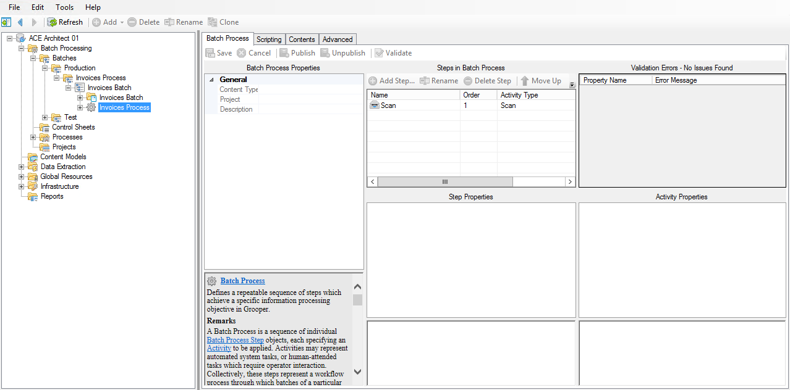

??? note
    When you create a production batch and assign it a particular Batch Process, it attaches a copy of that Process to that batch. This is to ensure that, should there be any changes to the process after the batch is created, it won't affect how this batch is processing.

    An important note is that because this Process is only a *copy* of the original, it doesn't maintain a link to the original.

If we want to make changes to the Process and subsequently test those changes against an batch, we need to tell that batch to update.

This is like telling Grooper, "Hey, I've changed the steps I want you to take when you process."

We'll be doing this quite a few times, so it won't hurt to become familiar with the technique!
    
## Cloning to test

We need to clean up our batch images, so we're going to create an Image Processing Profile to do that. However, profiles can be tested only against test batches, so we can't use our production batch.

We can, however, clone our production batch to our test batches. This way we don't have to create a brand new test batch to work with.

!!! abstract "Batch Processing / Batches / Production / Invoices Process / **Invoices Batch**"
    Press **Clone To Test**, and then **Execute** on the window that appears.

??? note
    A batch must first be paused before **Clone To Test** will appear.

??? warning
    Make sure you press **Clone To Test** and NOT **Clone** in the upper toolbar.

    - **Clone To Test** makes an exact replica of the batch in the test batches.

    - **Clone** is a way to create an exact copy of an object in-place in the node tree. If we used this option instead, we would have two identical production batches (and we'd have to rename the second one).

Once the clone is complete, you will see a confirmation window; press **OK**.

Now you can view the cloned batch by navigating to **Batch Processing > Batches > Test > Production Clones > Invoices Process > Invoices Batch**

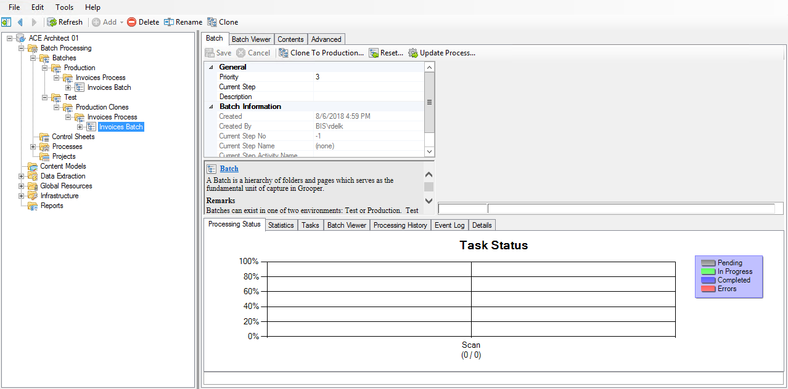

## Image Processing

Our current objective is to clean up the images, which we learned is done via an Image Processing Profile (or "IP Profile").

We can start creating one now that we've got a batch against which we can test it.

### Creating an IP Profile

!!! abstract "Global Resources / **IP Profiles**"
    1. Right click and select **Add > IP Profile...**.
    2. Name it ==Invoices IP Profile==.

### Configuring the IP Profile

Once you have your IP Profile created, you should see the configuration screen.

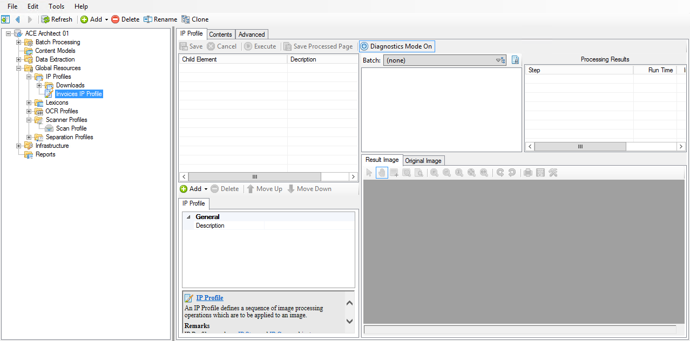

Setting up an IP Profile is a bit like setting up a Batch Process. We'll create a list of things to do (in an IP Profile we'll work with "commands") when the profile runs against a page. Then we'll actually get to test it out against our test batch before we put it into production.

#### Selecting a batch

!!! abstract "Global Resources / IP Profiles / **Invoices IP Profile**"
    From the **Batch** dropdown select our cloned **Invoices Batch**.

We're going to build the profile, but we first need to select a batch for testing.  Otherwise we won't know if the commands we're adding will work.

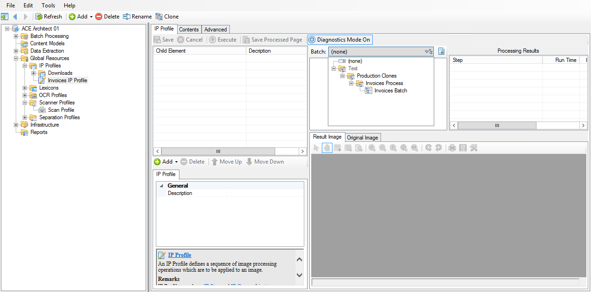

After you select the batch, it will appear in the batch viewer below.

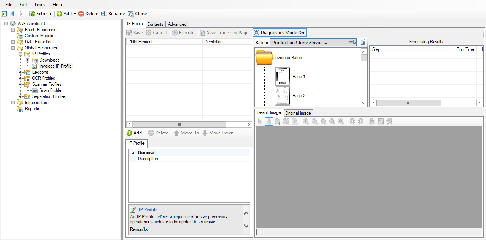

Let's add a command!

#### Adding a Deskew command

The first thing we want to do is deskew the images.

!!! abstract "Global Resources / IP Profiles / **Invoices IP Profile**"
    Press **Add** and select **Image Transforms > Auto Deskew**.

You should now see the "Auto Deskew" command in the list in the "Child Element" column.

??? tip
    If you're not seeing an image in the lower right panel, click on one of the pages in the batch.

??? tip
    When adding commands, if you're unsure what their purposes are, hover over them with your cursor. A tooltip will pop up and give you a brief description.

In the panel below, there are different properties that you can modify for each command, but we're going to leave these ones at their default configurations.

Let's test it out so far to make sure it's working.

#### Testing the command

!!! abstract "Global Resources / IP Profiles / **Invoices IP Profile**"
    Keeping your eye on the image in the lower right panel, press **Execute** in the toolbar.

This will run all commands in the list against the selected page from top to bottom.

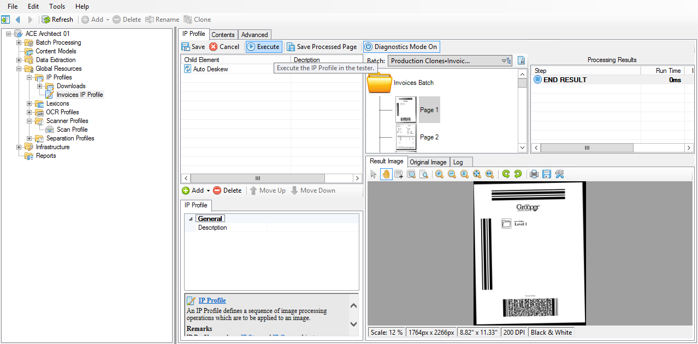

If you were watching, you probably noticed that the image did rotate, but now we have some extra white space around the edges that we didn't have before. That's okay, because we have plenty of other commands at our disposal to take care of that. Right now our primary concern is that the *text* is oriented correctly (we'll talk about why here in a bit).

!!! abstract "Global Resources / IP Profiles / **Invoices IP Profile**"
    In the lower right panel, click the rightmost magnifying glass to zoom the image to fit the panel.

This will make it easier to see.

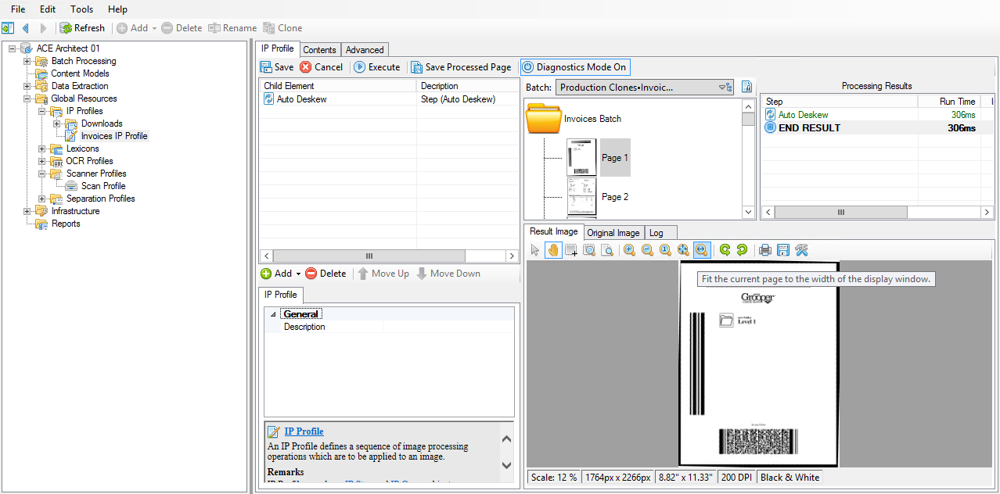

You can see the effect your commands have on your image by switching back and forth between **Result Image** and **Original Image**.

Check it out on page two.

!!! abstract "Global Resources / IP Profiles / **Invoices IP Profile**"
    Press **Save**.

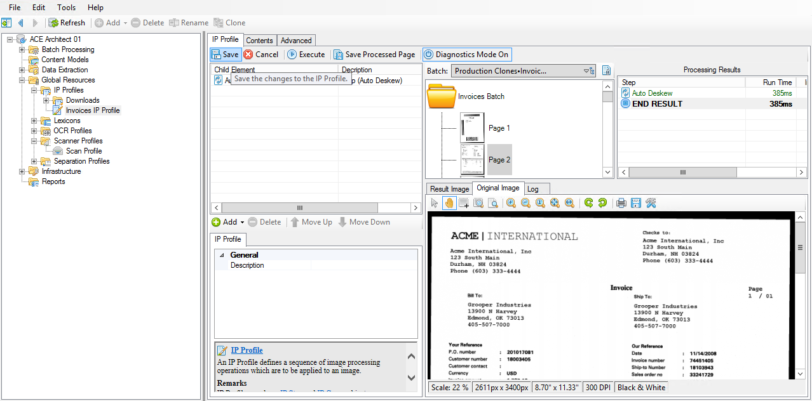

??? tip
    Save often!
    
    A good rule of thumb is to save every time you make a change you know you're going to keep.

We're done with the Deskew command. Remember that the goal is to make sure the text is displayed in horizontal lines, so try not to focus on the border skew.

Speaking of borders, let's take care of them.

#### Border cleanup commands

!!! abstract "Global Resources / IP Profiles / **Invoices IP Profile**"
    Press **Add**, and then **Border Cleanup > Auto Border Crop**.

We aren't going to change any of the default properties, so let's see what happens.
    
!!! abstract "Global Resources / IP Profiles / **Invoices IP Profile**"
    Press **Execute**.  Click back and forth between the images to see the changes.

??? tip
    As you're building an IP Profile and adding and testing commands, make sure you are on the **Result Image** to see if your configuration is working. It's not unusual to be adding commands and not see any changes in your image, only to realize you never switched over from the **Original Image** view!

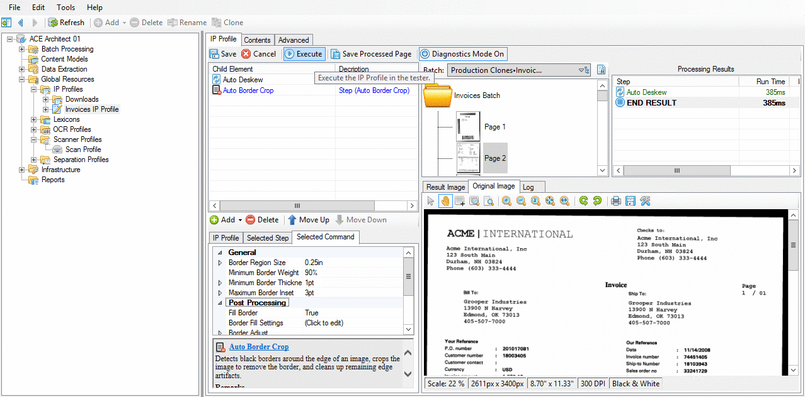

??? note
    The **Border Crop** command changes the size of your image. You can see this in the information panel below the image itself.

Our Border Crop works pretty well, but there are some images that still have a bit leftover. We don't necessarily want to increase the size of our crop because we risk cutting off any text that might be close to the edge of the page (for example, **Page 7** in our batch). We'll take care of that another way.
    
!!! abstract "Global Resources / IP Profiles / **Invoices IP Profile**"
    **Save** the profile.

    
!!! abstract "Global Resources / IP Profiles / **Invoices IP Profile**"
    Select **Page 1** in our batch. Press **Add** and select **Border Cleanup > Border Fill**.

??? note
    When you click on a page in the batch viewer, it automatically runs all commands against that page. The only time you need to use **Execute** is when you're adding commands and you want to run them against your current page without navigating away from it.

If you click on **Execute**, nothing happens. That tells us that the default properties for this command probably need to be tweaked for us to see results.
    
!!! abstract "Global Resources / IP Profiles / **Invoices IP Profile**"
    1. Select the **Border Fill** command.
    2. Change the **Border Region Size** property to ==25pt==.

This is increasing how far inward from the border Grooper will look when running this command.

Yet, once again, **Execute** yields no results.
    
!!! abstract "Global Resources / IP Profiles / **Invoices IP Profile**"
    1. Select **Page 9** in our batch.
    2. Change the **Method** property to ==Inclusive==.

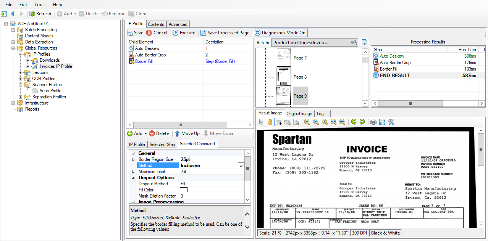
    
!!! abstract "Global Resources / IP Profiles / **Invoices IP Profile**"
    Press **Execute** and check out the results.

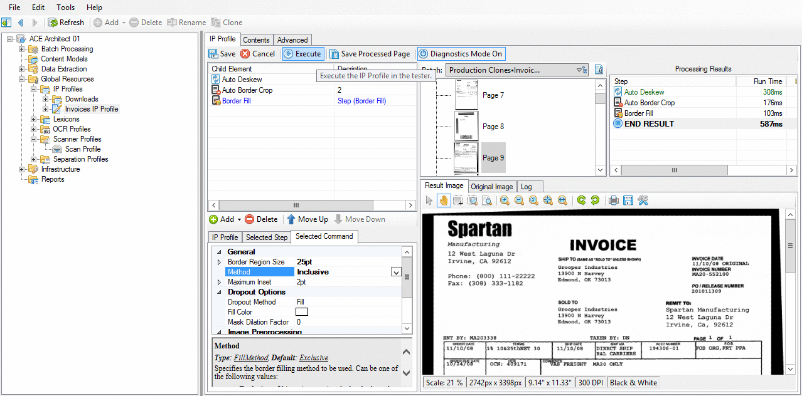

??? note
    Unlike the **Border Crop** command, **Border Fill** does not change the size of your image. This is because this command serves to fill in the edge of the page with whatever color is set in the **Fill Color** property.
    
    We're not changing the size of the page, only the stuff on it.

!!! abstract "Global Resources / IP Profiles / **Invoices IP Profile**"
    Press **Add** and select **Feature Detection > Patch Code Detection**.
    
    **Save** the profile.

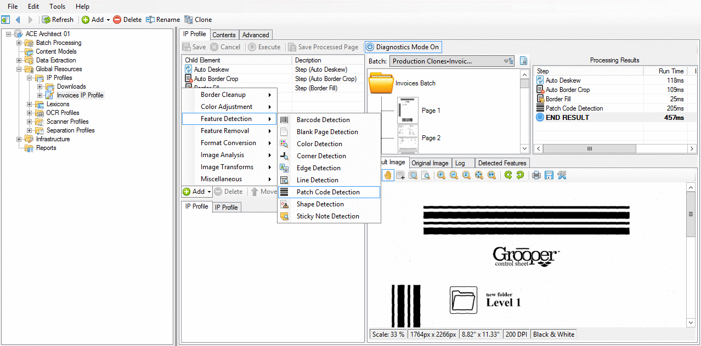

### Adding to the Batch Process

!!! abstract "Batch Processing / Processes / Working / **Invoices Process**."
    1. Press **Add Step...**.
    2. In the **Step Properties** for our new empty step, change the **Activity Type** to ==Image Processing==.
    3. Set the **IP Profile** on the right to the IP Profile we just got done making.
    4. **Save** and **Publish**.

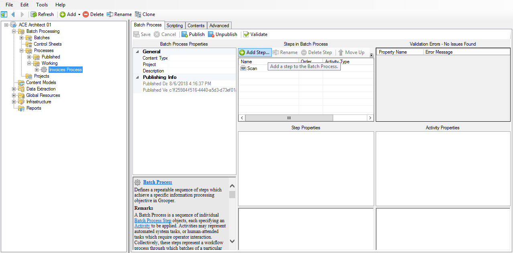

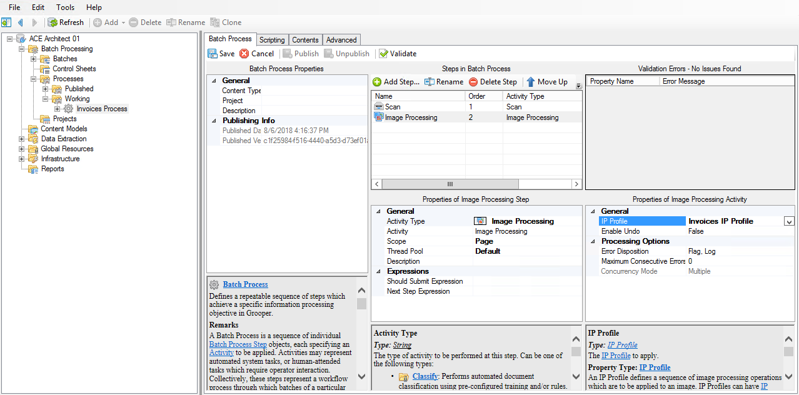

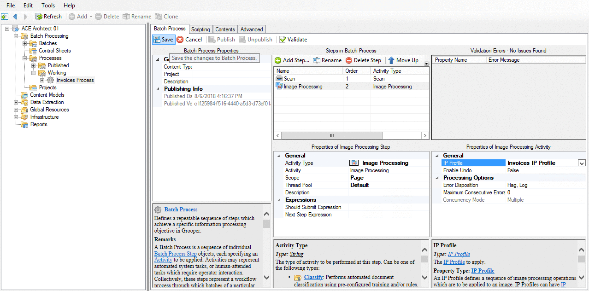

### Updating the production batch

!!! abstract "Batch Processing / Batches / Production / Invoices Process / Invoices Batch / **Invoices Process**"
    Notice how the Batch Process that is attached to this batch didn't receive the new step we just added. Remember that when this batch was created, the process had only the "Scan" step. We want to tell this batch to check out the changes we made to the process so that it can run through the new Image Processing step.

!!! abstract "Batch Processing / Batches / Production / **Invoices Process**"
    Select the batch from the list, and then press **Batch > Update Process...**.
    
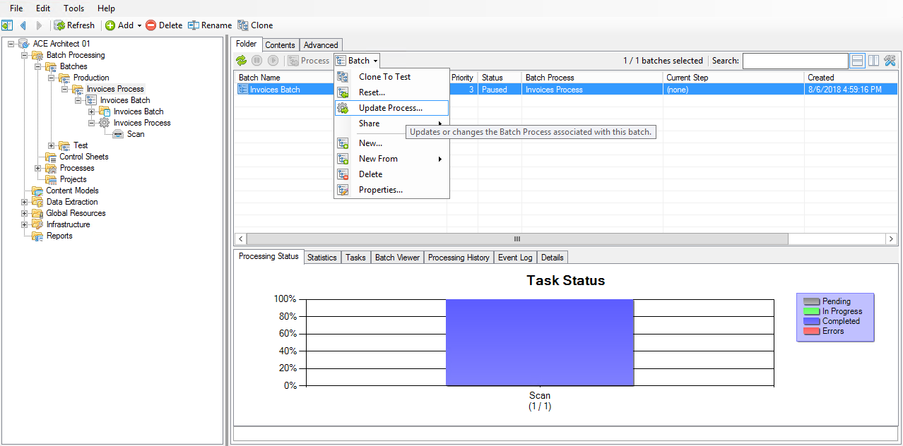

The **Update Process** window will appear.

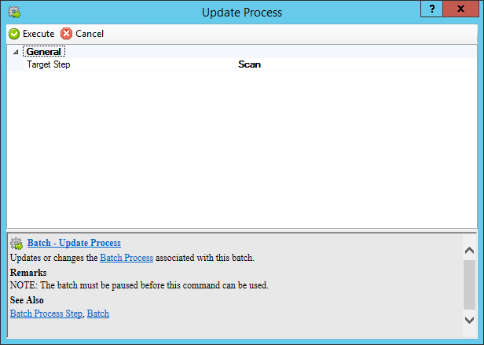

!!! abstract "Batch Processing / Batches / Production / **Invoices Process**"
    Select **Target Step**.  From the dropdown on the right select the **Image Processing** step, and then press **Execute**.
    
We're telling Grooper: "Update the process attached to this batch. We're using this process, I've added a step, and I want you to run the batch through it."

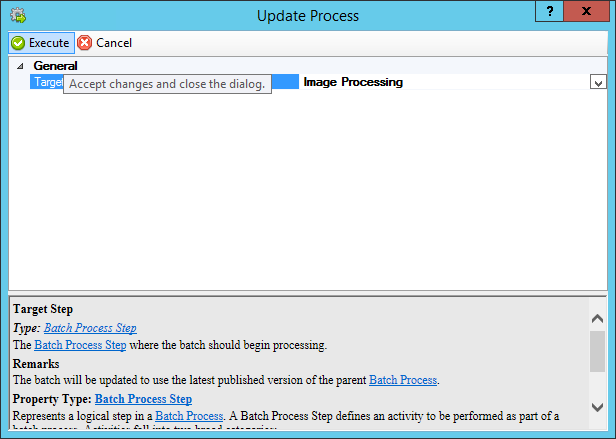

We will return to Grooper Design Studio, only now our batch's **Task Status** panel has another step in it.

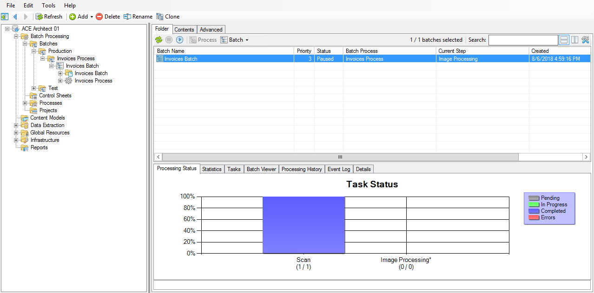

The task doesn't have a progress bar because the batch is still paused.

!!! abstract "Batch Processing / Batches / Production / **Invoices Process**"
    Press **Resume Batch**, and then **Execute** on the confirmation window that appears.
    
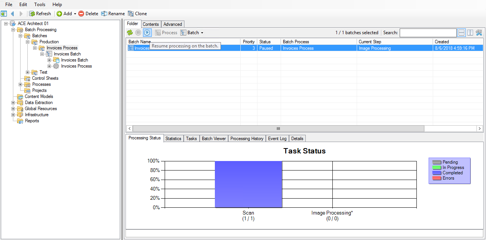

Now the batch has a gray progress bar for the **Image Processing** step. We know this means that it's ready and waiting for us to tell it to start this activity.

Before we do that, let's look at what we just did.

!!! abstract "Batch Processing / Batches / Production / **Invoices Process**"
    Expand this node in the node tree.

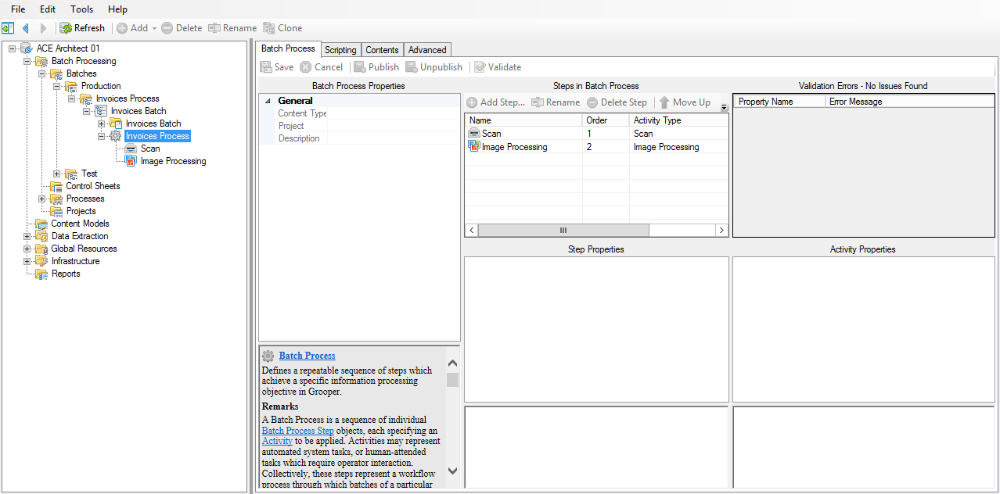

Now we see that there's an **Image Processing** step that wasn't here the last time we looked. This is the result of the **Update Process...** that we did to the batch.

The batch received the latest updates from our **Invoices Process**, which had a new step, so now it's ready to run it!

!!! abstract "Batch Processing / Batches / Production / **Invoices Process**"
    Navigate back up to **Batch Processing > Batches > Production > Invoices Process**, select the batch, and press **Process**.
    
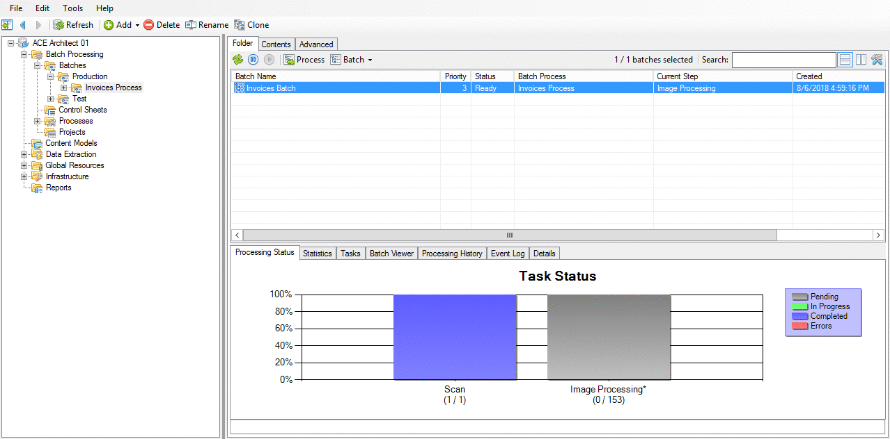

You'll see the **Grooper Unattended Client** window appear. This is the part of the Grooper suite that processes **unattended activities**.

When this shows up, you don't need to press anything - it will start working automatically.

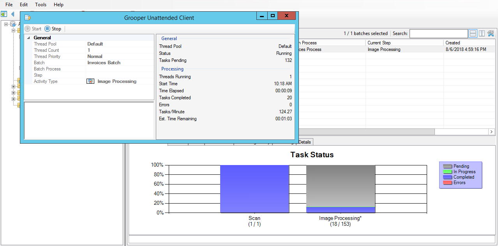

If you take a look at the **Image Processing** step, you can see it working on the pages.

When it's done, it will have a blue progress bar similar to the Scan step.

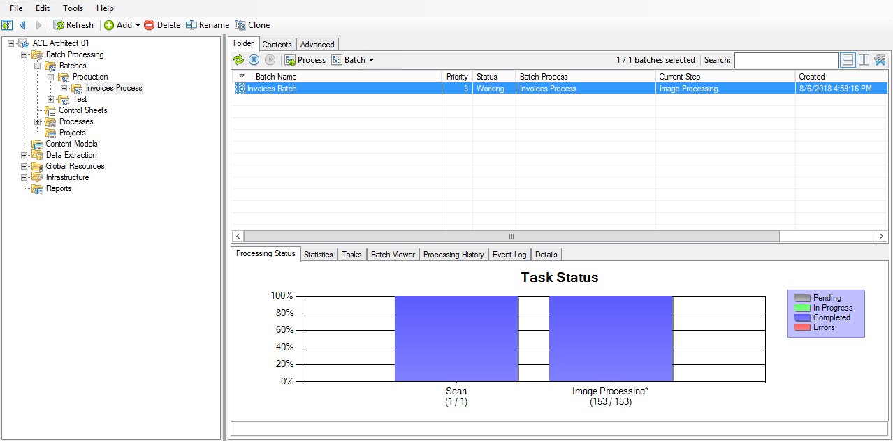

But how do we know that it actually worked, and that our images have been cleaned up satisfactorily?

## Image Review

In a production environment, you might want to have users review the images before they move on to any other steps in your Batch Process.

In Grooper, we can do this with an **Image Review** step. This is an attended activity that will display the batch to the users and give them an opportunity to approve or rescan any images that need it.

### Adding an Image Review step

!!! abstract "Batch Processing / Batches / Production / **Invoices Process**"
    1. Press **Add Step...**.
    2. Under **Step Properties**, set the **Activity Type** to ==Image Review==.
    3. **Save** and **Publish**.

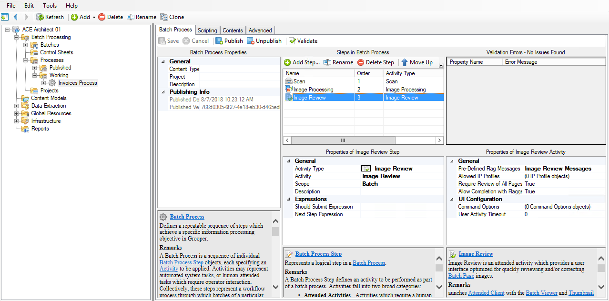

Now we need to go update our batch.

!!! abstract "Batch Processing / Batches / Production / **Invoices Process**"
    1. **Pause** the batch.
    2. Select the **Batch** dropdown and select **Update Process...**.
    3. In the **Update Process** window, set **Target Step** to ==Image Review==.
    4. Press **Execute**.

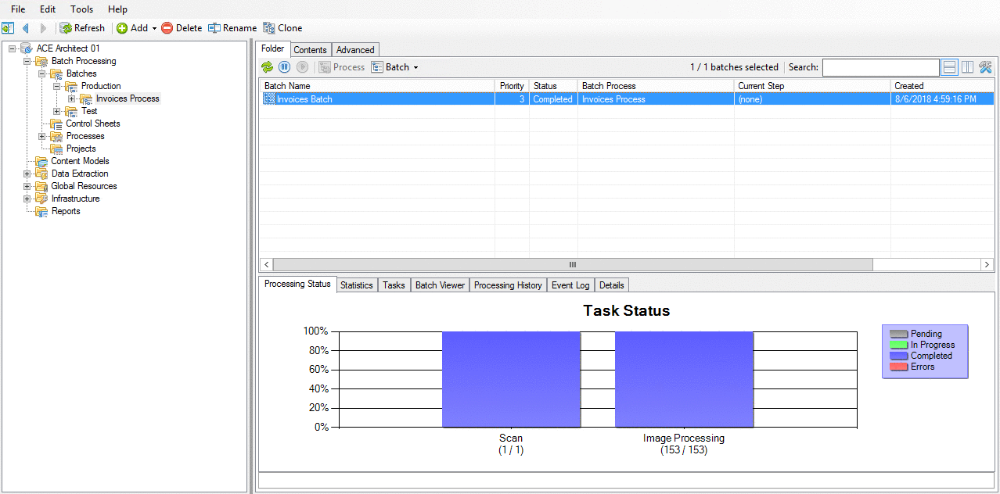

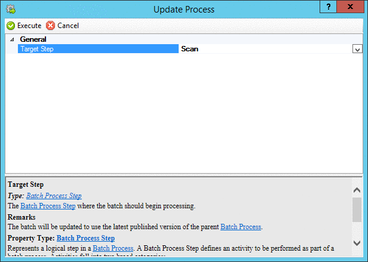

We should see another step in the **Task Status** panel, just like when we added **Image Processing**.

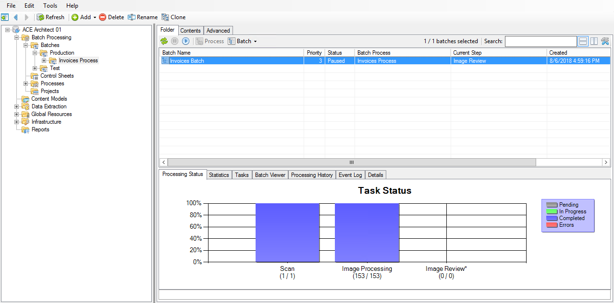

!!! abstract "Batch Processing / Batches / Production / **Invoices Process**"
    **Resume** the batch.

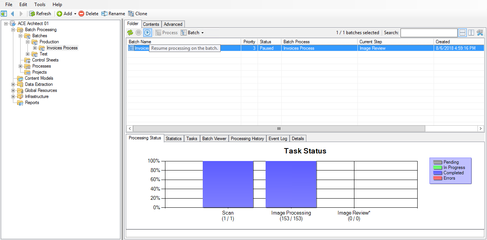

!!! abstract "Batch Processing / Batches / Production / **Invoices Process**"
    Press **Process** to start this activity.

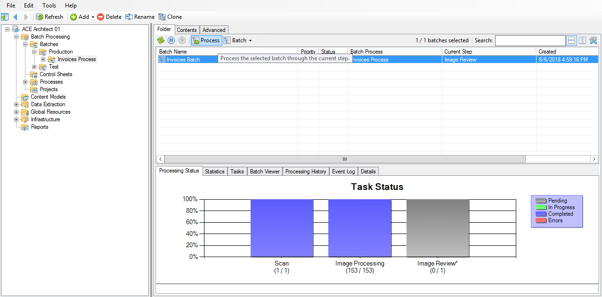

**Image Review** is an attended activity, so clicking **Process** will open up the **Grooper Attended Client** module (like it did when we scanned).

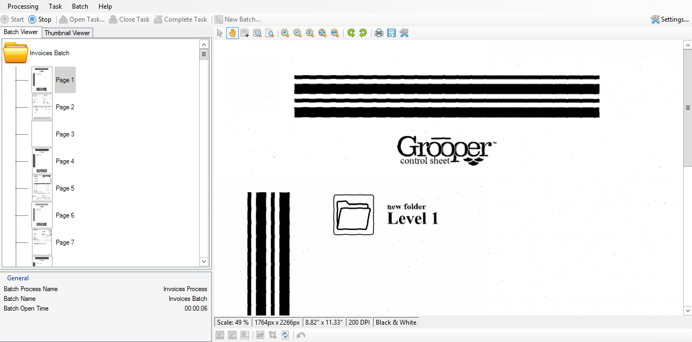

### Opening Image Review

!!! abstract "Batch Processing / Batches / Production / **Invoices Process**"
    Switch to the **Thumbnail Viewer** tab.

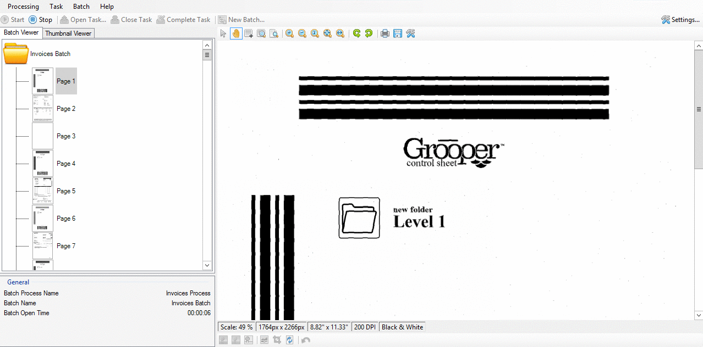

This gives us an easy way to see all of the thumbnails of the batch at a glance.

If you haven't noticed yet, there are a few blank pages in this batch. We don't really care about processing those, so let's get rid of them.

!!! abstract "Batch Processing / Batches / Production / **Invoices Process**"
    In the **Thumbnail Viewer**, press **Sort** in the upper right corner.

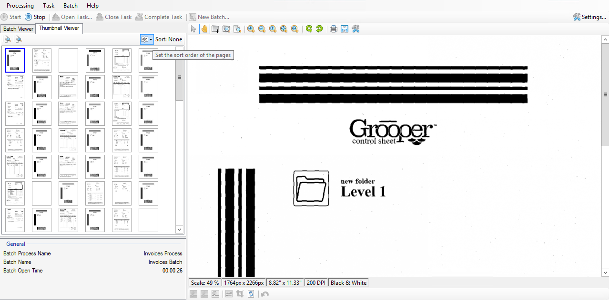

!!! abstract "Batch Processing / Batches / Production / **Invoices Process**"
    Select the **Sort By Intensity** option.

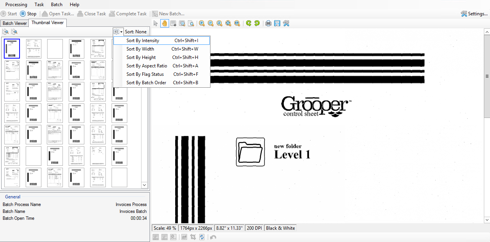

This will arrange the images by how intense they are, based on the black pixel count. Images will be arranged from top to bottom by least amount of black pixels to most.

??? note
    This does not permanently arrange the images in this order. This is just a technique to see how many blank pages we have.

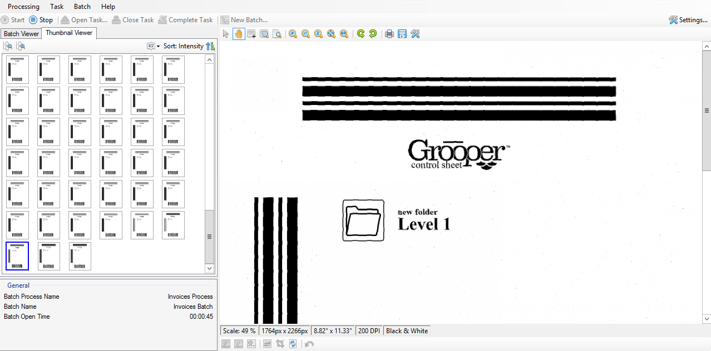

If you scroll to the top, you can see all of the pages with the least amount of black pixels - the blank pages we want to remove.

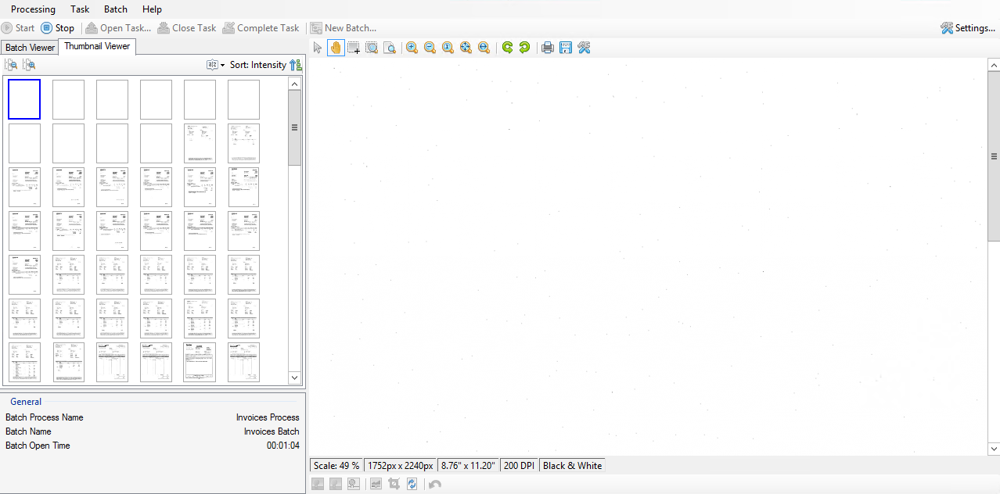

### Deleting blank pages

!!! abstract "Batch Processing / Batches / Production / **Invoices Process**"
    1. Select the blank pages. You can do this in the same way you select files on your computer.
        - Using your ++ctrl++ key and clicking on the page you want to select
        - Clicking the first blank page, holding ++shift++ on your keyboard, and then clicking on the last blank page
    2. Delete the pages. Either:
        - press the ++delete++ key on your keyboard, or
        - right click on the selected pages and select **Delete**.
    3. Confirm the deletion when the confirmation window comes up.

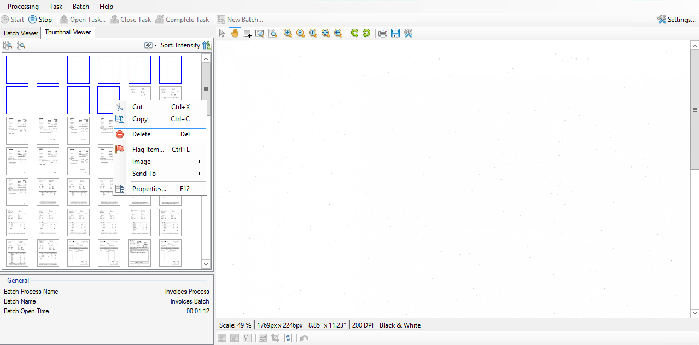

Ta-da! They're all gone.

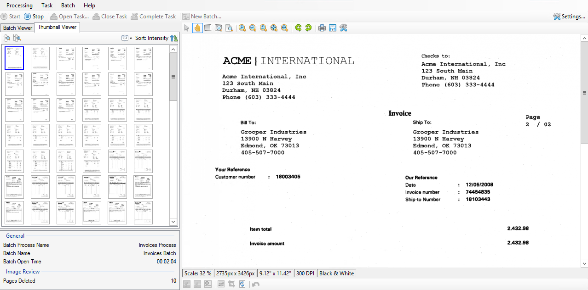

??? note
    This is only one of many ways that blank pages can be removed in Grooper.

!!! abstract "Batch Processing / Batches / Production / **Invoices Process**"
    Switch to the **Batch Viewer** tab.

Notice that the order of the pages didn't actually change, and now our batch is free of any blank pages.

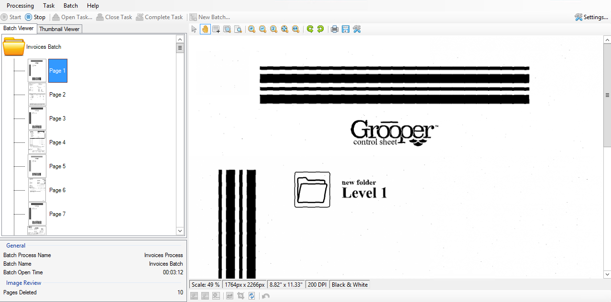

### Verifying the images

In order to complete this activity, the images have to be verified. This means that they need to be checked to make sure the previous step (Image Processing) worked correctly on all of the pages.

To verify that an image has been reviewed, you can:

1. right click on the image and press **Mark As Reviewed**, or
2. press ++enter++ on your keyboard.

You know an image has been reviewed when there is a green **✓** on the image.

Each image has to be reviewed before **Complete Task** in the toolbar will light up, so it's probably easiest to press ++enter++ for each of these.

!!! abstract "Batch Processing / Batches / Production / **Invoices Process**"
    Make sure every image in the batch has been marked as reviewed.

??? tip
    For this exercise, Image Processing works on all of the pages.

    To complete this step quickly, select the first page in the batch and hold your ++enter++ key down. It will quickly verify all of the pages in the batch.

When you have reviewed all of the pages in the batch, **Complete Task** in the toolbar will light up.

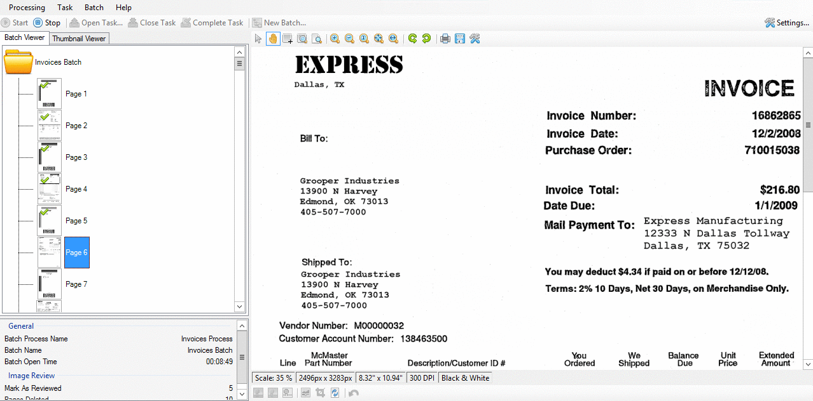

!!! abstract "Batch Processing / Batches / Production / **Invoices Process**"
    Press **Complete Task** to finish this activity and return to Grooper Design Studio.

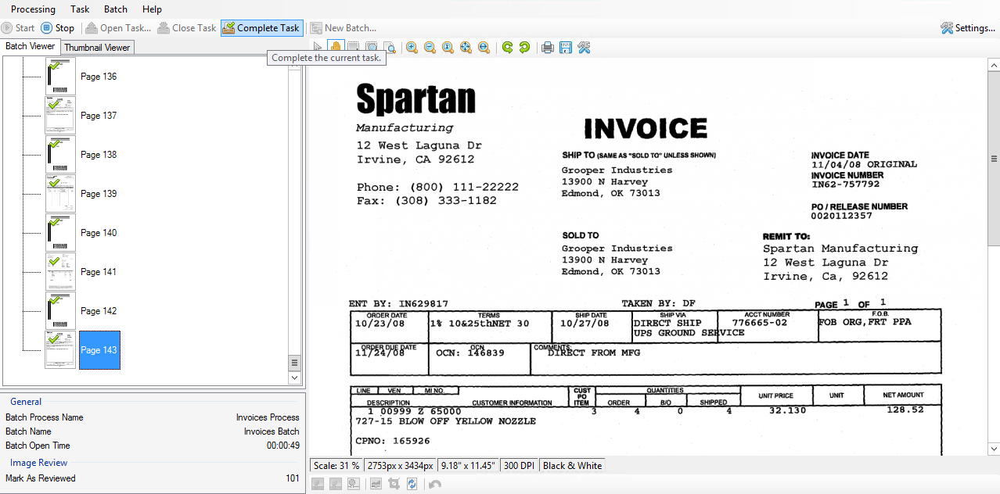

And that's it! We've successfully cleaned up our images. But now what do we do?

## OCR

You may be wondering why it's so important for us to have the images as clean as we can get them? Why can't we just store them however they came in? They weren't that bad, right?

Well, believe it or not, there is a reason behind the madness.

### About OCR

Remember that our overarching goal with Grooper is to automate the process of processing documents, collecting information from them, and sending them on their way.

We're well on our way to getting that information from the documents, but we have to do a few things to prepare Grooper to get the information for us.

#### What is OCR?

We're going to be performing what's called OCR, which stands for "optical character recognition." This means we're going to tell Grooper to look at the images in our batch, identify what on these images is text, and store that text for us to use later.

Image someone who doesn't know how to read. Letters on a page would simply look like a bunch of symbols without meaning, right?

Now image that that person is a computer. For a scanned document, a computer doesn’t even know the symbol is a letter, but instead an arbitrary combination of pixels. The OCR process is how the computer takes an image and, ==line by line==, finds combinations of pixels that it ultimately determines are letters, numbers, spaces, special characters, and so on.

For this to happen successfully, the quality of the images has to be as high as possible. If we tried to OCR low-quality images, the text identified by the OCR engine won't be very good, which essentially breaks down everything we do from this point forward.

#### When do I need to OCR?

To harness all the power of Grooper, pages must be OCRed. There are perhaps very simple batch processes that could be created that utilized human interaction for every step, and in that case OCR would not be required, but that’s like buying a Ferrari to take trips to the grocery store.

All the power of Grooper, from separation, to classification, to extraction, leverages the computer’s ability to read the document, and to that end require a page be OCRed. Therefore it is *crucial* to have the highest quality documents we can get in order for the automation process to run as smoothly as possible.

#### How does OCR work?

Check out [this video](https://upload.wikimedia.org/wikipedia/commons/transcoded/8/81/Portable_scanner_and_OCR_%28video%29.webm/Portable_scanner_and_OCR_%28video%29.webm.480p.webm) on Wikipedia. It’s a nice demonstration of a very manual approach to OCR. You can see the person live scanning the document, line by line, and the computer “reads” the letters as the scanning happens.

With Grooper, page scanning happens (usually) all at once. During the OCR process the image is broken into vertical and horizontal lines of pixels to identify individual letter characters and spacing.

<!-- | G     | r     | o     |
| :---: | :---: | :---: | -->
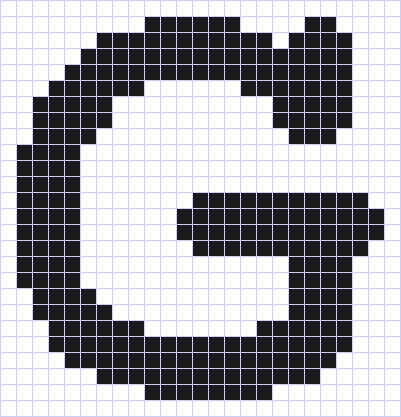

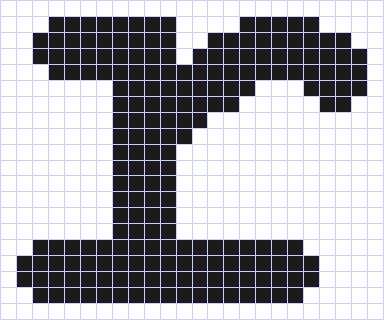

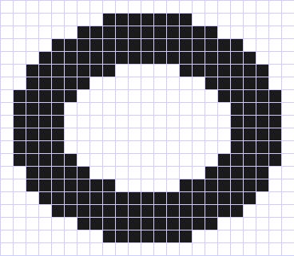

### Adding an OCR step

!!! abstract "Batch Processing / Processes / Working / **Invoices Process**"
    1. Press **Add Step...**.
    2. Under **Step Properties**, set the **Activity Type** to ==OCR==.
    3. Under **Properties of OCR Activity**, set the **OCR Profile** to ==Full Text - Accurate==.
    4. **Save** and **Publish** the process.

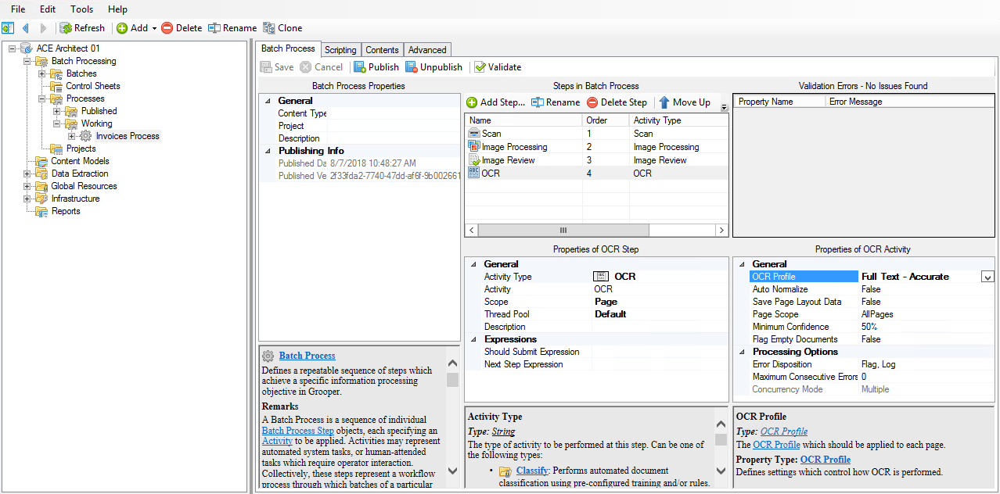

!!! abstract "Batch Processing / Batches / Production / **Invoices Process**"
    1. **Pause** the batch.
    2. Select the **Batch** dropdown and select **Update Process...**.
    3. In the **Update Process** window, set **Target Step** to ==OCR==.
    4. Press **Execute**.

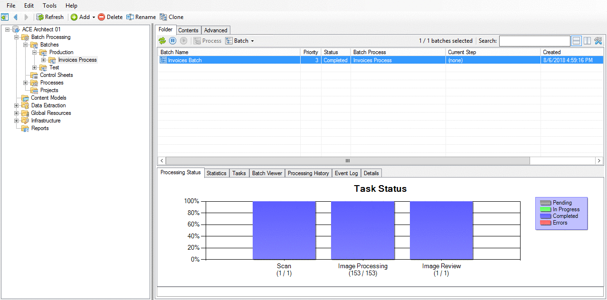

!!! abstract "Batch Processing / Batches / Production / **Invoices Process**"
    1. **Resume** the batch.
    2. Press **Process** to kick off the OCR activity.

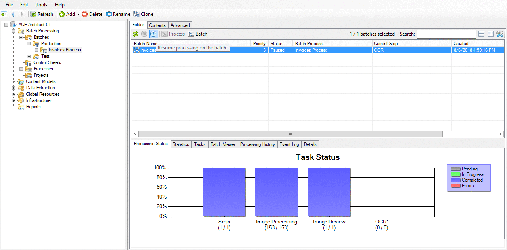

The **Grooper Unattended Client** should kick off again and start processing against the pages in the batch.

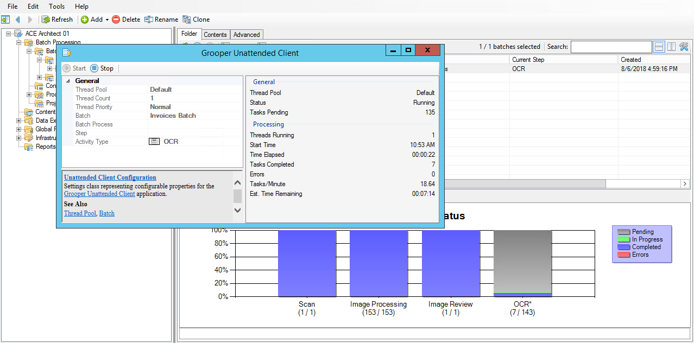

## Recap

That's it for the **Condition** phase! We've successfully prepped our images and extracted text from them.

Here's a list of everything we learned:

- how to clone a batch from production to test,
- how to create an Image Processing Profile (or "IP Profile"),
- how to configure our IP Profile to clean up our images,
- how to update an existing batch when you change its Batch Process,
- how to perform Image Review on the images, and
- how to extract text from the images using Optical Character Recognition (or "OCR")

And thus your arsenal of Grooper knowledge grows!

## Up next

We currently have a batch of loose pages with some patch code sheets. This batch consists of multiple invoices, but Grooper isn't aware of that yet. You and I know where one invoice ends and another begins, so it's up to us to tell Grooper how to recognize that as well.
