# Condition

## Overview

Remember that our goal for using Grooper is to automate tasks that we would otherwise have to perform manually.

Imagine we have a pile of papers in our inbox. We can think of this as the batch we just made, so they arrived there via the **Acquire** phase.

If we had to work through these documents by hand, we'd probably have to go through them and make sure they're all facing the same way, remove any sticky notes on them, take out the staples, and potentially white out smudges and marks.

This is the **Condition** phase, and we can automate these tasks in Grooper.

In this phase, we will:

- create and test an Image Processing Profile,
- use the new profile to clean up our batch, and
- use OCR to obtain text from our images that we'll use later.

Let the conditioning commence!

## But first

For the next few phases, we'll be testing the results of adding a single Batch Process step at a time. Let's take a deeper look at our batch so that when we start adding steps, the process makes a little bit more sense.

!!! abstract "Step 1"
    In Grooper Design Studio, navigate to ***(root)* > Batch Processing > Batches > Production > Invoices Process**.

``` clojure hl_lines="5"
(root)
├─ Batch Processing
|  ├─ Batches
|  |  ├─ Production
|  |  |  └─ Invoices Process
|  |  └─ Test
|  ├─ Control Sheets
|  ├─ Processes
|  └─ Projects
├─ Content Models
├─ Data Extraction
└─ ...
```


Any batches that are created will also be visible in the node tree. Viewing the batch from this location gives us access to more information about the batch itself.

You can simply view the batch by clicking on the **Batch Viewer** tab.


!!! abstract "Step 2"
    Click the **+** button next to the batch in the node tree to expand it.


Notice that there are two child objects here:

``` hl_lines="2 3"
└─ Invoices Batch
    ├─ Invoices Batch
    └─ Invoices Process
```

1. a folder with the same name as the batch, and
2. a gear icon with the name of the Batch Process we used to create the batch.


??? note
    When you create a production batch and assign it a particular Batch Process, it attaches a copy of that Process to that batch. This is to ensure that, should there be any changes to the process after the batch is created, it won't affect how this batch is processing.

    An important note is that because this Process is only a *copy* of the original, it doesn't maintain a link to the original.

If we want to make changes to the Process and subsequently test those changes against an batch, we need to tell that batch to update.

This is like telling Grooper, "Hey, I've changed the steps I want you to take when you process."

We'll be doing this quite a few times, so it won't hurt to become familiar with the technique!
    
## Cloning to test

!!! abstract "Step 1"
    Navigate back up the node tree to ***(root)* > Batch Processing > Batches > Production > Invoices Process > Invoices Batch**.


We need to clean up our batch images, so we're going to create an Image Processing Profile to do that. However, profiles can be tested only against test batches, so we can't use our production batch.

We can, however, clone our production batch to our test batches. This way we don't have to create a brand new test batch to work with.

!!! abstract "Step 2"
    Click the **Clone To Test** button, and then **Execute** on the window that appears.


??? warning
    Make sure you click the **Clone To Test** button and NOT the **Clone** button in the upper toolbar.

    - **Clone To Test** makes an exact replica of the batch in the test batches.

    - **Clone** is a way to create an exact copy of an object in-place in the node tree. If we used this option instead, we would have two identical production batches (and we'd have to rename the second one).

Once the clone is complete, you will see a confirmation window; click **OK**.

Now you can view the cloned batch by navigating to ***(root)* > Batch Processing > Batches > Test > Production Clones > Invoices Process > Invoices Batch**

``` clojure hl_lines="8"
(root)
├─ Batch Processing
|  ├─ Batches
|  |  ├─ Production
|  |  └─ Test
|  |     └─ Production Clones
|  |        └─ Invoices Process
|  |           └─ Invoices Batch
|  ├─ Control Sheets
|  ├─ Processes
|  └─ Projects
├─ Content Models
├─ Data Extraction
└─ ...
```


## Image Processing

Our current objective is to clean up the images, which we learned is done via an Image Processing Profile (or "IP Profile").

We can start creating one now that we've got a batch against which we can test it.

### Creating an IP Profile

!!! abstract "Step 1"
    Navigate to ***(root)* > Global Resources > IP Profiles**.

``` clojure hl_lines="6"
(root)
├─ Batch Processing
├─ Content Models
├─ Data Extraction
├─ Global Resources
|  └─ IP Profiles
├─ Infrastructure
└─ Reports
```

!!! abstract "Step 2"
    Right-click on this node and click **Add > IP Profile...**.

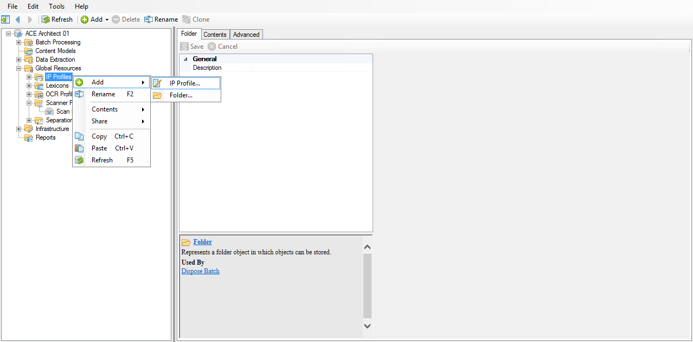

!!! abstract "Step 3"
    Give the profile a name, such as ==Invoices IP Profile==, and click **OK**.

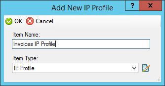

### Configuring the IP Profile

Once you have your IP Profile created, you should see the configuration screen.


Setting up an IP Profile is a bit like setting up a Batch Process. We'll create a list of things to do (called "commands") when the profile runs against a page. Then we'll actually get to test it out against our test batch before we put it into production.

#### Selecting a batch

!!! abstract "Step 1"
    From the **Batch** dropdown, select our cloned **Invoices Batch**.

We're going to build the profile, but we first need to select a batch for testing, otherwise we won't know if the commands we're adding will work.


After you select the batch, it will appear in the batch viewer below.


Let's add a command!

#### Adding a Deskew command

The first thing we want to do is deskew the images.

!!! abstract "Step 2"
    Click the **Add** button, and then click on **Image Transforms > Auto Deskew**.

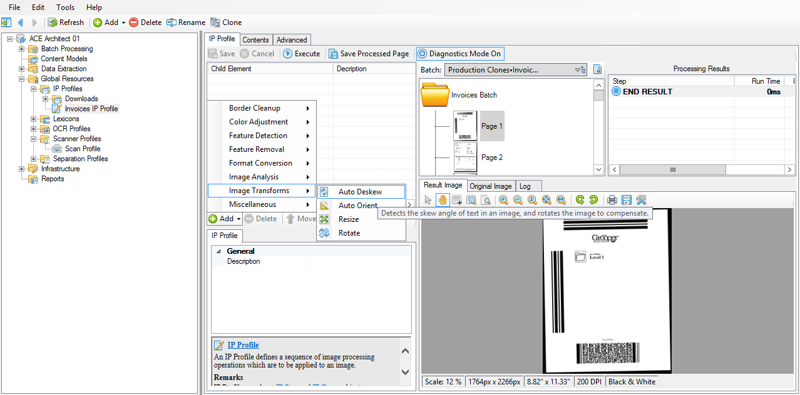

You should now see the "Auto Deskew" command in the list in the "Child Element" column.

??? tip
    If you're not seeing an image in the lower right panel, click on one of the pages in the batch.

??? tip
    When adding commands, if you're unsure what their purposes are, hover over them with your cursor. A tooltip will pop up and give you a brief description.

In the panel below, there are different properties that you can modify for each command, but we're going to leave these ones at their default configurations.

Let's test it out so far to make sure it's working.

#### Testing the command

!!! abstract "Step 3"
    Click the **Execute** button in the toolbar. Keep your eye on the image in the lower right panel.

This will run all commands in the list against the selected page from top to bottom.


If you were watching, you probably noticed that the image did rotate, but now we have some extra white space around the edges that we didn't have before. That's okay, because we have plenty of other commands at our disposal to take care of that. Right now our primary concern is that the *text* is oriented correctly (we'll talk about why here in a bit).

!!! abstract "Step 4"
    In the lower right panel, click the rightmost magnifying glass to zoom the image to fit the panel.

This will make it easier to see.


You can see the effect your commands have on your image by switching back and forth between **Result Image** and **Original Image**.

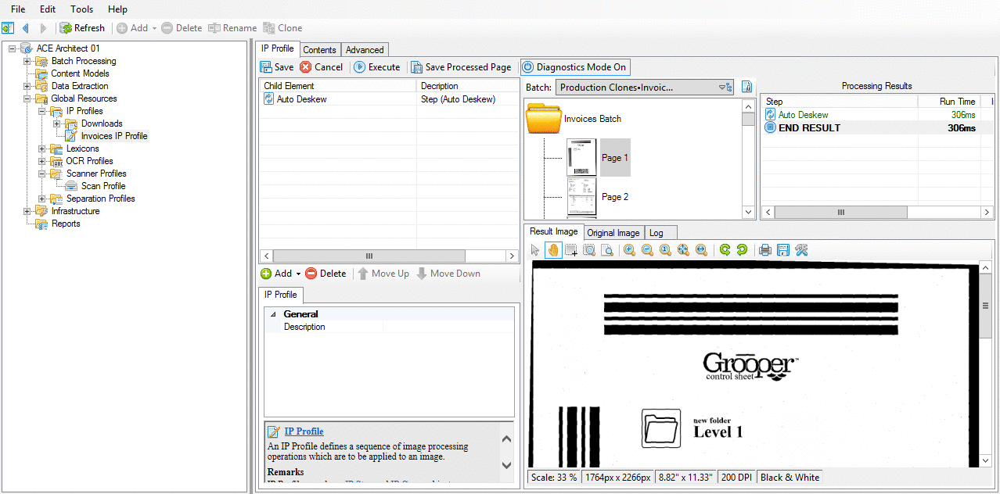

Check it out on page two.

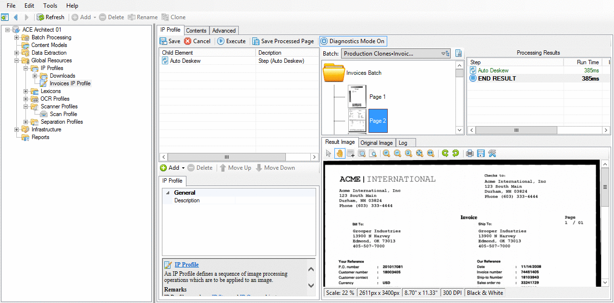

!!! abstract "Step 5"
    Click **Save**.

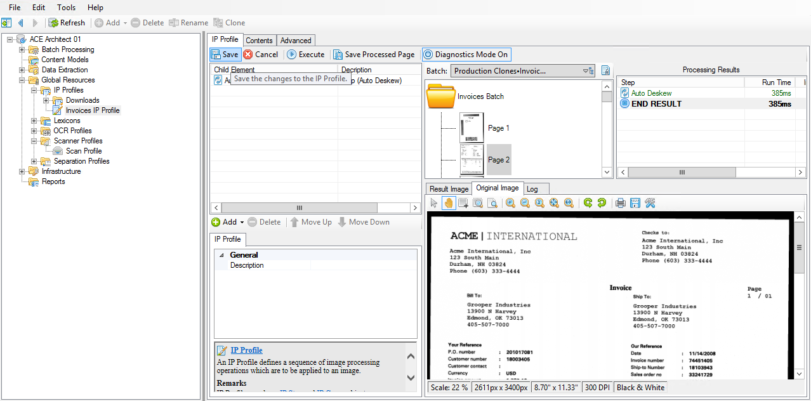

??? tip
    Save often!
    
    A good rule of thumb is to save every time you make a change you know you're going to keep.

We're done with the Deskew command. Remember that the goal is to make sure the text is displayed in horizontal lines, so try not to focus on the border skew.

Speaking of borders, let's take care of them.

#### Border cleanup commands

!!! abstract "Step 6"
    Click **Add**, and then **Border Cleanup > Auto Border Crop**.

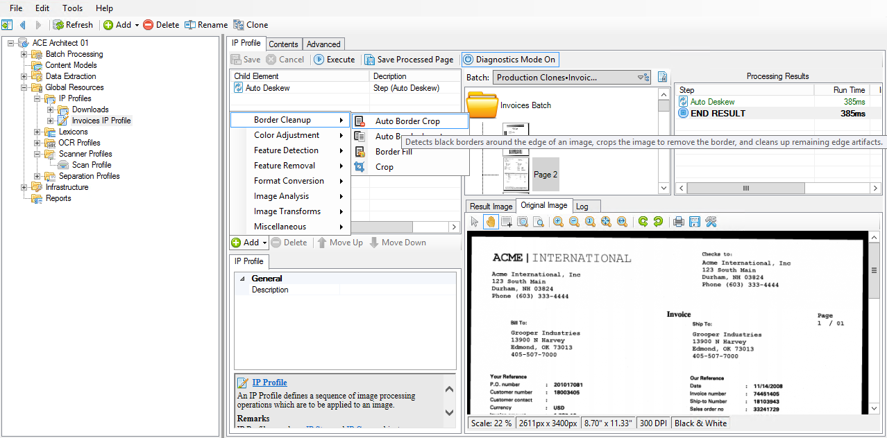

We aren't going to change any of the default properties, so let's see what happens.
    
!!! abstract "Step 7"
    Click **Execute**, and click back and forth between the images to see the changes.

??? tip
    As you're building an IP Profile and adding and testing commands, make sure you are on the **Result Image** to see if your configuration is working. It's not unusual to be adding commands and not see any changes in your image, only to realize you never switched over from the **Original Image** view!


??? note
    The **Border Crop** command changes the size of your image. You can see this in the information panel below the image itself.

Our Border Crop works pretty well, but there are some images that still have a bit leftover. We don't necessarily want to increase the size of our crop because we risk cutting off any text that might be close to the edge of the page (for example, **Page 7** in our batch). We'll take care of that another way.
    
!!! abstract "Step 8"
    **Save** the profile.

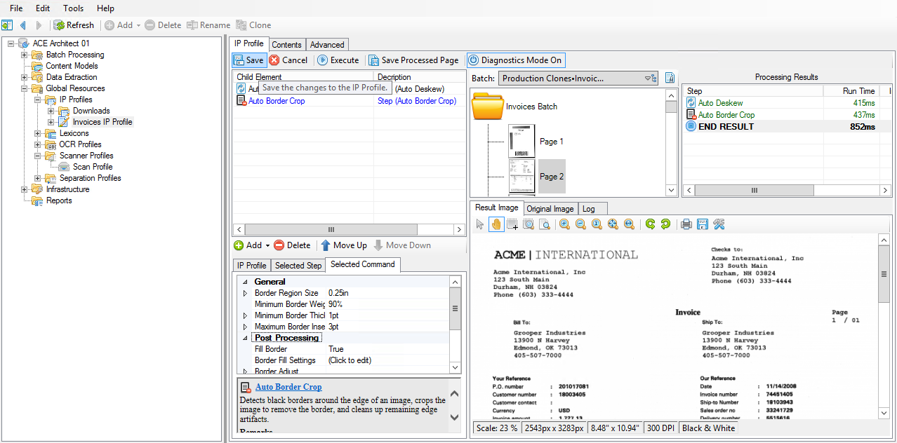
    
!!! abstract "Step 9"
    Select **Page 1** in our batch. Click on **Add**, and then select **Border Cleanup > Border Fill.**

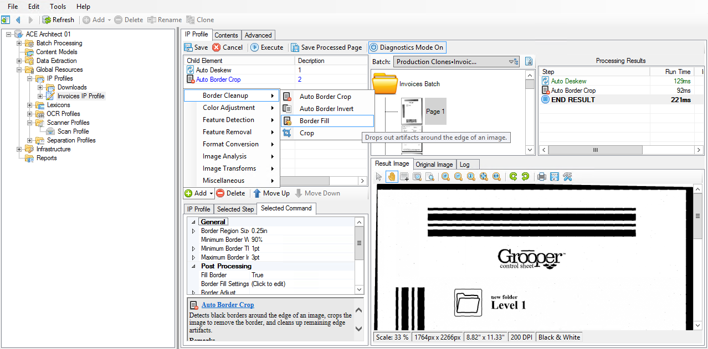

??? note
    When you click on a page in the batch viewer, it automatically runs all commands against that page. The only time you need to use the **Execute** button is when you're adding commands and you want to run them against your current page without navigating away from it.

If you click on **Execute**, nothing happens. That tells us that the default properties for this command probably need to be tweaked for us to see results.
    
!!! abstract "Step 10"
    Make sure you have the **Border Fill** command selected in your list and change the **Border Region Size** property to ==25pt==.

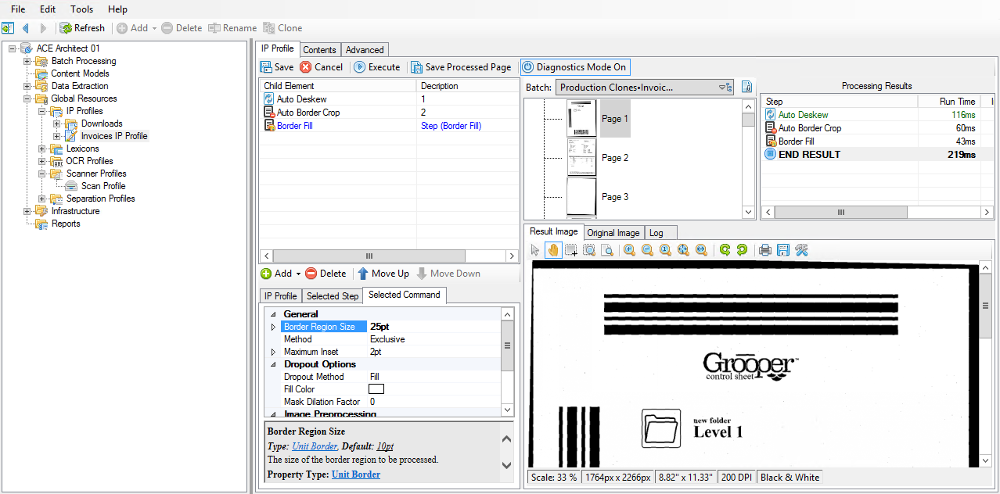

This is increasing how far inward from the border Grooper will look when running this command.

Yet, once again, **Execute** yields no results.
    
!!! abstract "Step 11"
    Select **Page 9** in our batch. Change the **Method** property to **Inclusive**.


    
!!! abstract "Step 12"
    Click **Execute** and check out the results.

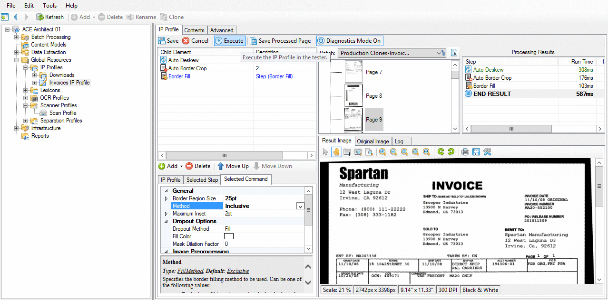

??? note
    Unlike the **Border Crop** command, **Border Fill** does not change the size of your image. This is because this command serves to fill in the edge of the page with whatever color is set in the **Fill Color** property.
    
    We're not changing the size of the page, only the stuff on it.