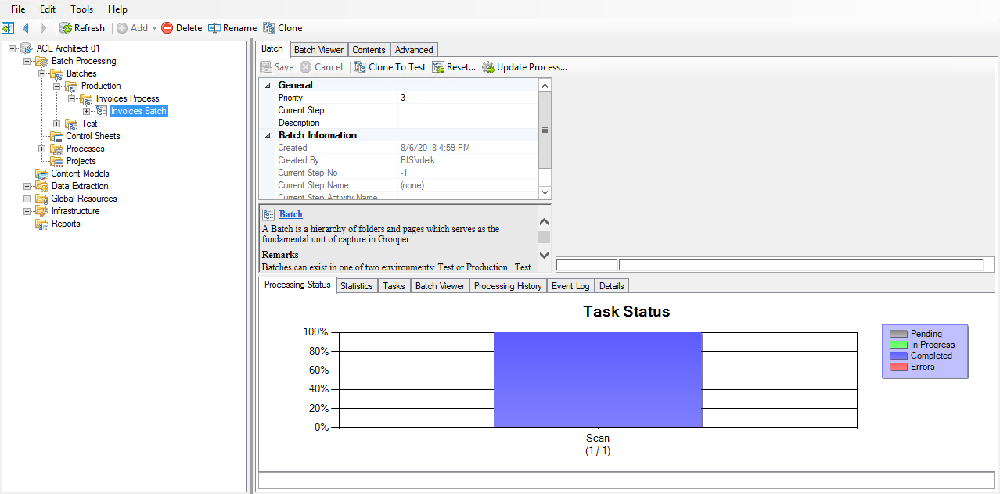
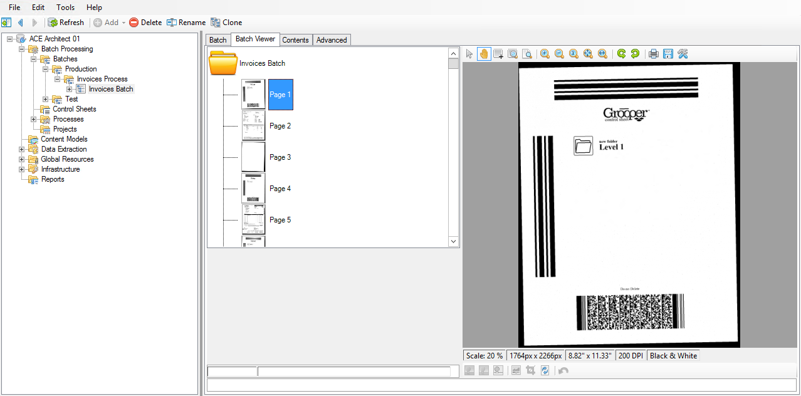
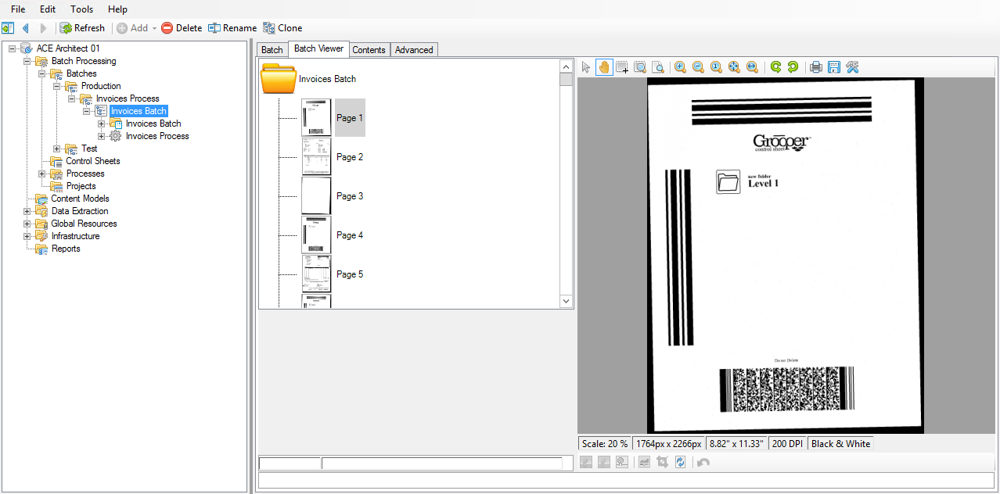
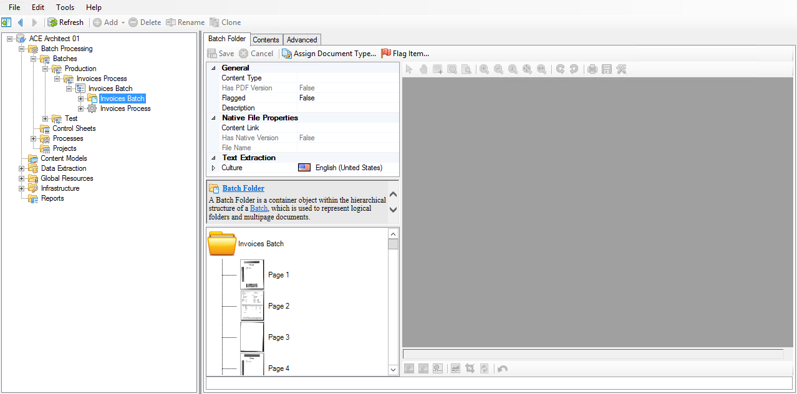
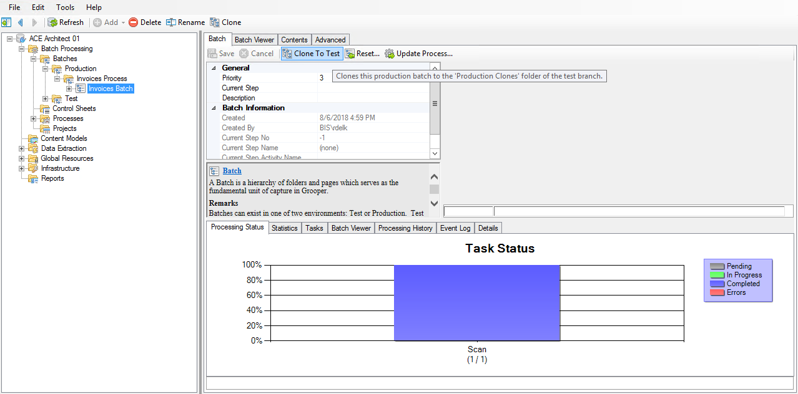
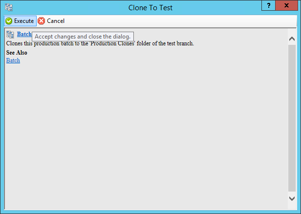

# Condition

## Overview

Remember that our goal for using Grooper is to automate tasks that we would otherwise have to perform manually.

Imagine we have a pile of papers in our inbox. We can think of this as the batch we just made, so they arrived there via the **Acquire** phase.

If we had to work through these documents by hand, we'd probably have to go through them and make sure they're all facing the same way, remove any sticky notes on them, take out the staples, and potentially white out smudges and marks.

This is the **Condition** phase, and we can automate these tasks in Grooper.

In this phase, we will:

- create and test an Image Processing Profile,
- use the new profile to clean up our batch, and
- use OCR to obtain text from our images that we'll use later.

Let the conditioning commence!

## But first

For the next few phases, we'll be testing the results of adding a single Batch Process step at a time. Let's take a deeper look at our batch so that when we start adding steps, the process makes a little bit more sense.

1. In Grooper Design Studio, navigate to ***(root)* > Batch Processing > Batches > Production > Invoices Process**.

    ``` clojure hl_lines="5"
    (root)
    ├─ Batch Processing
    |  ├─ Batches
    |  |  ├─ Production
    |  |  |  └─ Invoices Process
    |  |  └─ Test
    |  ├─ Control Sheets
    |  ├─ Processes
    |  └─ Projects
    ├─ Content Models
    ├─ Data Extraction
    └─ ...
    ```

    

    Any batches that are created will also be visible in the node tree. Viewing the batch from this location gives us access to more information about the batch itself.

    You can simply view the batch by clicking on the **Batch Viewer** tab.

    

2. Click the **+** button next to the batch in the node tree to expand it.

    

    Notice that there are two child objects here:

    ``` hl_lines="2 3"
    └─ Invoices Batch
        ├─ Invoices Batch
        ├─ Invoices Process
    ```

    1. a folder with the same name as the batch, and
    2. a gear icon with the name of the Batch Process we used to create the batch.

    

    

    !!! note
        When you create a production batch and assign it a particular Batch Process, it attaches a copy of that Process to that batch. This is to ensure that, should there be any changes to the process after the batch is created, it won't affect how this batch is processing.

        An important note is that because this Process is only a *copy* of the original, it doesn't maintain a link to the original.

    If we want to make changes to the Process and subsequently test those changes against an batch, we need to tell that batch to update.

    This is like telling Grooper, "Hey, I've changed the steps I want you to take when you process."

    We'll be doing this quite a few times, so it won't hurt to become familiar with the technique!

3. Navigate back up the node tree to ***(root)* > Batch Processing > Batches > Production > Invoices Process > Invoices Batch**.

    

    We need to clean up our batch images, so we're going to create an Image Processing Profile to do that. However, profiles can be tested only against test batches, so we can't use our production batch.

    We can, however, clone our production batch to our test batches. This way we don't have to create a brand new test batch to work with.

4. Click the **Clone To Test** button, and then **Execute** on the window that appears.

    

    

    !!! warning
        Make sure you click the **Clone To Test** button and NOT the **Clone** button in the upper toolbar.

        - **Clone To Test** makes an exact replica of the batch in the test batches.

        - **Clone** is a way to create an exact copy of an object in-place in the node tree. If we used this option instead, we would have two identical production batches (and we'd have to rename the second one).


