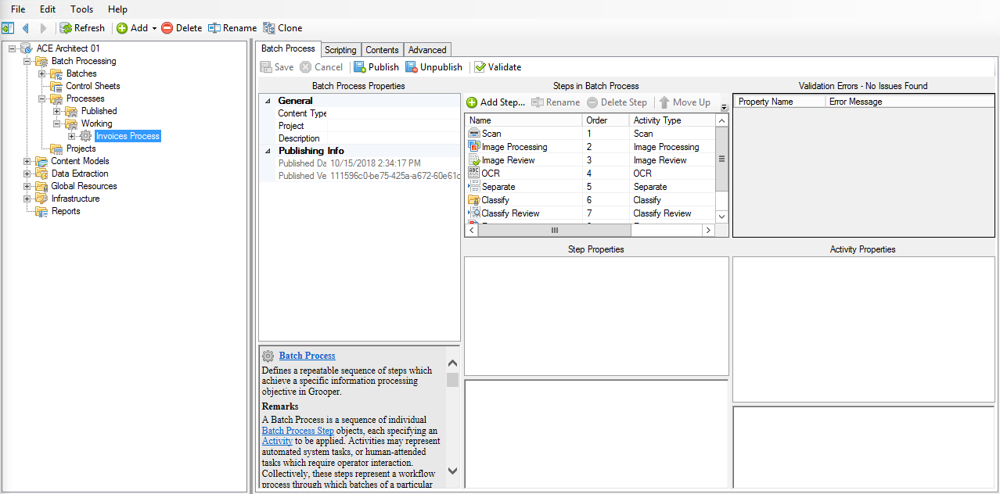
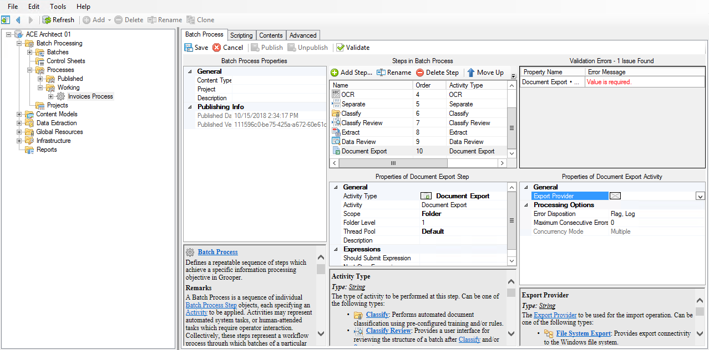
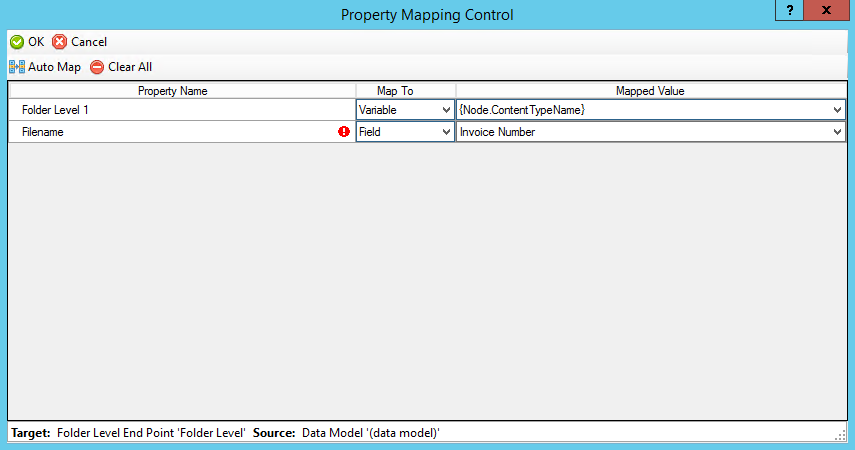
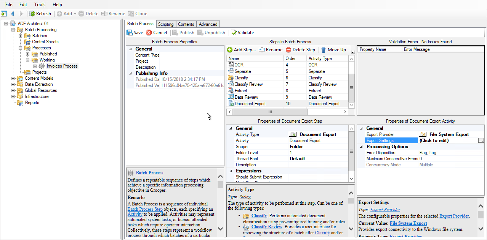
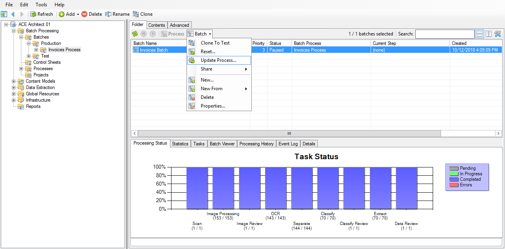
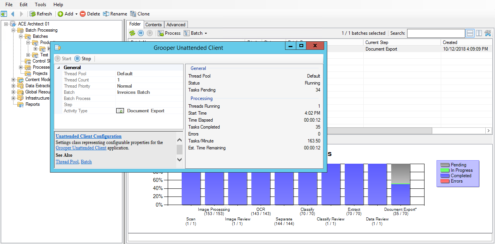
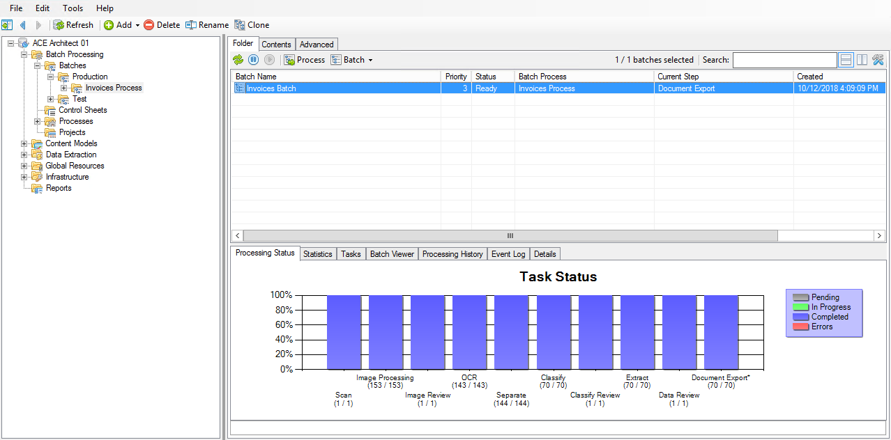
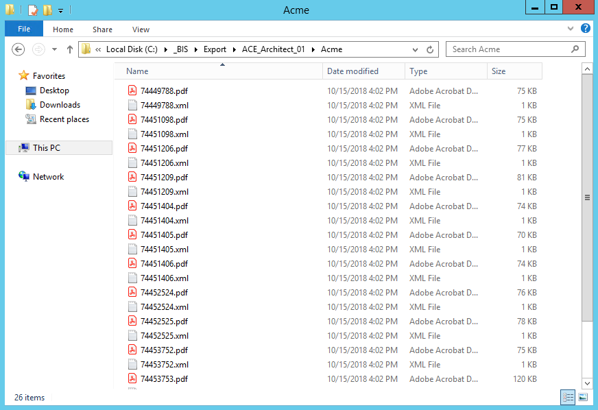

# Deliver

## Document Export

### Adding and configuring Document Export

!!! abstract "Step 1"
    1. Navigate to (root) > Batch Processing > Batches > Production > Invoices Process
    2. Add a new step
    3. Set the Activity Type property of the new step to ==Document Export==
    4. Set the Export Provider property to ==File System Export==
    5. Click on the Export Settings property to edit its settings

!!! abstract "Step 2"
    1. In the File System Export window, in the General section:
        1. Set the Base Export Folder property to a path where the files can be exported
        2. Set the File Export Settings > Content Format property to ==PDF==
        3. Set the File Export Settings > PDF Options > Make Searchable property to ==True==
    2. In the File and Directory Naming section:
        1. Set the Content Type property to the ==Invoices== Content Model
        2. Set the Subfolder Levels property to ==1==
        3. Edit the Folder Mappings property:
            1. For Folder Level 1, set Map To to ==Variable== and Mapped Value to =={Node.ContentTypeName}==
            2. For Filename, set Map To to ==Field== and Mapped Value to ==Invoice Number==
    3. In the Metadata Export section:
        1. Set the Metadata Format property to ==XML==
    4. Click OK to close the window
    5. Save and Publish

### Updating the production batch

!!! abstract "Step 1"
    1. Navigate to (root) > Batch Processing > Batches > Production > Invoices Process
    2. Make sure the batch is paused
    3. Right click on the Invoices Batch and select Update Process...
    4. Set Target Step to ==Document Export==
    5. Click Execute

!!! abstract "Step 2"
    1. Resume the batch
    2. Click Process
    3. View the exported documents in Windows Explorer

