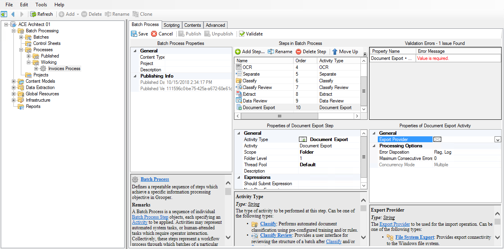
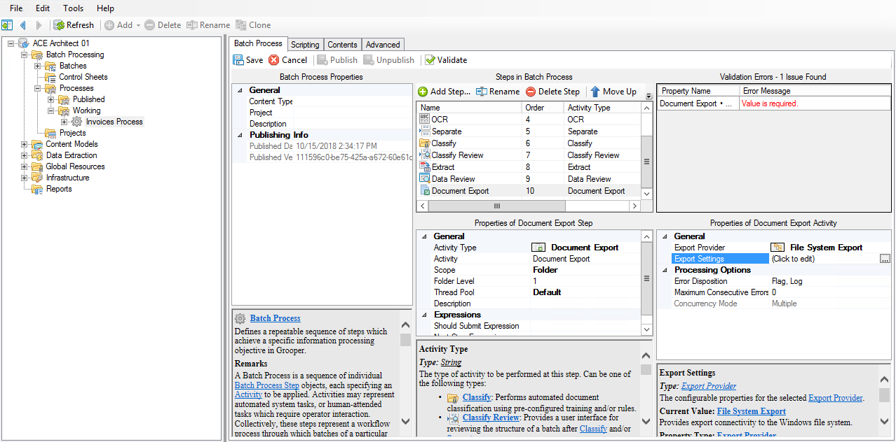
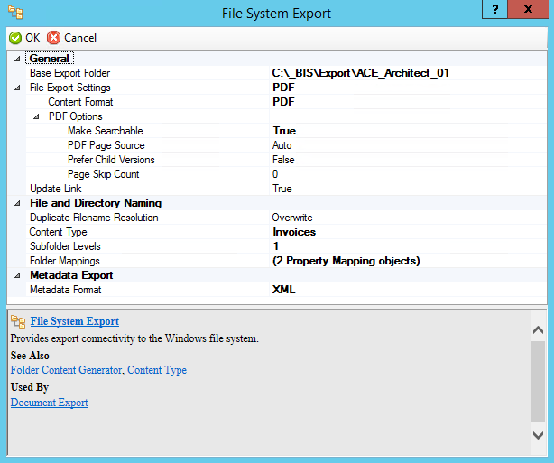
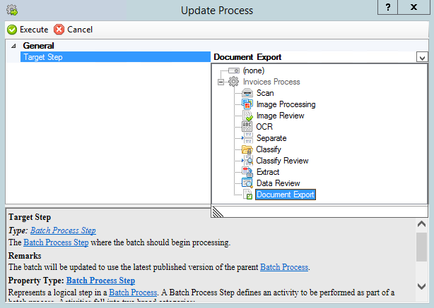
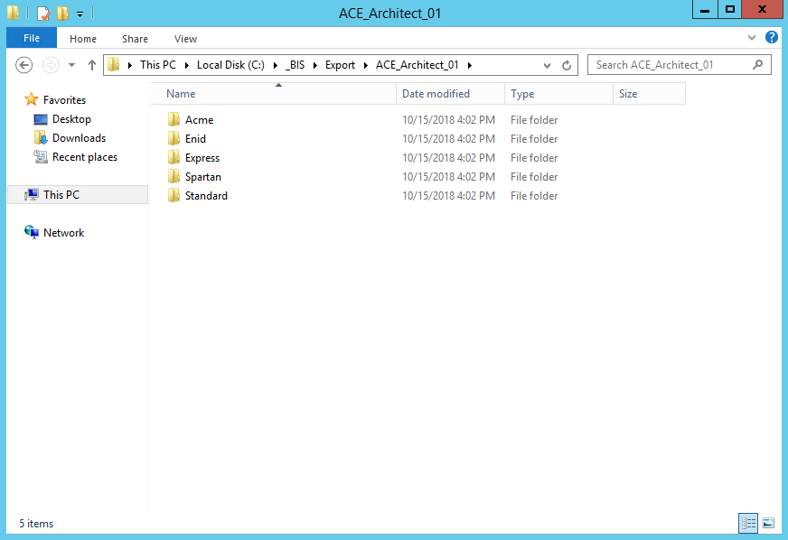

# Deliver

## Document Export

### Adding and configuring Document Export

!!! abstract "Batch Processing / Processes / Production / **Invoices Process**"
    1. Add a new step.
    2. Set the Activity Type property of the new step to ==Document Export==.
    3. Set the Export Provider property to ==File System Export==.
    4. Click on the Export Settings property to edit its settings.

!!! abstract "Batch Processing / Processes / Production / **Invoices Process**"
    1. Change the following property value(s):
    
        | Property                    | Default Value     | New Value         |
        |-----------------------------|-------------------|-------------------|
        | General                     |                   |                   |
        | **Base Export Folder**      | `-`               | *(Export path)*   |
        | **File Export Settings**    |                   |                   |
        | --> **Content Format**      | `Native`          | ==`PDF`==         |
        | --> **PDF Options**         |                   |                   |
        | --> --> **Make Searchable** | `False`           | ==`True`==        |
        | File and Directory Naming   |                   |                   |
        | **Content Type**            | `-`               | ==`Invoices`==    |
        | **Subfolder Levels**        | `0`               | ==`1`==           |
        | **Folder Mappings**         | *(Click to edit)* | *(Click to edit)* |
        | Metadata Export             |                   |                   |
        | **Metadata Format**         | `None`            | ==`XML`==         |
    
    2. In the **Property Mapping Control** window, assign the following mapping(s):

        | Property Name      | Map To         | Mapped Value                 |
        |--------------------|----------------|------------------------------|
        | **Folder Level 1** | ==`Variable`== | ==`{Node.ContentTypeName}`== |
        | **Filename**       | ==`Field`==    | ==`Invoice Number`==         |

    3. Press **OK** to close the window.
    4. **Save** and **Publish**.

### Updating the production batch

!!! abstract "Batch Processing / Batches / Production / **Invoices Process**"
    1. Make sure the batch is paused.
    2. Right click on **Invoices Batch** and select **Update Process...**.
    3. Set **Target Step** to ==Document Export==.
    4. Press **Execute**.

!!! abstract "Batch Processing / Batches / Production / **Invoices Process**"
    1. Resume the batch.
    2. Press **Process**.
    3. View the exported documents in Windows Explorer.

