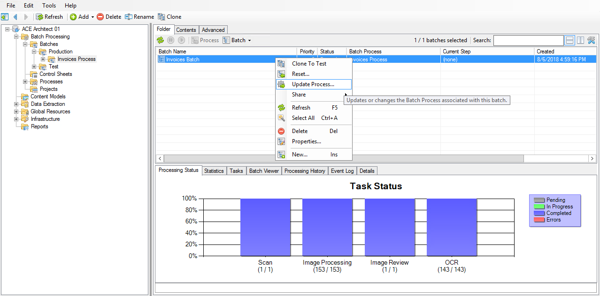
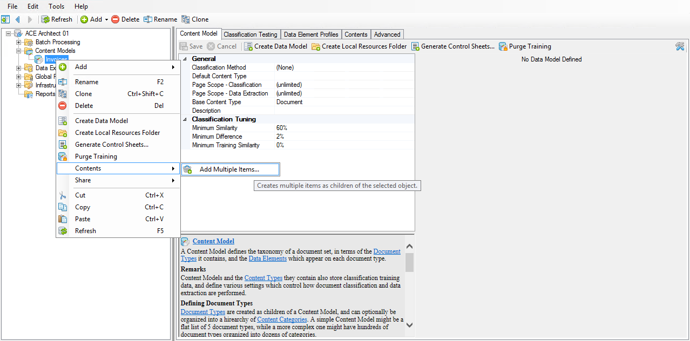
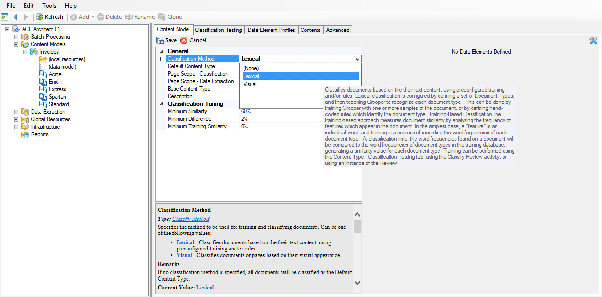
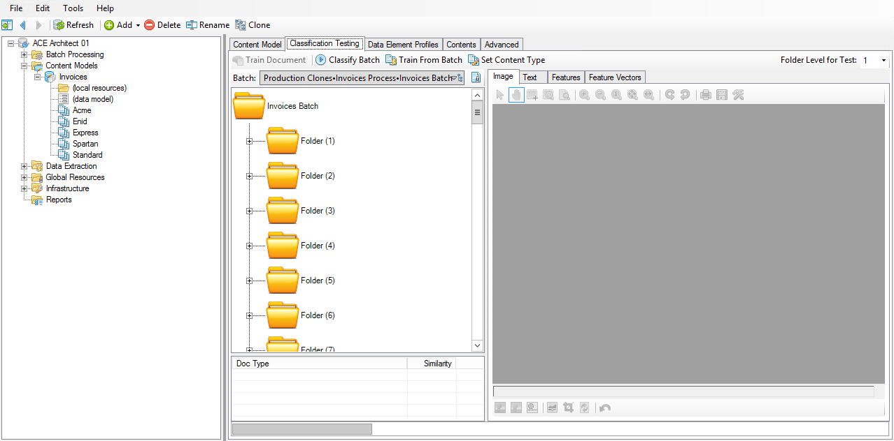
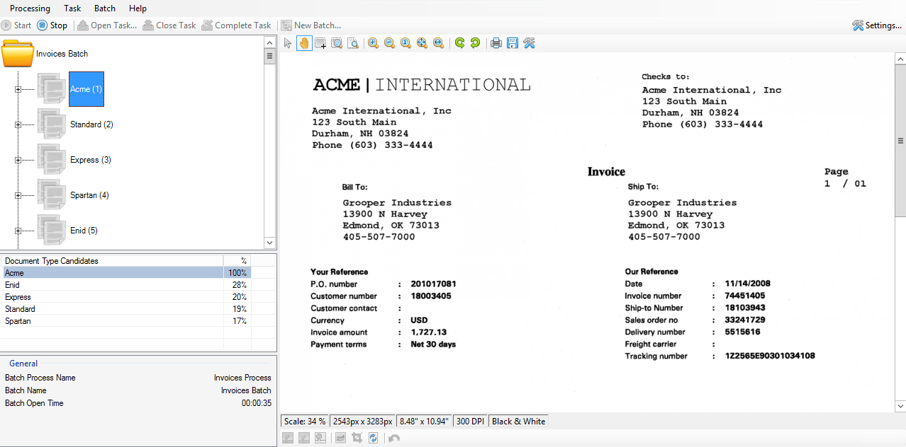
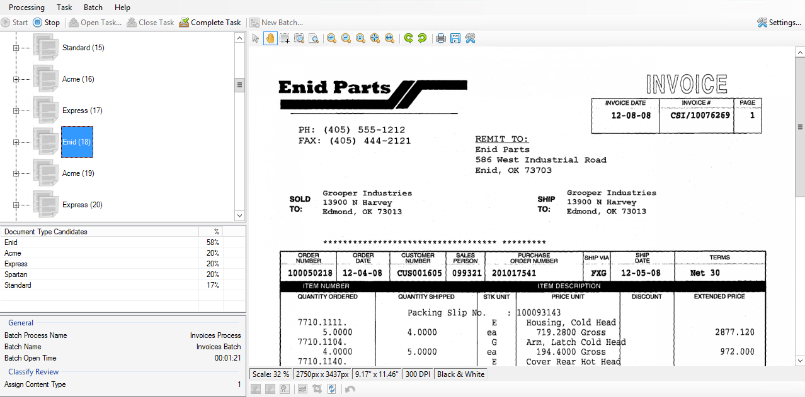
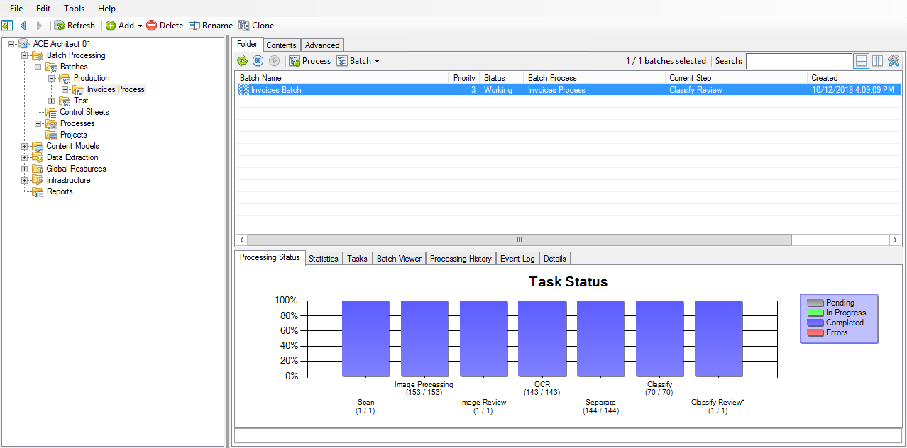

# Organize

## Overview

Thinking back to our real-world scenario, what might we need to do next if we were processing these documents by hand?

We probably don't want to throw all of our invoices into one giant file and call it a day, right? (Well, we might _want_ to, but we have to at least pretend like we're responsible!)

If we were ultimately going to store these documents in a file cabinet somewhere, we would need to separate them using file folders so that one invoice doesn't get mixed up with another. We would also need to have some kind of label on the folders so we can easily identify what the folder contains and what information it has.

We have to do the same things with Grooper, and these are done in the **Organize** phase.

In this phase, we will:

- create a **Separation Profile**,
- use the new profile to separate our invoices into individual folders,
- learn about classification and content types,
- train Grooper to recognize our documents so it knows what information to get from them, and
- update our Batch Process to do all of this automatically in the future.

Let's get organized!

## Separation

Before we can expect to get any kind of information from these invoices, we need to sort them. While we could get away with doing this manually, Grooper most certainly provides us with a better way.

### Creating a Separation Profile

!!! abstract "Global Resources / **Separation Profiles**"
    1. Right click and select **Add > Separation Profile...**.
    2. Name it ==Invoices Separation==.

!!! abstract "Global Resources / **Separation Profiles**"
    1. Set **Provider** to ==Control Sheet Separation==.
    2. Set **Delete All Separators** to ==True==.

### Updating the production batch

!!! abstract "Batch Processing / Processes / Working / **Invoices Process**"
    1. Add a new step.
    2. Set the **Activity Type** property of the new step to ==Separate==.
    3. Set the **Separation Profile** to the new ==Invoices Separation== profile we created.
    4. **Save** and **Publish**.

!!! abstract "Batch Processing / Batches / Production / **Invoices Process**"
    1. Right click and select **Update Process….**.
    2. Set **Target Step** to ==Separate==.
    3. Press **Execute**.

!!! abstract "Batch Processing / Batches / Production / **Invoices Process**"
    1. Resume the batch.
    2. Press **Process**.

## Classification

### Setting up the Content Model

!!! abstract "**Content Models**"
    1. Right click and select **Add > Content Model…**.
    2. Name it ==Invoices==.

!!! abstract "Content Models / **Invoices**"
    1. Right click and select **Contents > Add Multiple Items…**.
    2. In the **Contents • Add Multiple Items** window, set **Item Type** to ==Document Type==.
    3. Edit the **Item Names** property and type out the names of each vendor:
        - ==Acme==
        - ==Enid==
        - ==Express==
        - ==Spartan==
        - ==Standard==
    4. Press **Execute** to complete.
    

### Re-cloning the production batch

!!! abstract "Batch Processing / Batches / Test / Production Clones / Invoices Process / **Invoices Batch**"
    Right click and select **Delete**.

!!! abstract "Batch Processing / Batches / Production / Invoices Process / **Invoices Batch**"
    Press **Clone To Test**.

### Setting the classification method

!!! abstract "Content Models / **Invoices**"
    1. Right click and select **Create Data Model**.
    2. Right click and select **Create Local Resources Folder**.

!!! abstract "Content Models / **Invoices**"
    1. In the General section, set the **Classification Method** property to ==Lexical==.
    2. Set the **Classification Method > Text Feature Extractor > Type** property to ==Reference==.
    3. Set the **Referenced Extractor** property to the **Data Extraction > Downloads > Features > ==Words (Stemmed)==** Data Type.

### Training and testing classification

!!! abstract "Content Models / **Invoices**"
    1. Switch to the **Classification Testing** tab.
    2. Select **Folder (1)**.
    3. In the toolbar, press **Train Document**.
    4. Select the **Acme** Document Type from the list.
    5. In the toolbar, press **Classify Batch**.

!!! abstract "Content Models / **Invoices**"
    1. Train the other four vendors:
        - Folder (2) --> Standard (2)
        - Folder (3) --> Express (3)
        - Folder (4) --> Spartan (4)
        - Folder (5) --> Enid (5)
    2. In the toolbar, press **Classify Batch**.

## Classify Review

### Adding a Classify Review step

!!! abstract "Batch Processing / Processes / Working / **Invoices Process**"
    1. Add a new step.
    2. Set the **Activity Type** property of the new step to ==Classify==.
    3. Set the **Content Model Scope** to our ==Invoices== Content Model.

!!! abstract "Batch Processing / Processes / Working / **Invoices Process**"
    1. Add a new step.
    2. Set the **Activity Type** property of the new step to ==Classify Review==.
    3. Set the **Classification Viewer Settings > Content Model Scope** to our ==Invoices== Content Model.
    4. **Save** and **Publish**.

### Updating the production batch

!!! abstract "Batch Processing / Batches / Production / **Invoices Process**"
    1. Right click and select **Update Process…**.
    2. Set **Target Step** to ==Classify==.
    3. Press **Execute**.

!!! abstract "Batch Processing / Batches / Production / **Invoices Process**"
    1. Resume the batch.
    2. Press **Process**.

### Reviewing and correcting classification

!!! abstract "Batch Processing / Batches / Production / **Invoices Process**"
    1. After the Classify step has completed, press **Process** to start the Classify Review step.
    2. In Grooper Classify Review, right click on **Folder (18)** and select **Assign Content Type**.
    3. Select the **Enid** Document Type from the list and press **OK**.
    4. In the toolbar, press **Complete Task** to finish this activity.

