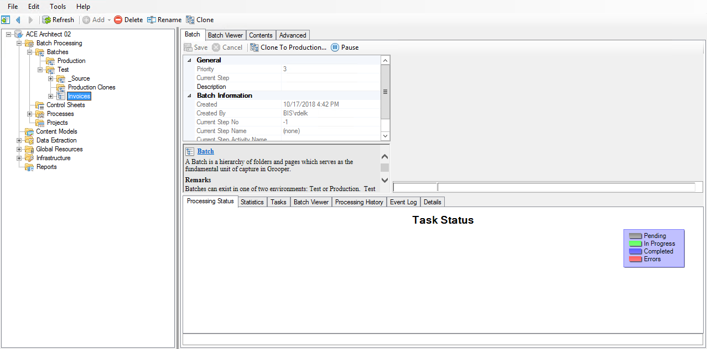
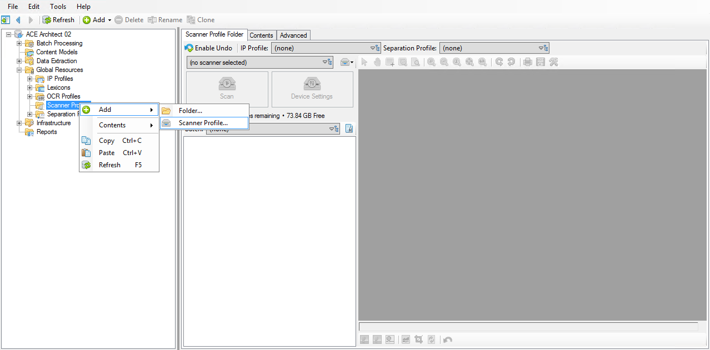
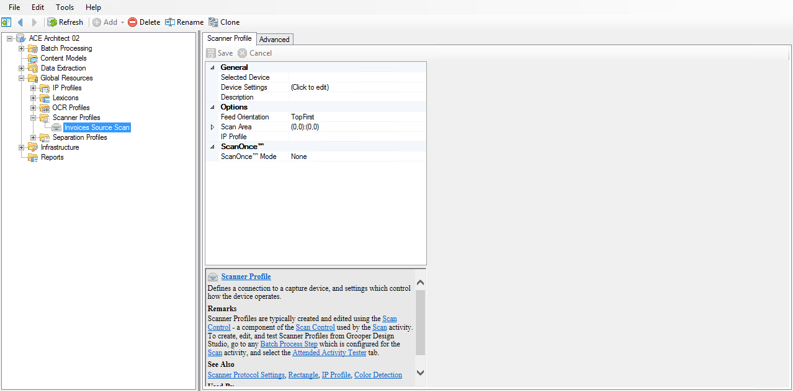
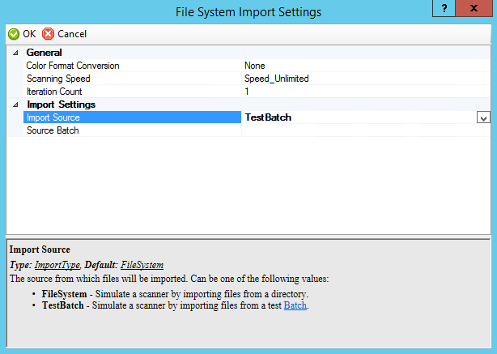
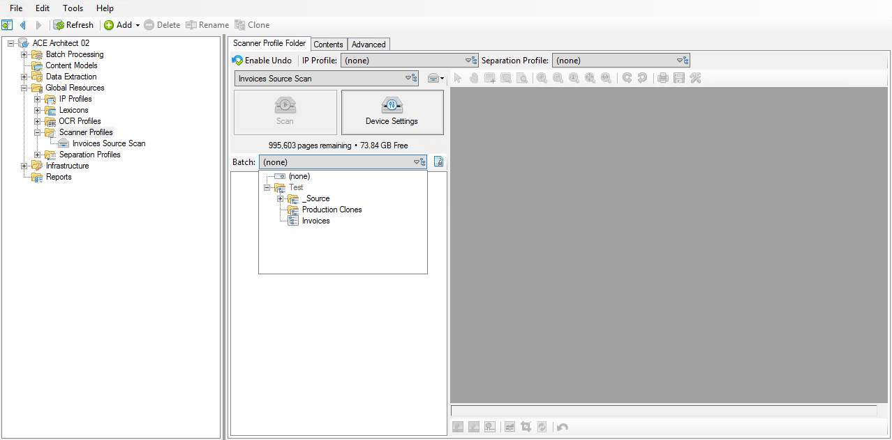
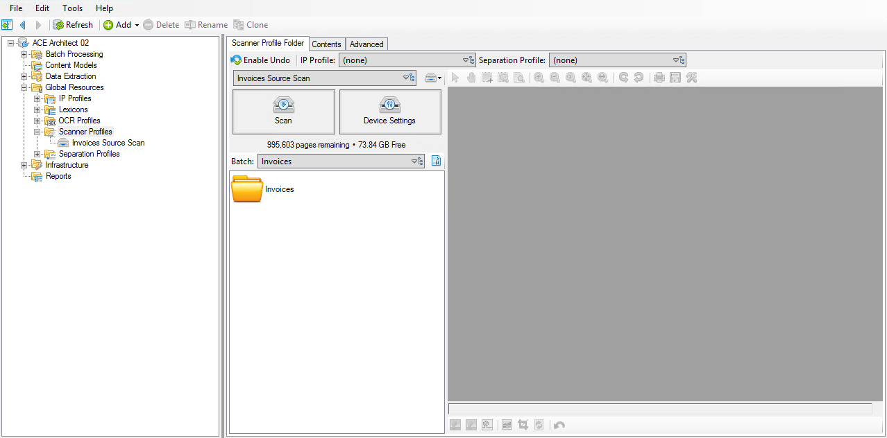

# Acquire

## Importing

### Importing a pre-made batch

!!! abstract "Step "
    1. Right click on ***(root)*** and select **Import > Compressed Archive.**
    2. Set the **Import Path** property to the ==Grooper ACE - Architect - Volume II - Begin.zip== file.


### Creating an empty test batch

!!! abstract "Step "
    1. Navigate to ***(root)* > Batch Processing > Batches > Test**.
    2. Right click and select **Add > Batch...**.
    3. Name it something like ==Invoices==.




## Scanning

### Creating a Scanner Profile

!!! abstract "Step "
    1. Navigate to ***(root)* > Global Resources > Scanner Profiles**.
    2. Right click and select **Add > Scanner Profile...**.
    3. Name it ==Invoices Source Scan==.





### Configuring the Scanner Profile

!!! abstract "Step "
    1. Set the **Selected Device** property to ==File System Import==.
    2. Click to edit the **Device Settings** property.
    3. Set the **Import Source** property to ==TestBatch==.
    4. Set the **Source Batch** property to the **Batches • Test > _Source > _Source** batch.





### Testing the Scanner Profile

!!! abstract "Step "
    1. Navigate to ***(root)* > Global Resources > Scanner Profiles**.
    2. Click the **Scanner Profile** dropdown and select the **Invoices Source Scan** profile.
    3. Click the **Batch** dropdown and select the **Invoices** batch.
    4. Click **Scan**.







1. Edit the patterns for each of the Data Formats:
    - Acme/Standard/Express

        ```tab="Value Pattern"
        [0-9]{6,16}
        ```

    - Enid

        ```tab="Value Pattern"
        ([A-Z]{3})/([@Number]{8})
        ```

        ```tab="Output Format"
        {1}{2:Number}
        ```

    - Spartan

        ```tab="Value Pattern"
        ([A-Z]{2})([@Number]{2})-([@Number]{6})
        ```

        ```tab="Output Format"
        {1}{2:Number}-{3}
        ```

| Acme/Standard/Express |               |
|-----------------------|---------------|
| Value Pattern         | `[0-9]{6,16}` |
| Look Ahead Pattern    |               |
| Look Behind Pattern   |               |
| Output Format         |               |

| Enid                |                             |
|---------------------|-----------------------------|
| Value Pattern       | `([A-Z]{3})/([@Number]{8})` |
| Look Ahead Pattern  |                             |
| Look Behind Pattern |                             |
| Output Format       | `{1}{2:Number}`             |

| Spartan             |                                           |
|---------------------|-------------------------------------------|
| Value Pattern       | `([A-Z]{2})([@Number]{2})-([@Number]{6})` |
| Look Ahead Pattern  |                                           |
| Look Behind Pattern |                                           |
| Output Format       | `{1}{2:Number}-{3}`                       |

| Data Format         | Acme/Standard/Express | Enid                        | Spartan                                   |
|---------------------|-----------------------|-----------------------------|-------------------------------------------|
| Value Pattern       | `[0-9]{6,16}`         | `([A-Z]{3})/([@Number]{8})` | `([A-Z]{2})([@Number]{2})-([@Number]{6})` |
| Look Ahead Pattern  |                       |                             |                                           |
| Look Behind Pattern |                       |                             |                                           |
| Output Format       |                       | `{1}{2:Number}`             | `{1}{2:Number}-{3}`                       |


Edit the patterns for each of the Data Formats:

- Acme
    
    *Make sure to enable Tab Marking*

    ```tab="Value Pattern"
    ([@Number.]{3,12})
    ```

    ```tab="Look Ahead Pattern"
    WS.FREIGHT[0o]231[^\n]+\n
    [^\n]+\n
    [^\t]+\t
    [^\t]+\t
    ```

    ```tab="Look Behind Pattern"
    \r\n
    ```

    ```tab="Output Format"
    {1:Number}
    ```

- Enid

    ```tab="Value Pattern"
    ([@Number.]{3,12})
    ```

    ```tab="Look Ahead Pattern"
    020-0027[^\n]*?\n[^\r]*?
    ```

    ```tab="Look Behind Pattern"
    \r\n
    ```

    ```tab="Output Format"
    {1:Number}
    ```

- Express

    ```tab="Value Pattern"
    ([@Number.]{3,12})
    ```

    ```tab="Look Ahead Pattern"
    shipping charge:?[^0-9]{0,4}
    ```

    ```tab="Look Behind Pattern"
    
    ```

    ```tab="Output Format"
    {1:Number}
    ```

- Standard

    ```tab="Value Pattern"
    ([@Number.]{3,12})
    ```

    ```tab="Look Ahead Pattern"
    shipping charge\s
    ```

    ```tab="Look Behind Pattern"
    
    ```

    ```tab="Output Format"
    {1:Number}
    ```
    
---
    
1. Create two child Data Formats of the Spartan Data Type:
    1. Freight
    2. Value 1
2. Edit the Value Patterns for each of the Data Formats:

    ```tab="Freight"
    freight
    ```

    ```tab="Value 1"
    [\d.]+
    ```