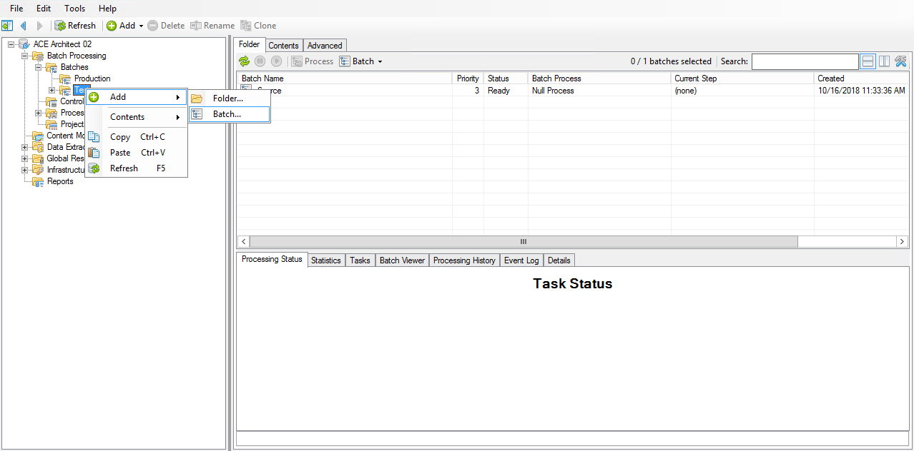
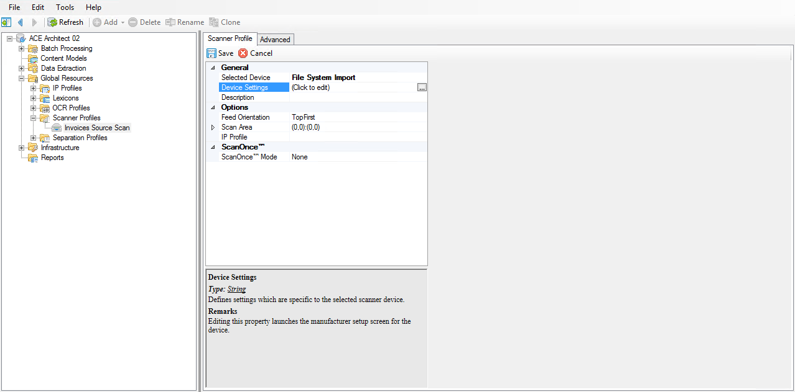
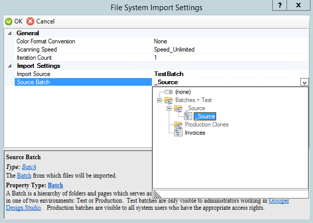
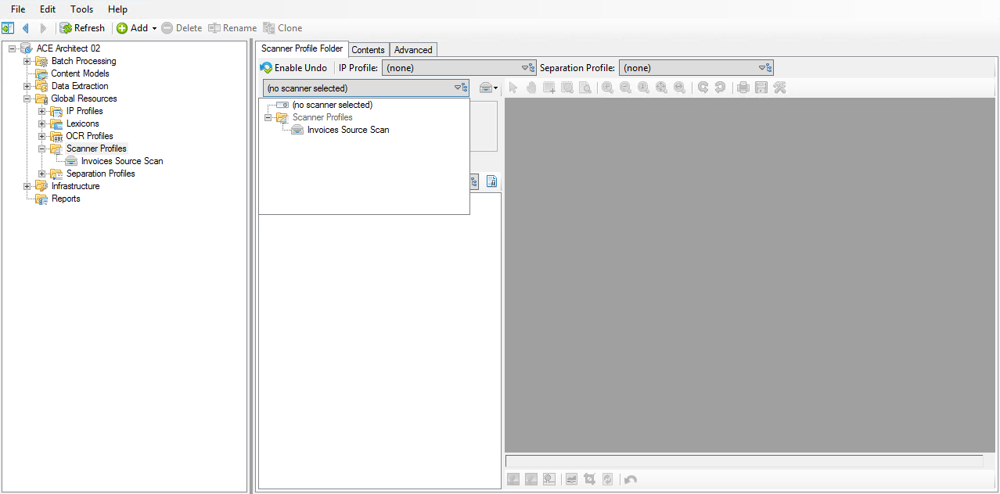

# Acquire

## Importing

### Importing a pre-made batch

!!! abstract "***(root)***"
    1. Right click and select **Import > Compressed Archive**.
    2. Set the **Import Path** property to the ==Grooper ACE - Architect - Volume II - Begin.zip== file.
    3. Press **Execute**.

### Creating an empty test batch

!!! abstract "Batch Processing / Batches / **Test**"
    1. Right click and select **Add > Batch...**.
    2. Name it ==Invoices==.

## Scanning

### Creating a Scanner Profile

!!! abstract "Global Resources / **Scanner Profiles**"
    1. Right click and select **Add > Scanner Profile...**.
    2. Name it ==Invoices Source Scan==.

### Configuring the Scanner Profile

!!! abstract "Global Resources / Scanner Profiles / **Invoices Source Scan**"
    1. Change the following properties:

        | Section/Property        | Default Value     | New Value                |
        |-------------------------|-------------------|--------------------------|
        | General                 |                   |                          |
        | **Selected Device**     | `-`               | ==`File System Import`== |
        | --> **Device Settings** | *(Click to edit)* | *(Click to edit)*        |

    2. In the **File System Import Settings** window, change the following property values:

        | Section/Property  | Default Value | New Value       |
        |-------------------|---------------|-----------------|
        | Import Settings   |               |                 |
        | **Import Source** | `FileSystem`  | ==`TestBatch`== |
        | **Source Batch**  | `-`           | ==`_Source`==   |

### Testing the Scanner Profile

!!! abstract "Global Resources > **Scanner Profiles**"
    1. From the **Scanner Profile dropdown** select the ==Invoices Source Scan== profile.
    2. From the **batch dropdown** select the ==Invoices== batch.
    3. Press **Scan**.

