## Invoice Date

!!! abstract "Content Models / Invoices / **(data model)**"
    1. Right click and select **Contents > Add Multiple Items...**.
    2. In the **Contents • Add Multiple Items** window, make sure **Item Type** is set to ==Data Field==
    3. Edit the **Item Names** property and type out the names of the following fields:
        - Invoice Number
        - PO Number
        - Invoice Date
        - Freight
        - Sales Tax
        - Discount
        - Invoice Amount
        - Payment Terms
        - Ship To
        - Remit To
    4. Press **Execute**.

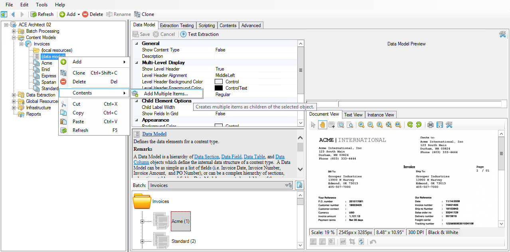

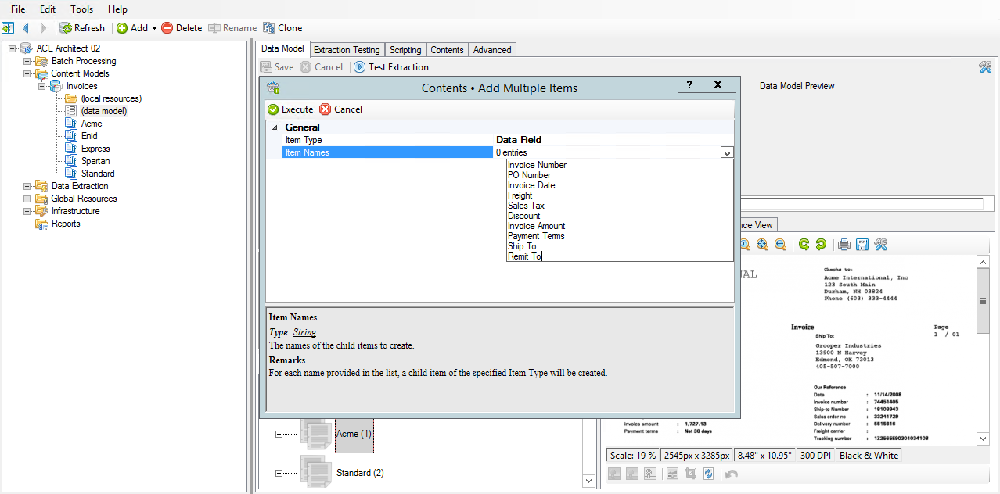


!!! abstract "Content Models / Invoices / **(local resources)**"
    1. Right click and select **Add > Folder...**
    2. Name it ==Extractors==


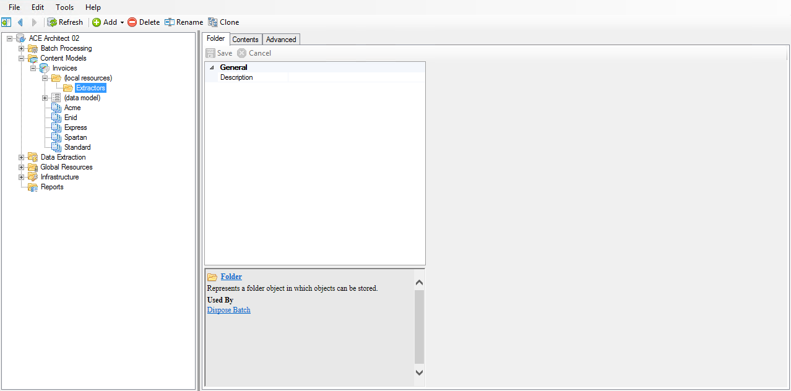

!!! abstract "Content Models / Invoices / (local resources) / **Extractors**"
    1. Right click and select **Add > Field Class...**
    2. Name it ==Invoice Date==


!!! abstract "Content Models / Invoices / (local resources) / Extractors / **Invoice Date** *(Field Class)*"
    Change the following property values:

    | Property                     | Default Value | New Value       |
    |------------------------------|---------------|-----------------|
    | General                      |               |                 |
    | **Value Extractor**          |               |                 |
    | --> **Type**                 | `none`        | ==`Reference`== |
    | --> **Referenced Extractor** | `-`           | ==`Date`==      |

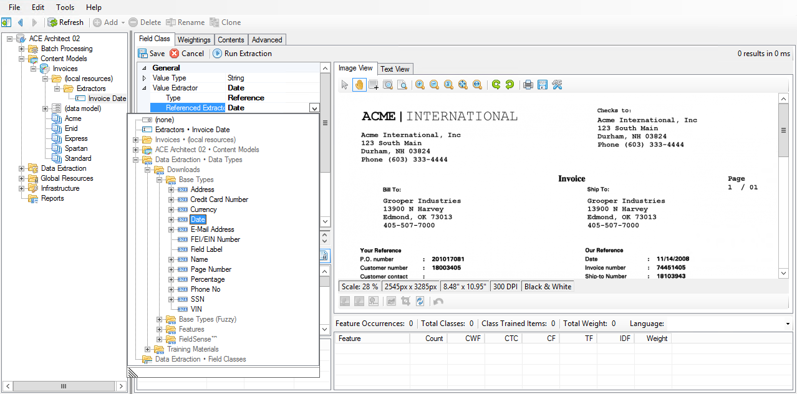

!!! abstract "Content Models / Invoices / (local resources) / Extractors / **Invoice Date**"
    Change the following property values:

    | Property                     | Default Value | New Value       |
    |------------------------------|---------------|-----------------|
    | General                      |               |                 |
    | **Feature Extractor**        |               |                 |
    | --> **Type**                 | `none`        | ==`Reference`== |
    | --> **Referenced Extractor** | `-`           | ==`Phrases`==   |

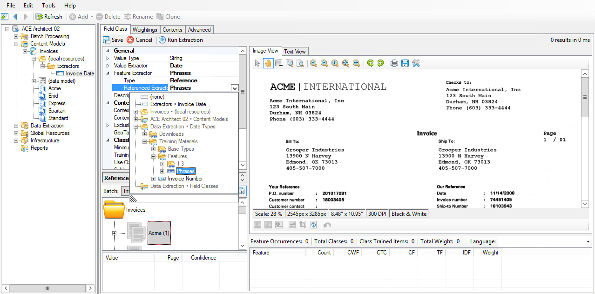

!!! abstract "Content Models / Invoices / (local resources) / Extractors / **Invoice Date**"
    1. Select **Acme (1)**
    2. Press **Run Extraction**
    3. In the candidate list, right click on the ==11/14/2008== value and select **Train As Positive**


!!! abstract "Content Models / Invoices / (local resources) / Extractors / **Invoice Date**"
    1. Select **Standard (2)**
    2. Select both of the ==11/11/2008== candidates that have correct features
    3. Right click on either of them and select **Train As Positive**


!!! abstract "Content Models / Invoices / (local resources) / Extractors / **Invoice Date**"
    1. Select **Express (3)**
    2. Right click on the ==12/2/2008== candidate with 58.1689% confidence and select **Train As Positive**

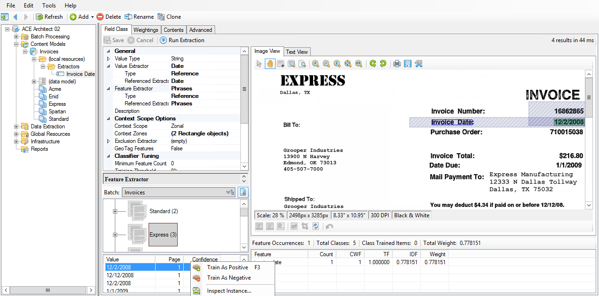

!!! abstract "Content Models / Invoices / (local resources) / Extractors / **Invoice Date**"
    1. Select **Spartan (4)**
    2. Click to edit the **Context Zones** property

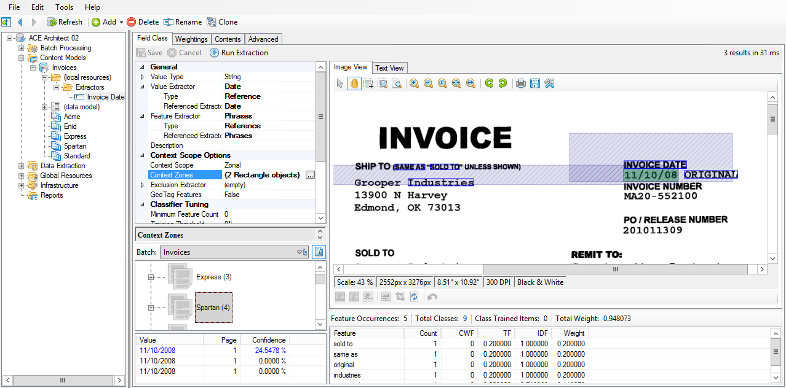

!!! abstract "Content Models / Invoices / (local resources) / Extractors / **Invoice Date**"
    1. In the Context Zones window, edit the dimensions as follows:

    | Property   | Zone 1       | Zone 2      |
    |------------|--------------|-------------|
    | **Left**   | ==`-3.278`== | ==`-0.67`== |
    | **Top**    | ==`-0.054`== | ==`-0.67`== |
    | **Right**  | ==`0.312`==  | ==`0.5`==   |
    | **Bottom** | ==`0.054`==  | ==`0.04`==  |

    2. Press **OK**


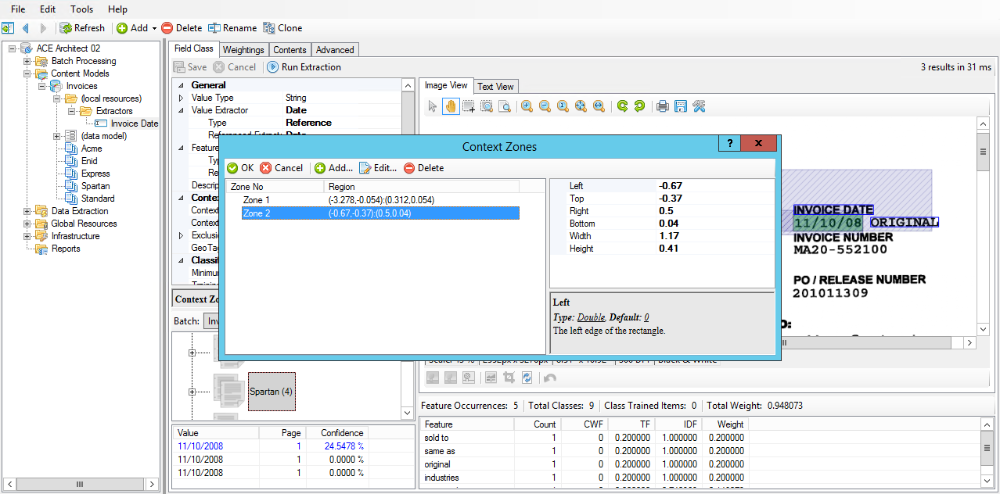

!!! abstract "Content Models / Invoices / (local resources) / Extractors / **Invoice Date**"
    1. Select **Enid (5)**
    2. In the Output section, set the **Minimum Confidence** property to ==70%==

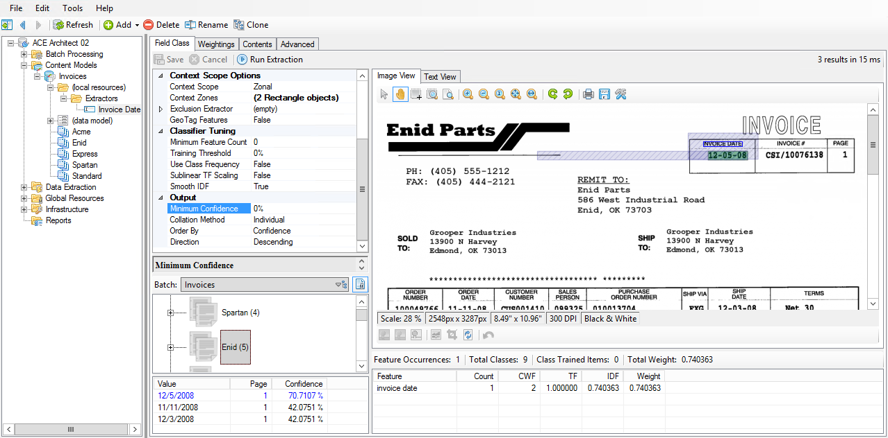


!!! abstract "Content Models / Invoices / (data model) / **Invoice Date**"
    Change the following property values:

    | Property                     | Default Value | New Value          |
    |------------------------------|---------------|--------------------|
    | General                      |               |                    |
    | **Value Extractor**          |               |                    |
    | --> **Type**                 | `None`        | ==`Reference`==    |
    | --> **Referenced Extractor** | `-`           | ==`Invoice Date`== |
    | Behavior                     |               |                    |
    | **Required**                 | `False`       | ==`True`==         |

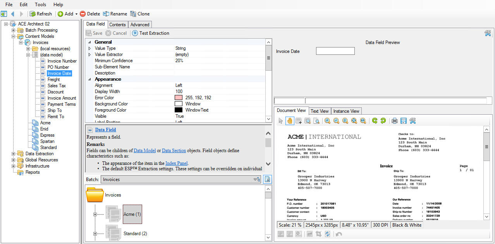


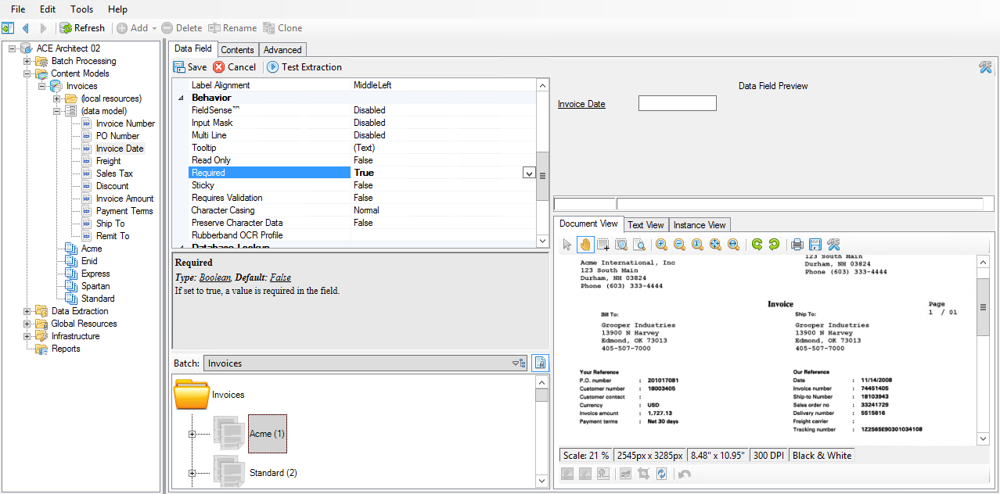

## Ship To

!!! abstract "Step"
    1. Right click on the Extractors folder and select Add > Field Class...
    2. Name it ==Ship To==

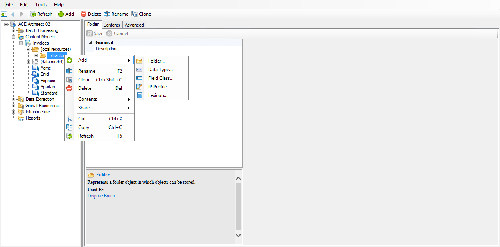


!!! abstract "Step"
    1. Right click on the Ship To Field Class and select Add > Data Type...
    2. Name it ==[Features] Ship To==
    3. In the Data Extraction section, click to edit the Pattern

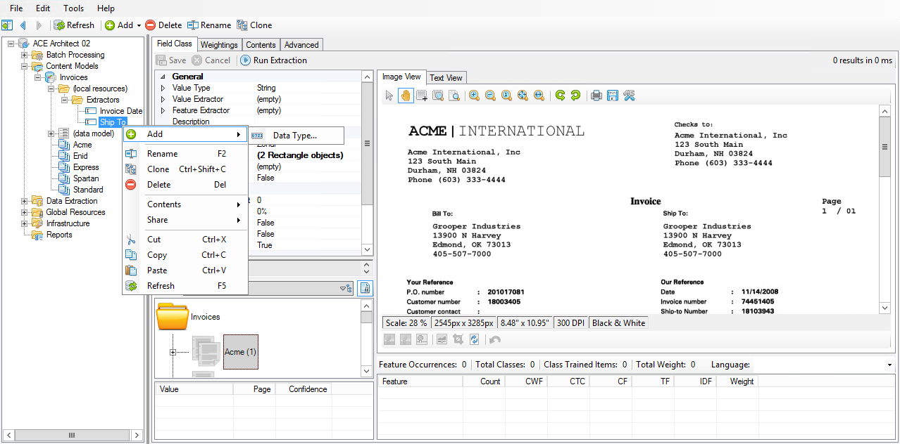


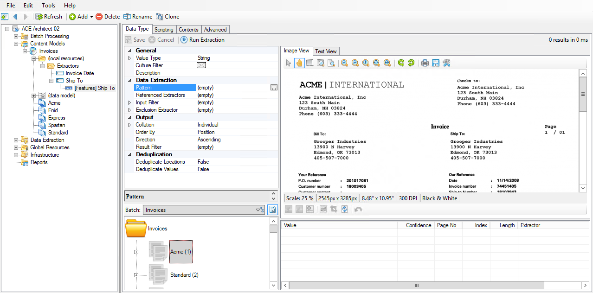

!!! abstract "Step"
    1. In the Value Pattern editor, type:
        ```
        ship to|shipped to|ship
        ```
    2. In the Output Format editor, type:
        ```
        ship to
        ```
    3. Press **OK**


!!! abstract "Step"
    1. Click on the Ship To Field Class
    2. In the General section, set the Value Extractor > Type property to Reference
    3. Set the Referenced Extractor property to the Data Extraction • Data Types > Training Materials > Base Types > Address Data Type

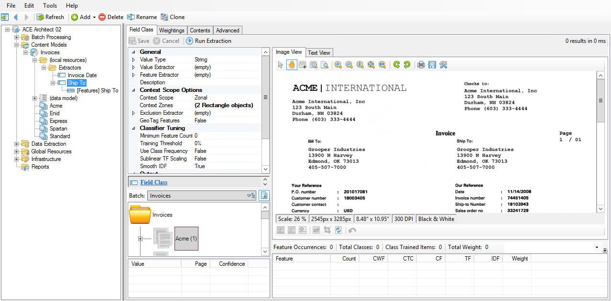


!!! abstract "Step"
    1. In the General section, set the Value Extractor > Type property to Reference
    2. Set the Referenced Extractor property to the Extractors • Ship To > [Features] Ship To Data Type


!!! abstract "Step"
    1. In the Context Scope Options section, click to edit the Context Zones
    2. In the Context Zones window, delete one of the zones
    3. Edit the dimensions of the remaining zone:
        1. Left: `-1.25`
        2. Top: `-0.54`
        3. Right: `0.73`
        4. Bottom: `0.13`
    4. Press **OK**
    5. Click Run Extraction


!!! abstract "Step"
    1. In the candidate list, find the value that has features that can be trained
    2. Right click on that value and select **Train As Positive**
    3. Set the Minimum Confidence property to ==70%==


!!! abstract "Step"
    1. In the Data Model, select the Ship To Data Field
    2. In the General section, set the Value Extractor > Type property to Reference
    3. Set the Referenced Extractor property to the Invoices • (local resources) > Extractors > Ship To Field Class.
    4. In the Behavior section, set the Required property to ==True==


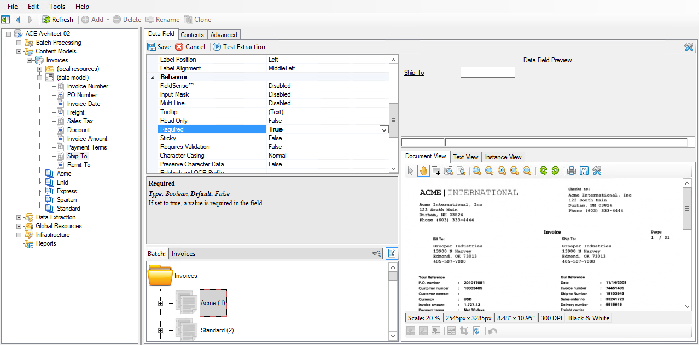

## Remit To

!!! abstract "Step"
    1. Right click on the Extractors folder and select Add > Field Class...
    2. Name it Remit To
    3. In the General section, set the Value Extractor > Type property to Reference
    4. Set the Referenced Extractor property to the Data Extraction • Data Types > Training Materials > Base Types > Address Data Type

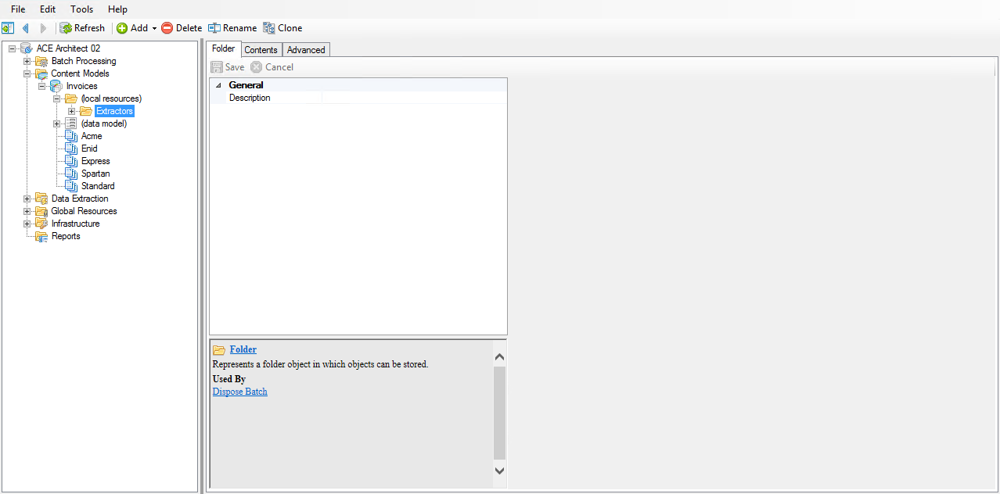

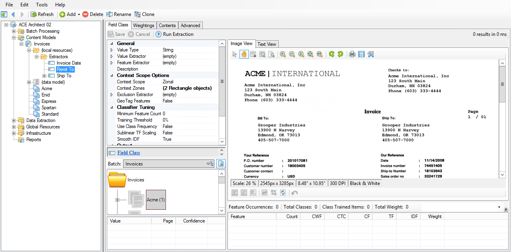


!!! abstract "Step"
    1. In the General section, set the Feature Extractor > Type property to Internal
    2. Click to edit the Pattern

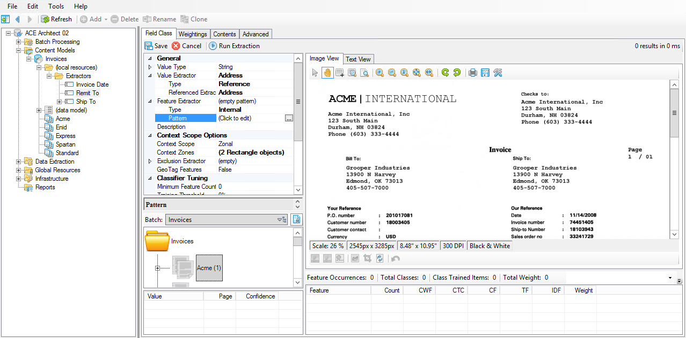

!!! abstract "Step"
    1. In the Value Pattern editor, type:
        ```
        remit to|mail payment to|checks to
        ```
    2. In the Output Format editor, type:
        ```
        remit to
        ```
    3. Select Standard (2)
    4. Click on the Properties tab
    5. Change the Mode property to FuzzyRegEx
    6. In the Fuzzy Matching Options section, expand Fuzzy Match Weightings
    7. Click to edit Local Entries
    8. In the List Editor window, type:
        ```
        li=0.25
        ```
    9. Press **OK** to close the List Editor
    10. Press **OK** to close the Pattern Editor


!!! abstract "Step"
    1. Click to edit the Context Zones property
    2. In the Context Zones window, delete one of the zones
    3. Edit the dimensions of the remaining zone:
        1. Left: `-2.55`
        2. Top: `-0.55`
        3. Right: `1`
        4. Bottom: `0.15`
    4. Press **OK**


!!! abstract "Step"
    1. Select Acme (1)
    2. In the candidate list, find the value that has features that can be trained
    3. Right click on that value and select **Train As Positive**
    4. Set the Minimum Confidence property to ==70%==


!!! abstract "Step"
    1. In the Remit To Data Field, set the Value Extractor > Type property to Reference
    2. Set the Referenced Extractor property to the Invoices • (local resources) > Extractors > Remit To Field Class.
    3. In the Behavior section, set the Required property to ==True==

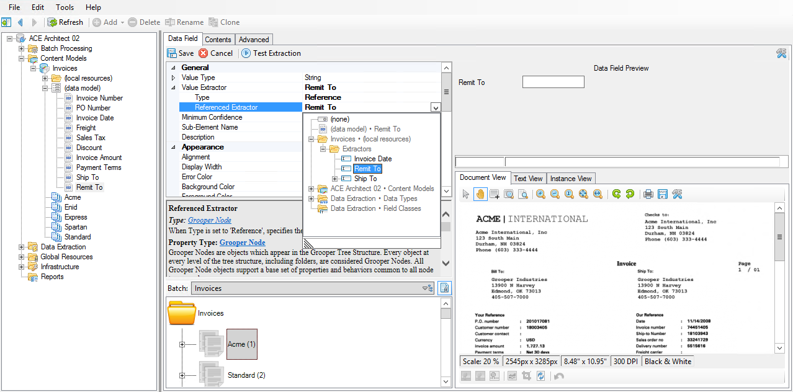


## Feature List

!!! abstract "Step"
    1. Navigate to (root) > Batch Processing > Batches > Test > Invoices
    2. Click on the Batch Viewer tab
    3. Collapse the Node Tree using the button in the toolbar
    4. Open Notepad.exe alongside Grooper Design Studio

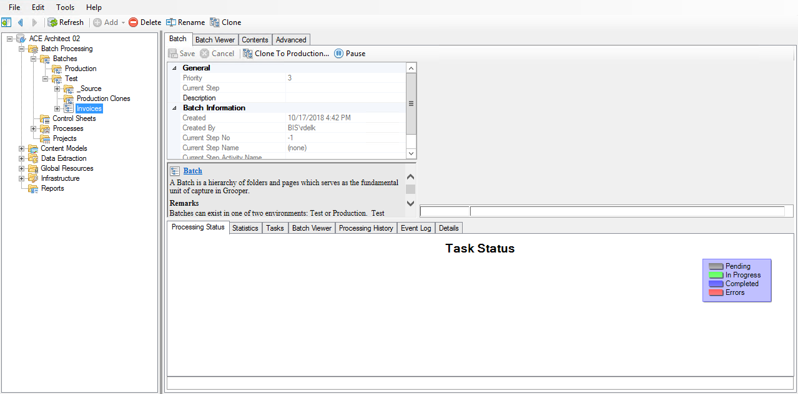


!!! abstract "Step"
    1. Select Acme (1)
    2. In Notepad, begin typing a list of all words and phrases used to identify invoice items
    3. Do this for the remaining four vendors
    4. When complete, copy everything in Notepad to your clipboard


!!! abstract "Step"
    1. Restore the default Grooper Design Studio view
    2. Navigate to Content Models > Invoices > (local resources)
    3. Right click and select Add > Folder...
    4. Name it ==Lexicons==
    5. Right click on the Lexicons folder and select Add > Lexicon...
    6. Name it ==Invoice Field Labels==


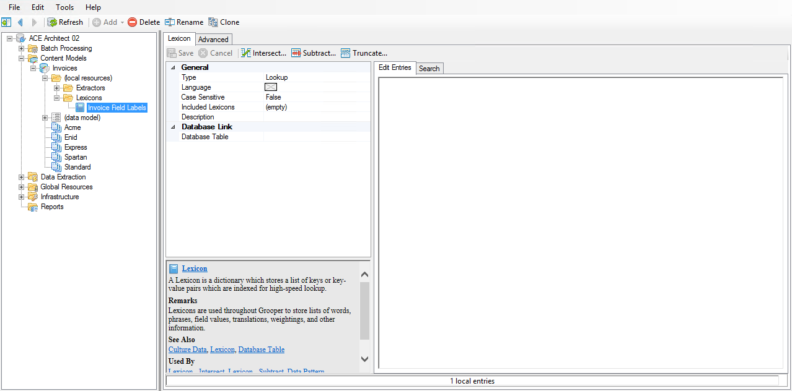

!!! abstract "Step"
    1. Paste your list of field labels in the Edit Entries editor
    2. Right click in the Edit Entries editor and select Sort
    3. Right click in the Edit Entries editor and select Deduplicate
    4. Normalize synonymous phrases by setting an `=` sign between the original phrase and the desired transformed phrase

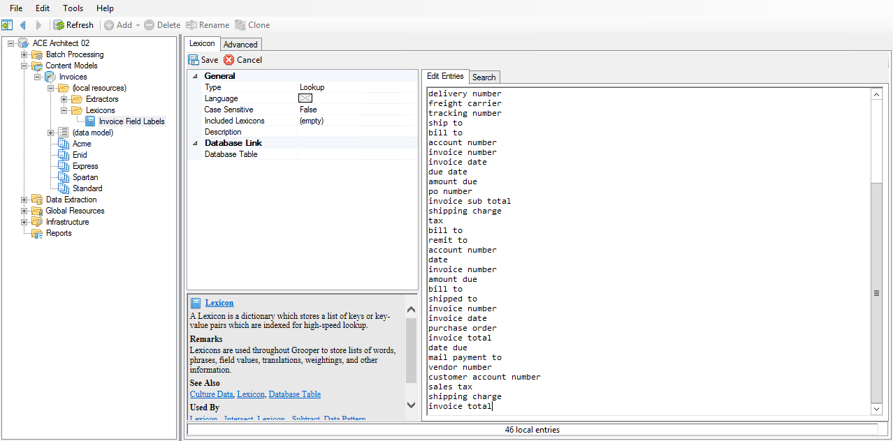


!!! abstract "Step"
    1. Delete this Lexicon
    2. Navigate to (root) > Global Resources > Lexicons > Training Materials > Invoice Field Labels
    3. Right click and select Copy
    4. Right click on the Invoices > (local resources) > Lexicons folder and select Paste


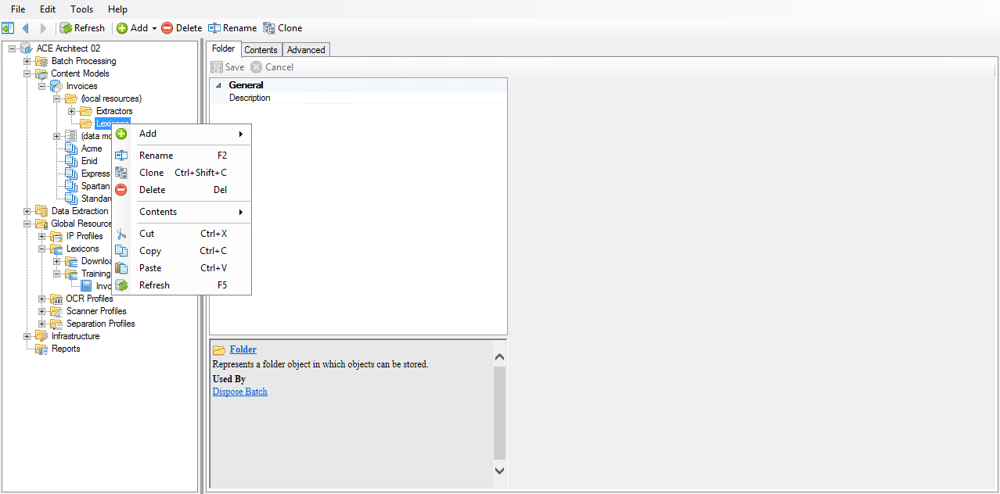

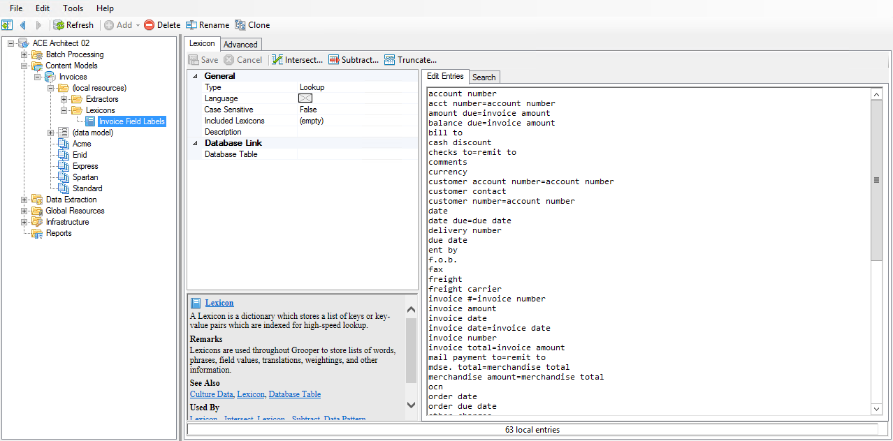

!!! abstract "Step"
    1. Right click on the (local resources) folder and select Add > Folder...
    2. Name it ==_Global==
    3. Right click on the _Global folder and select Add > Data Type...
    4. Name it ==Invoice Field Labels==
    5. Click to edit the Pattern


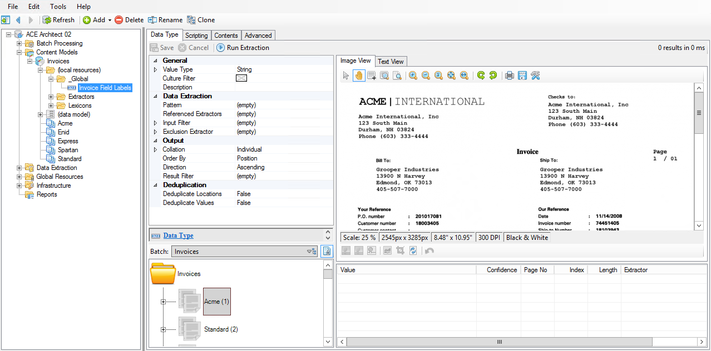


!!! abstract "Step"
    1. In the Value Pattern editor, type:
        ```
        [^\r\n\t\f:]+
        ```
    2. Click on the Properties tab
    3. Expand Preprocessing Options and set the Tab Marking property to Enabled


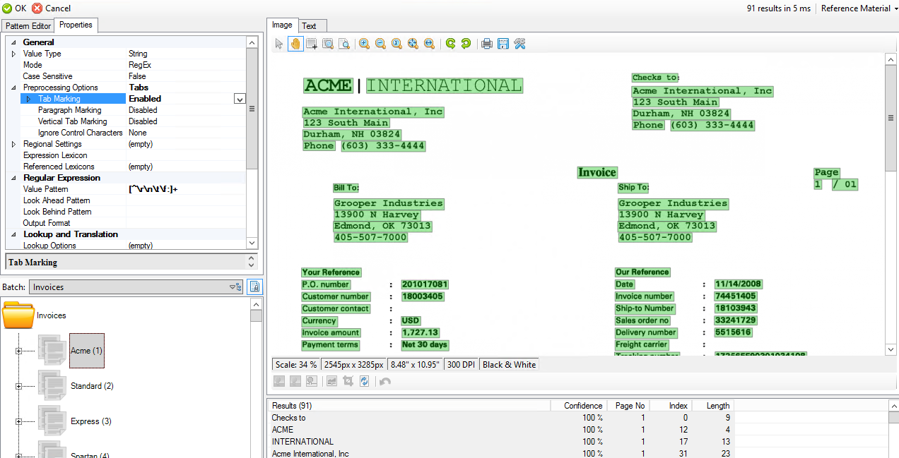

!!! abstract "Step"
    1. In the Lookup and Translation section, click to edit the Lookup Options
    2. In the Lookup Options window, expand Vocabulary
    3. Select the Vocabulary > Included Lexicons property dropdown and check the box next to the Invoices • (local resources) > Lexicons > Invoice Field Labels Lexicon
    4. Set the Enable Translation property to ==True==
    5. Set the Fuzzy Match Similarity property to ==90%==
    6. Press **OK**


!!! abstract "Step"
    1. In the Output Options section, click to edit Result Filter
    2. In the Result Filter window, set the Output Case property to ==Lower==
    3. Press **OK** to close the Result Filter window
    4. Press **OK** to close the pattern editor window


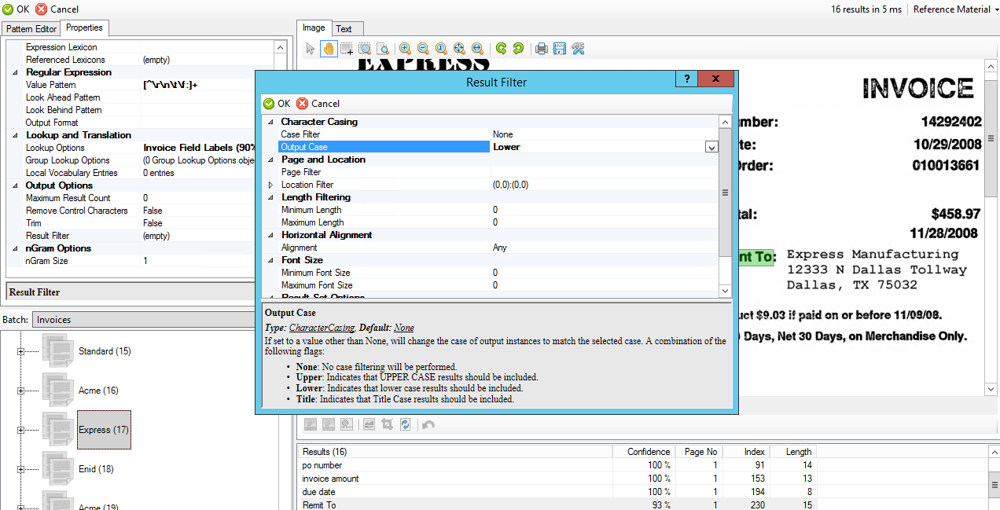

!!! abstract "Step"
    1. Right click on the (local resources) > _Global folder and select Add > Data Type...
    2. Name it ==[Array] PO Number==
    3. Add two child Data Formats to the [Array] PO Number Data Type:
        1. Purchase
        2. Order Number


!!! abstract "Step"
    1. Select the [Array] PO Number > Purchase Data Format
    2. Select Enid (5)
    3. In the Value Pattern editor, type:
        ```
        purchase
        ```
    4. In the Output Format editor, type:
        ```
        po
        ```

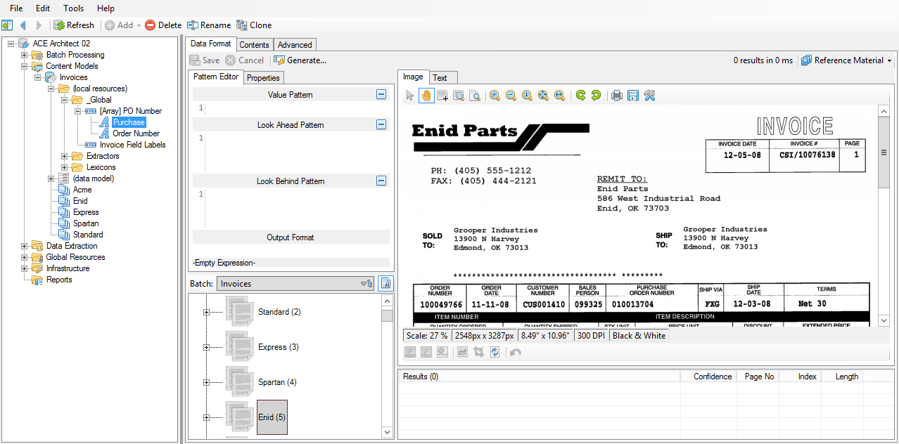


!!! abstract "Step"
    1. Select the [Array] PO Number > Order Number Data Format
    2. Select Enid (5)
    3. In the Value Pattern editor, type:
        ```
        order number
        ```
    4. In the Output Format editor, type:
        ```
        number
        ```


!!! abstract "Step"
    1. Select the [Array] PO Number Data Type
    2. Set the Collation property to ==Ordered Array==
    3. Expand Collation and set the Vertical Layout property to ==Enabled==
    4. Expand the Vertical Layout property
    5. Set the Maximum Distance property to ==0.25==
    6. Set the Alignment property to ==Center==
    7. Set the Alignment Tolerance property to ==0.1==
    8. Set the Result Separator property to ==`␣`== (a single space)

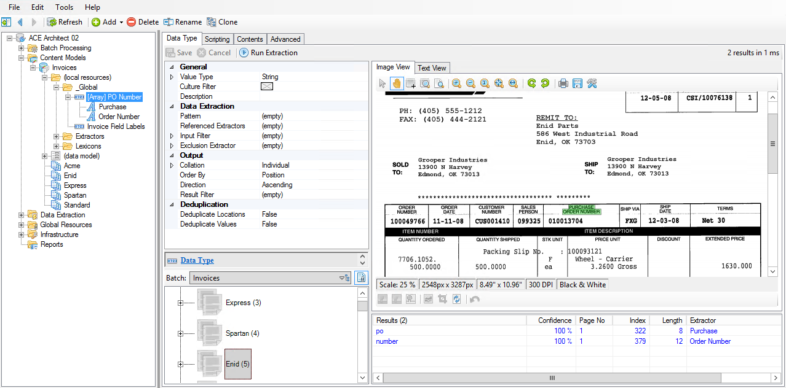


!!! abstract "Step"
    1. Drag the [Array] PO Number Data Type on top of the Invoice Field Labels Data Type
    2. Select the Invoice Field Labels Data Type to ensure the array is now being included in the results

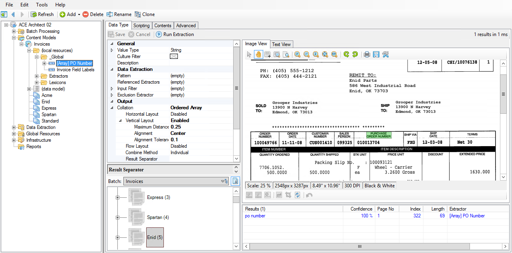


## Invoice Number

!!! abstract "Step"
    1. Right click on the Extractors folder and select Add > Field Class...
    2. Name it ==Invoice Number==

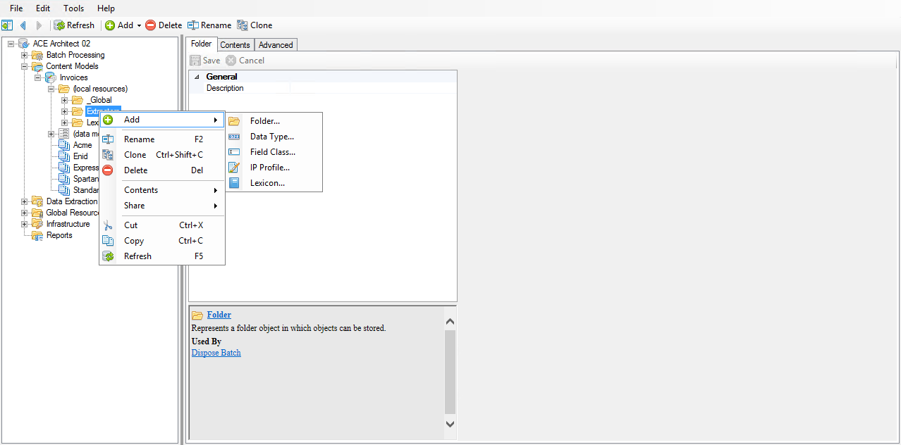

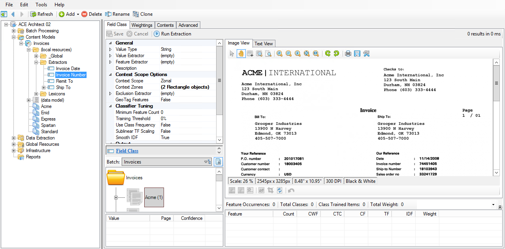

!!! abstract "Step"
    1. Create a child Data Type under the Invoice Number Field Class
    2. Name it ==[Values] Invoice Number==
    3. Create three child Data Formats under the [Values] Invoice Number Data Type and name them:
        1. ==Acme/Standard/Express==
        2. ==Enid==
        3. ==Spartan==


    ---
    Edit the patterns for each of the Data Formats:
    - Acme/Standard/Express

        ```tab="Value Pattern"
        [0-9]{6,16}
        ```

    - Enid

        ```tab="Value Pattern"
        ([A-Z]{3})/([@Number]{8})
        ```

        ```tab="Output Format"
        {1}{2:Number}
        ```

    - Spartan

        ```tab="Value Pattern"
        ([A-Z]{2})([@Number]{2})-([@Number]{6})
        ```

        ```tab="Output Format"
        {1}{2:Number}-{3}
        ```


!!! abstract "Step"
    1. Select the Invoice Number Field Class
    2. In the General section, set the Value Extractor > Type property to Reference
    3. Set the Referenced Extractor property to the Extractors • Invoice Number > [Values] Invoice Number Data Type
    4. Set the Feature Extractor > Type property to Reference
    5. Set the Referenced Extractor property to the Invoices • (local resources) > _Global > Invoice Field Labels Data Type
    6. Select Acme (1)
    7. Click Run Extraction

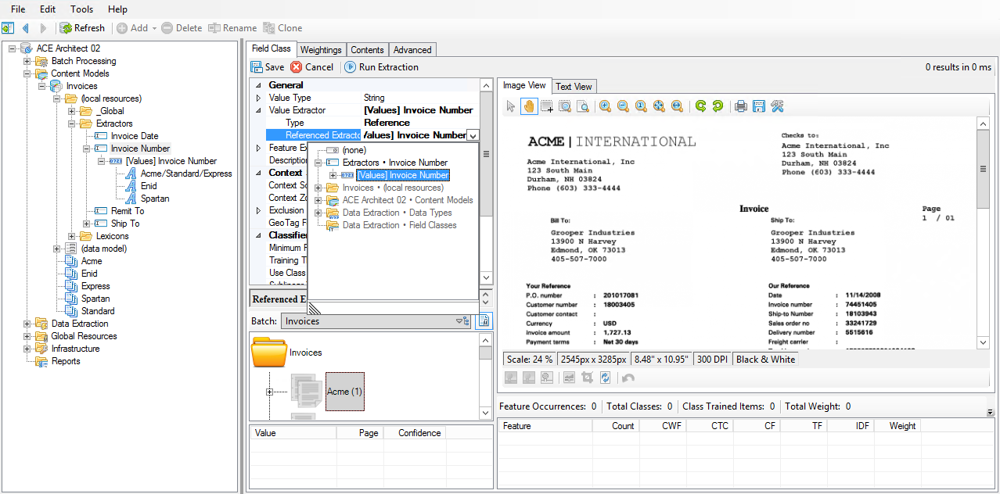


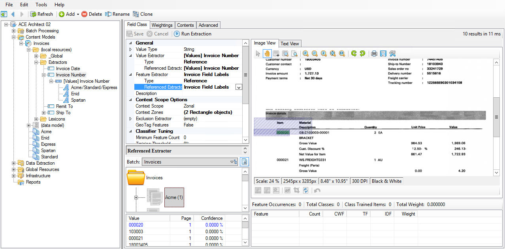

!!! abstract "Step"
    1. In the candidate list, find the value that has the appropriate feature(s) to train
    2. Right click and select **Train As Positive**


!!! abstract "Step"
    1. Select Spartan (4)
    2. Click to edit the Context Zones property
    3. In the Context Zones window, edit the dimensions as follows:
        1. Zone 1:
            1. Left: `-4`
            2. Top: `-0.02`
            3. Right: `0.35`
            4. Bottom: `0.1`
        2. Zone 2:
            1. Left: `-1`
            2. Top: `-0.25`
            3. Right: `0.375`
            4. Bottom: `0.05`
    2. Press **OK**


!!! abstract "Step"
    1. Click on the [Values] Invoice Number Data Type
    2. In the Deduplication section, set the Deduplicate Locations property to ==True==

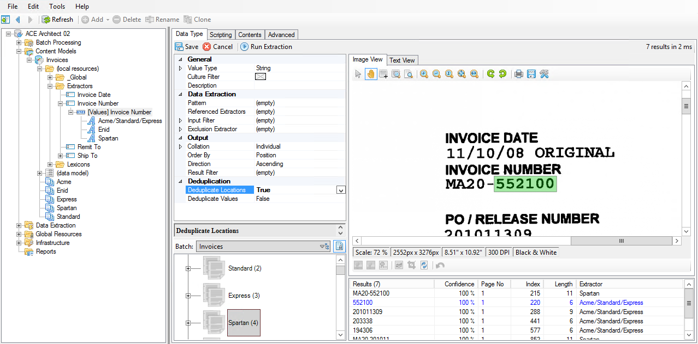

!!! abstract "Step"
    1. Click on the Invoice Number Field Class
    2. In the Output section, set the Minimum Confidence property to ==70%==


!!! abstract "Step"
    1. In the Data Model, select the Invoice Number Data Field
    2. In the General section, set the Value Extractor > Type property to Reference
    3. Set the Referenced Extractor property to the Invoices • (local resources) > Extractors > Invoice Number Field Class.
    4. In the Behavior section, set the Required property to ==True==


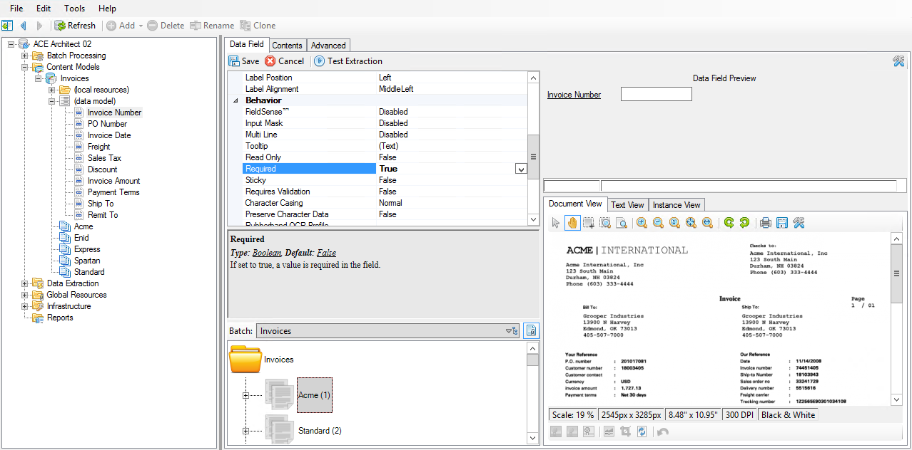

## PO Number/Exclusion Extractor

!!! abstract "Step"
    1. Right click on the (local resources) > _Global folder and select Add > Data Type...
    2. Name it ==Addresses, Phone Numbers==
    3. In the Data Extraction section, click to edit Referenced Extractors


!!! abstract "Step"
    1. In the Referenced Extractors window, click Add...
    2. In the Select Items window, expand (root) • Data Extraction > Data Types > Training Materials > Base Types and check the following:
        1. Address
        2. Phone Number
    3. Press **OK** to close the Select Items window
    4. Press **OK** to close the Referenced Extractors window


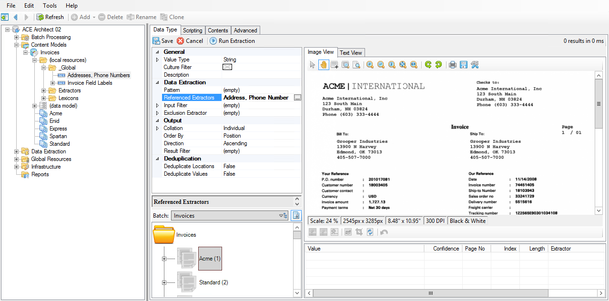

!!! abstract "Step"
    1. Right click on the Extractors folder and select Add > Field Class...
    2. Name it ==PO Number==
    3. Create a child Data Type of PO Number and name it ==[Values] PO Number==
    4. On the [Values] PO Number Data Type, click to edit the Pattern

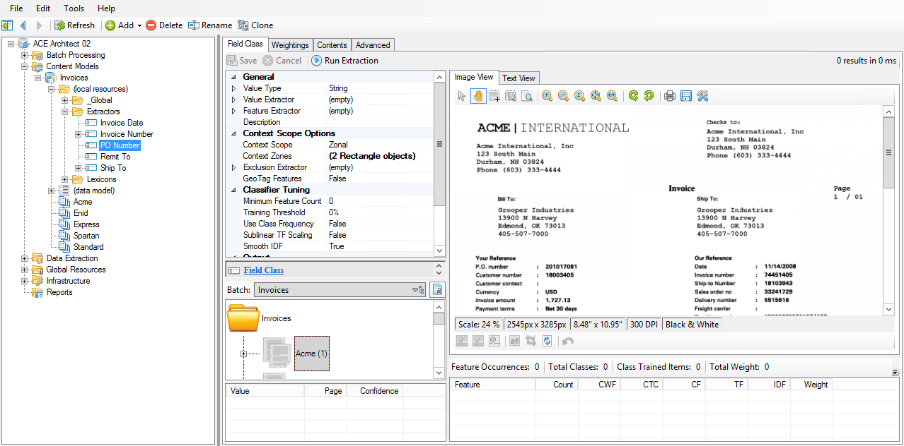


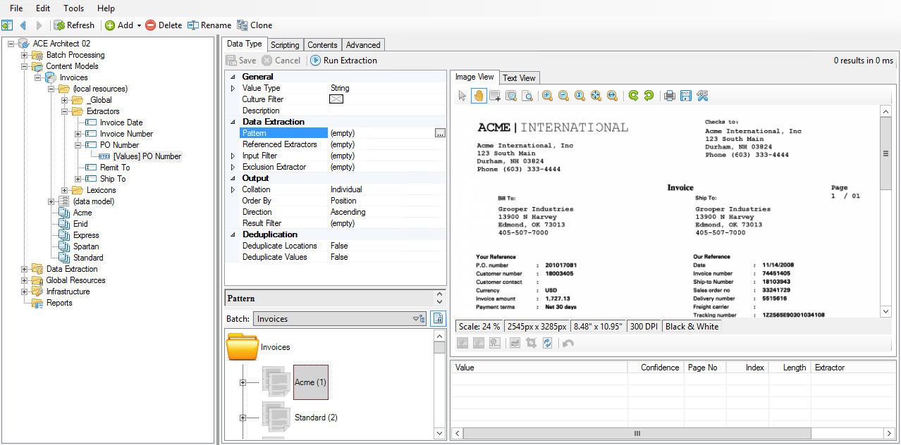

!!! abstract "Step"
    1. In the Value Pattern editor, type:
        ```
        [0-9]{4,16}
        ```
    2. Press **OK**

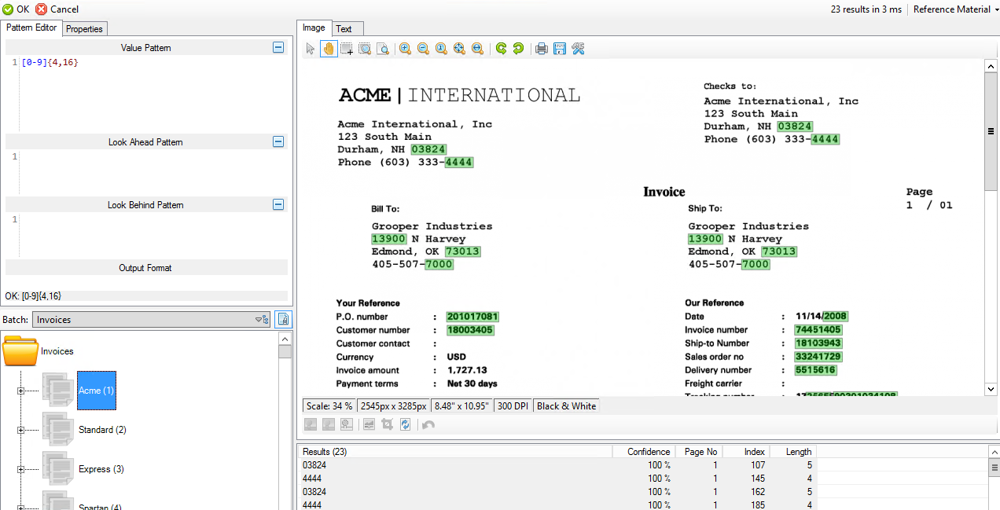

!!! abstract "Step"
    1. On the [Values] PO Number Data Type, in the Data Extraction section, set the Exclusion Extractor > Type property to ==Reference==
    2. Set the Referenced Extractor property to the Invoices • (local resources) > _Global > ==Addresses, Phone Numbers== Data Type

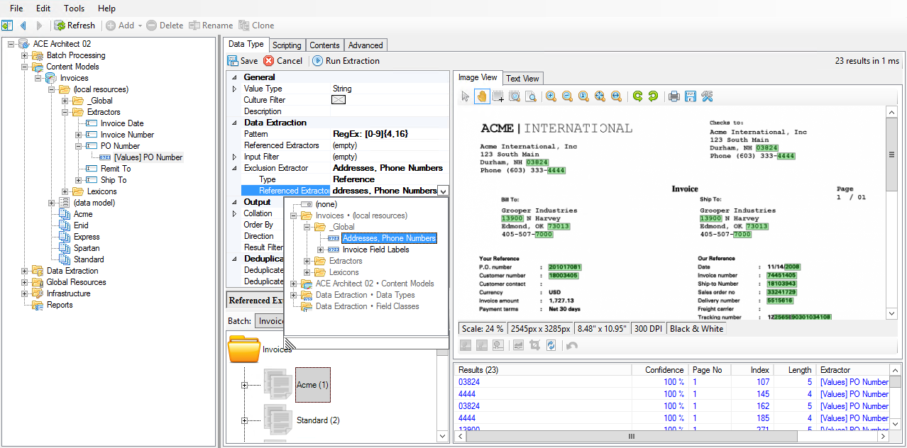

!!! abstract "Step"
    1. Click on the PO Number Field Class
    2. In the General section, set the Value Extractor > Type property to Reference
    3. Set the Referenced Extractor property to the Extractors • PO Number > ==[Values] PO Number== Data Type
    4. In the General section, set the Feature Extractor > Type property to Reference
    5. Set the Referenced Extractor property to the Invoices • (local resources) > _Global > Invoice Field Labels Data Type


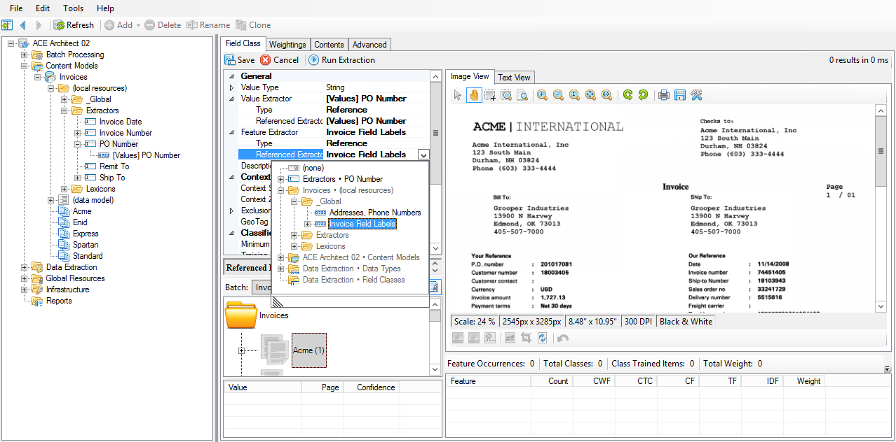

!!! abstract "Step"
    1. Select Acme (1)
    2. Click Run Extraction
    3. In the candidate list, find the value that has the appropriate feature(s) to train
    4. Right click and select **Train As Positive**


!!! abstract "Step"
    1. Click to edit the Context Zones property
    2. In the Context Zones window, edit the dimensions as follows:
        1. Zone 1:
            1. Left: `-3.278`
            2. Top: `-0.054`
            3. Right: `0.312`
            4. Bottom: `0.054`
        2. Zone 2:
            1. Left: `-0.67`
            2. Top: `-0.37`
            3. Right: `0.5`
            4. Bottom: `0.04`
    3. Press **OK**
    4. In the Output section, set the Minimum Confidence property to ==70%==


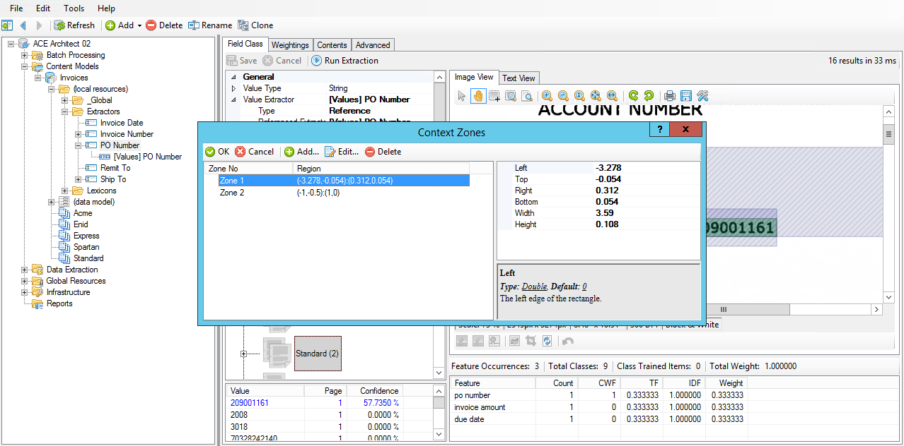


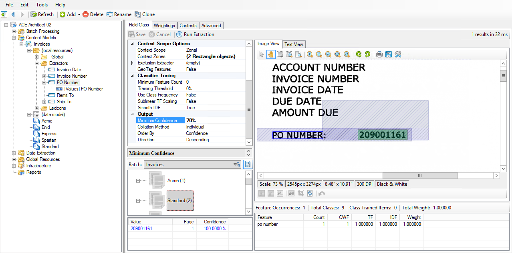

!!! abstract "Step"
    1. In the Data Model, select the PO Number Data Field
    2. In the General section, set the Value Extractor > Type property to Reference
    3. Set the Referenced Extractor property to the Invoices • (local resources) > Extractors > PO Number Field Class.
    4. In the Behavior section, set the Required property to ==True==


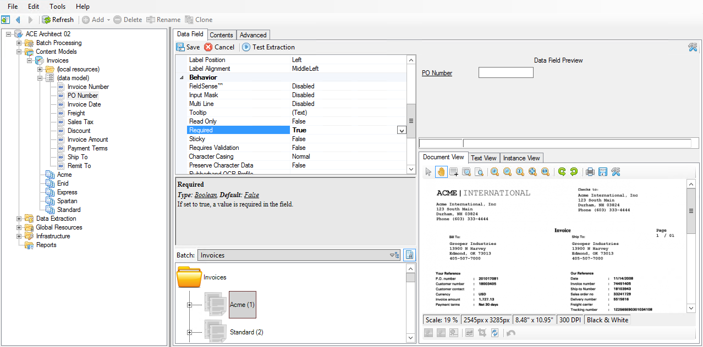

## Invoice Amount

!!! abstract "Step"
    1. Right click on the Extractors folder and select Add > Field Class...
    2. Name it ==Invoice Amount==


!!! abstract "Step"
    1. In the General section, set the Value Extractor > Type property to Reference
    3. Set the Referenced Extractor property to the Data Extraction • Data Types > Downloads > Base Types > ==Currency Data== Type
    4. Set the Feature Extractor > Type property to Reference
    5. Set the Referenced Extractor property to the Invoices • (local resources) > _Global > Invoice Field Labels Data Type


!!! abstract "Step"
    1. Select Acme (1)
    2. Click Run Extraction
    3. In the candidate list, find the value that has the appropriate feature(s) to train
    4. Right click and select **Train As Positive**


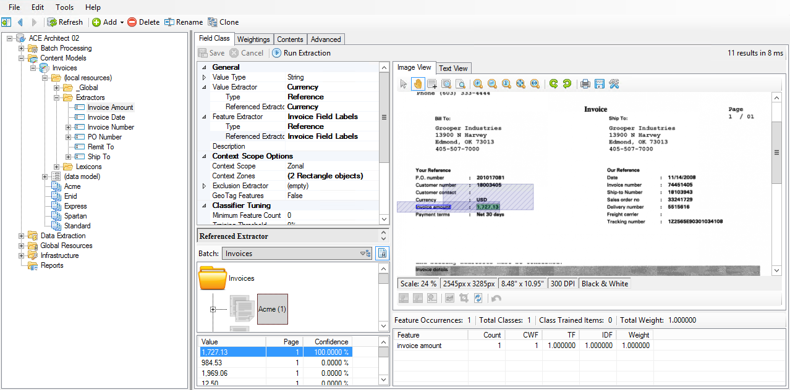

!!! abstract "Step"
    1. Click to edit the Context Zones property
    2. In the Context Zones window, edit the dimensions as follows:
        1. Zone 1:
            1. Left: `-4`
            2. Top: `-0.05`
            3. Right: `0.2`
            4. Bottom: `0.1`
        2. Zone 2:
            1. Left: `-0.58`
            2. Top: `-0.36`
            3. Right: `0.3`
            4. Bottom: `0.05`
    3. Press **OK**
    4. In the Output section, set the Minimum Confidence property to ==70%==


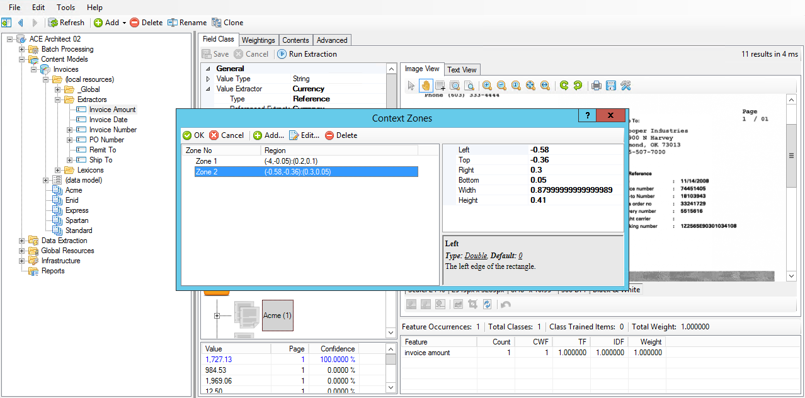


!!! abstract "Step"
    1. In the Data Model, select the Invoice Amount Data Field
    2. In the General section, set the Value Type to ==Decimal==
    3. Expand Value Type and set the Format Specifier property to ==c2==


!!! abstract "Step"
    1. In the General section, set the Value Extractor > Type property to Reference
    2. Set the Referenced Extractor property to the Invoices • (local resources) > Extractors > Invoice Amount Field Class.
    3. In the Behavior section, set the Required property to ==True==


## Payment Terms

!!! abstract "Step"
    1. In the Data Model, select the PO Number Data Field
    2. In the General section, set the Value Extractor > Type property to Internal
    3. Click to edit the pattern


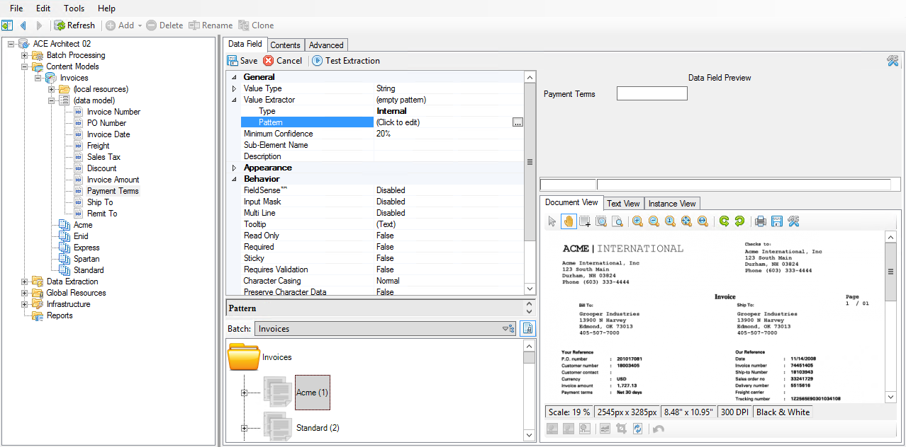

!!! abstract "Step"
    1. Select Acme (16)
    2. In the Value Pattern editor, type:
        ```
        n[eo]t ([@Number]{2})
        ```
    3. In the Output Format editor, type:
        ```
        Net {1:Number}
        ```
    4. Press **OK**


!!! abstract "Step"
    1. On the Payment Terms Data Field, set the Required Property to ==True==


## Freight

!!! abstract "Step"
    1. Right click on the Extractors folder and select Add > Data Type...
    2. Name it ==Freight==


!!! abstract "Step"
    1. As child extractors under the Freight Data Type, create:
        1. Data Format: ==Acme==
        2. Data Format: ==Enid==
        3. Data Format: ==Express==
        4. Data Format: ==Standard==
        5. Data Type: ==Spartan==


    ---
    Edit the patterns for each of the Data Formats:
    - Acme
        
        *Make sure to enable Tab Marking*

        ```tab="Value Pattern"
        ([@Number.]{3,12})
        ```

        ```tab="Look Ahead Pattern"
        WS.FREIGHT[0o]231[^\n]+\n
        [^\n]+\n
        [^\t]+\t
        [^\t]+\t
        ```

        ```tab="Look Behind Pattern"
        \r\n
        ```

        ```tab="Output Format"
        {1:Number}
        ```

    - Enid

        ```tab="Value Pattern"
        ([@Number.]{3,12})
        ```

        ```tab="Look Ahead Pattern"
        020-0027[^\n]*?\n[^\r]*?
        ```

        ```tab="Look Behind Pattern"
        \r\n
        ```

        ```tab="Output Format"
        {1:Number}
        ```

    - Express

        ```tab="Value Pattern"
        ([@Number.]{3,12})
        ```

        ```tab="Look Ahead Pattern"
        shipping charge:?[^0-9]{0,4}
        ```

        ```tab="Output Format"
        {1:Number}
        ```

    - Standard

        ```tab="Value Pattern"
        ([@Number.]{3,12})
        ```

        ```tab="Look Ahead Pattern"
        shipping charge\s
        ```

        ```tab="Output Format"
        {1:Number}
        ```

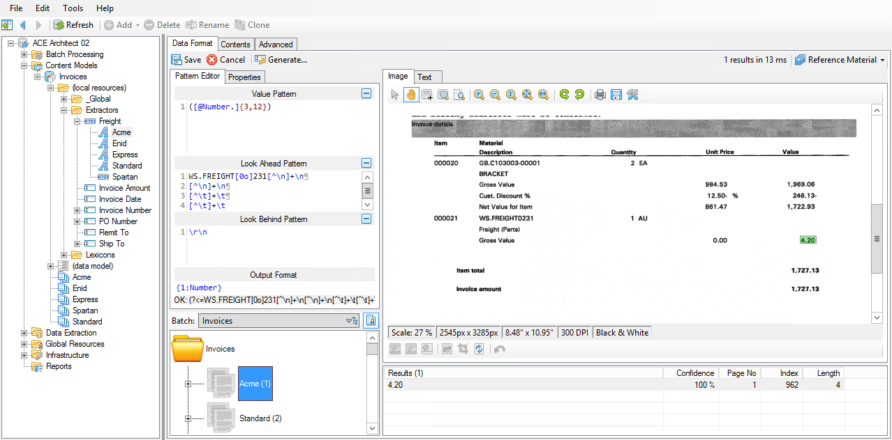


!!! abstract "Step"
    1. Create two Data Formats as children of the Spartan Data Type:
        1. ==Freight==
        2. ==Value 1==
    2. Edit the Value Patterns for each of the Data Formats:

        ```tab="Freight"
        freight
        ```

        ```tab="Value 1"
        [\d.]+
        ```

    3. Right click on the Value 1 Data Format and select Clone
    4. Name the clone ==Value 2==


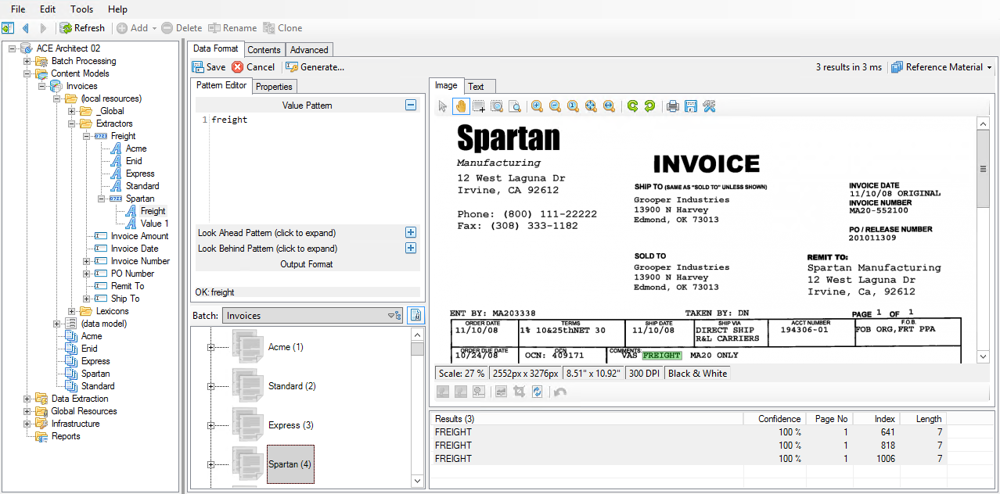


!!! abstract "Step"
    1. Select the Spartan Data Type
    2. Set the Collation property to ==Ordered Array==
    3. Expand Collation and set the Vertical Layout property to ==Enabled==
    4. Expand the Vertical Layout property
    5. Set the Maximum Distance property to ==0.25==
    6. Set the Combine Method property to ==Sum==

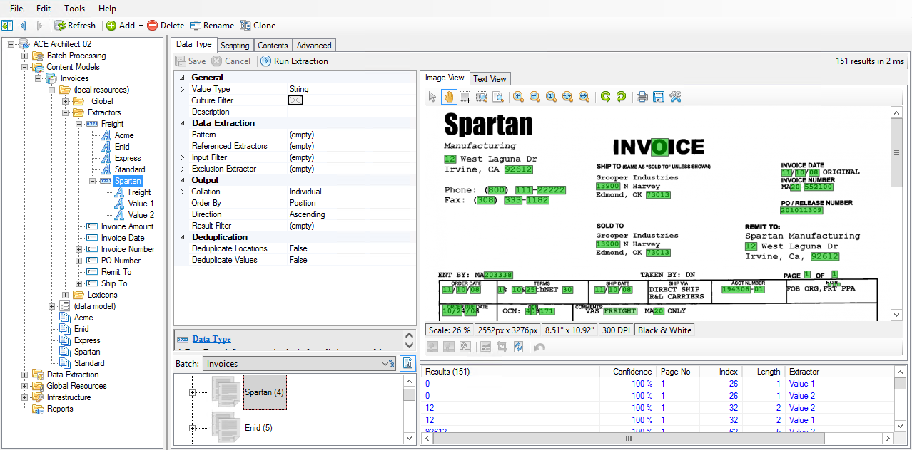


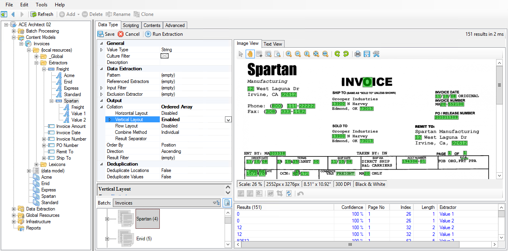


!!! abstract "Step"
    1. In the Data Model, select the Freight Data Field
    2. In the General section, set the Value Type to ==Decimal==
    3. Expand Value Type and set the Format Specifier property to ==c2==
    4. In the Expressions section, set the Default Value Expression property to ==0==


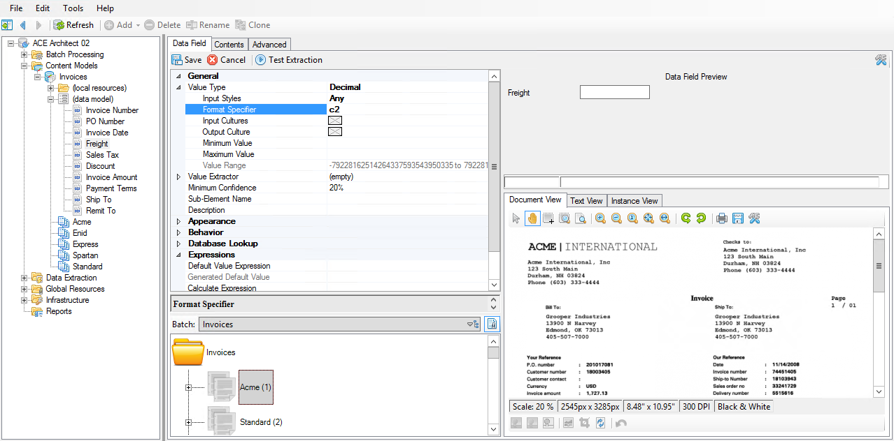


!!! abstract "Step"
    1. In the General section, set the Value Extractor > Type property to Reference
    2. Set the Referenced Extractor property to the Invoices • (local resources) > Extractors > ==Freight== Data Type.


## Discount

!!! abstract "Step"
    1. Right click on the Extractors folder and select Add > Data Type...
    2. Name it ==Discount==


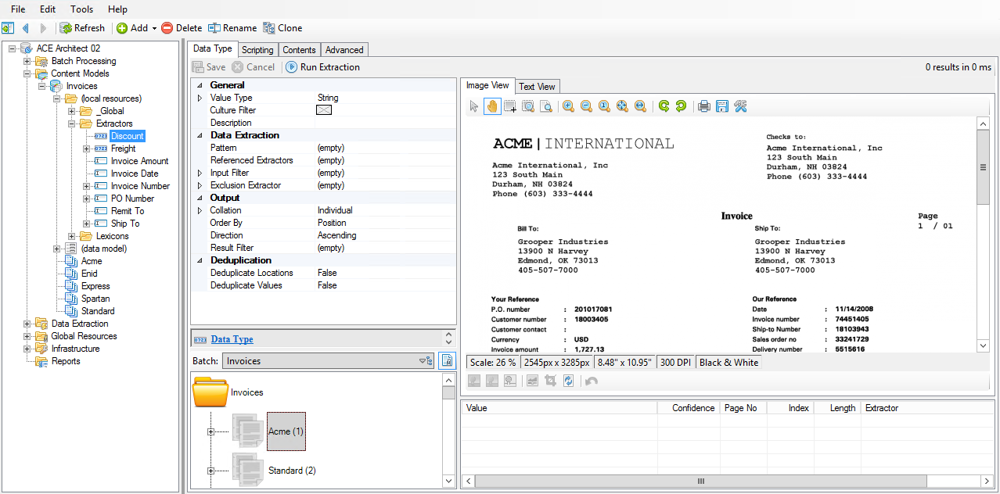

!!! abstract "Step"
    1. Create two Data Types as children of the Discount Data Type:
        - ==Acme==
        - ==Enid==
    2. Select the Acme Data Type and click to edit its Pattern

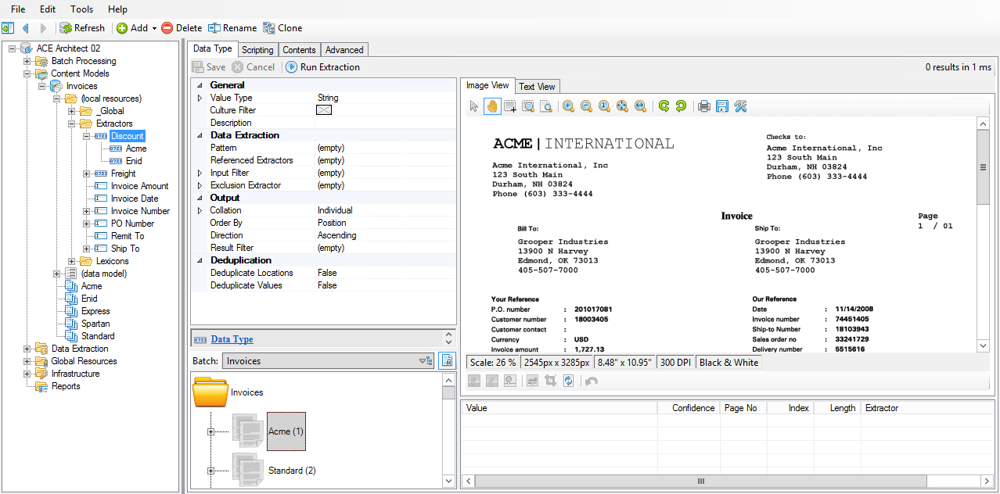

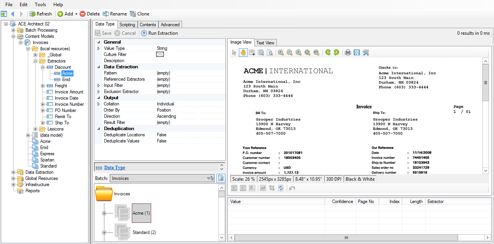


!!! abstract "Step"
    1. Click on the Properties tab and set the Preprocessing Options > Tab Marking property to ==True==
    2. Click back to the Pattern Editor tab
    3. In the Value Pattern editor, type:
        ```
        [@Number.,]{3,12}
        ```
    4. In the Look Ahead Pattern editor, type:
        ```
        cust\.\sdiscount\s%(\t|\r\n)[^\t]+\t
        ```
    5. In the Output Format editor, type:
        ```
        {0:Number}
        ```
    6. Press **OK** to close the pattern editor window


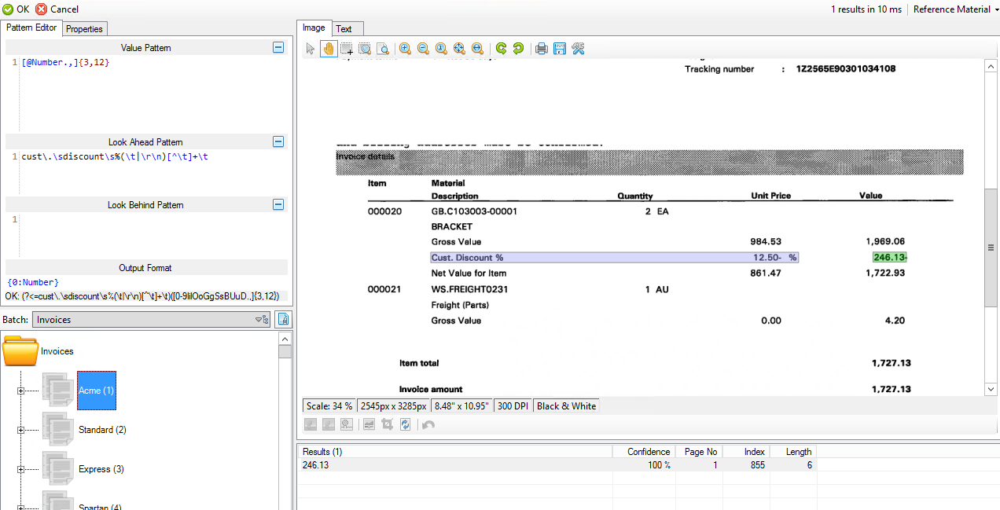

!!! abstract "Step"
    1. Select Acme (14)
    2. In the Output section, set the Collation property to ==Combine==
    3. Expand Collation and set the Combine Method property to ==Sum==


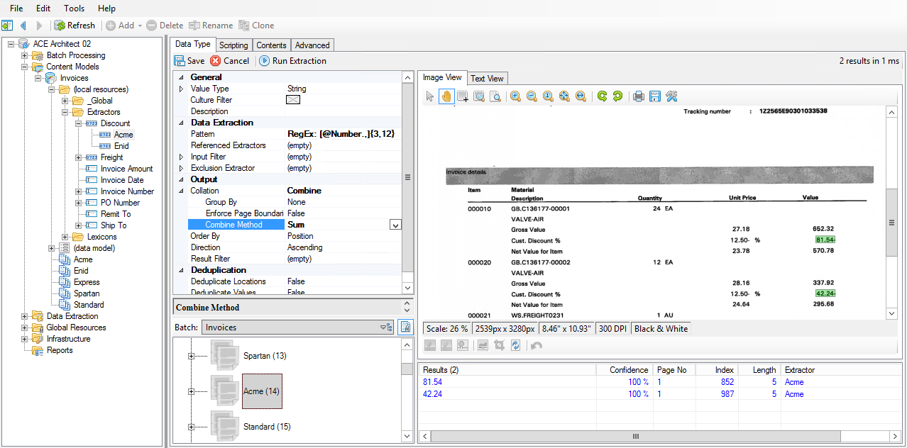
    ---
    Create two Data Formats as children of the Enid Data Type:
        - ==[Key] Enid - Discount==
        - ==[Value] Enid - Discount==


!!! abstract "Step"
    1. Select the [Key] Enid - Discount Data Format
    2. Select Enid (5)
    3. In the Value Pattern editor, type:
        ```
        order discount amount
        ```


!!! abstract "Step"
    1. Click on the Properties tab
    2. In the General section, set the Mode property to ==FuzzyRegEx==
    3. In the Fuzzy Matching Options section, set the Minimum Similarity property to ==85%==
    4. Expand Fuzzy Match Weightings and click to edit Local Entries
    5. In the List Editor window, type:
        ```
        )D=0.1
        ```
    6. Press **OK** to close the List Editor window

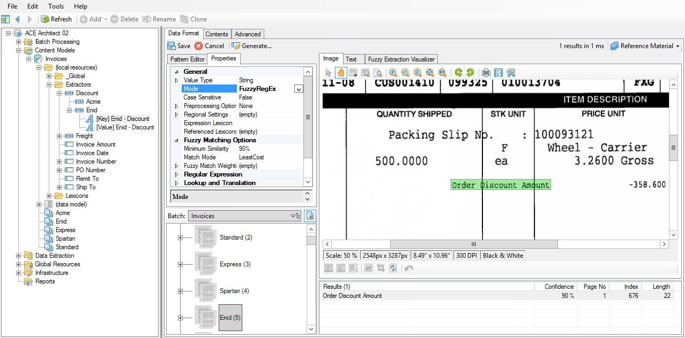


!!! abstract "Step"
    1. Select the [Value] Enid - Discount Data Format
    2. In the Value Pattern editor, type:
        ```
        \d{1,6}\.\d{2,3}
        ```

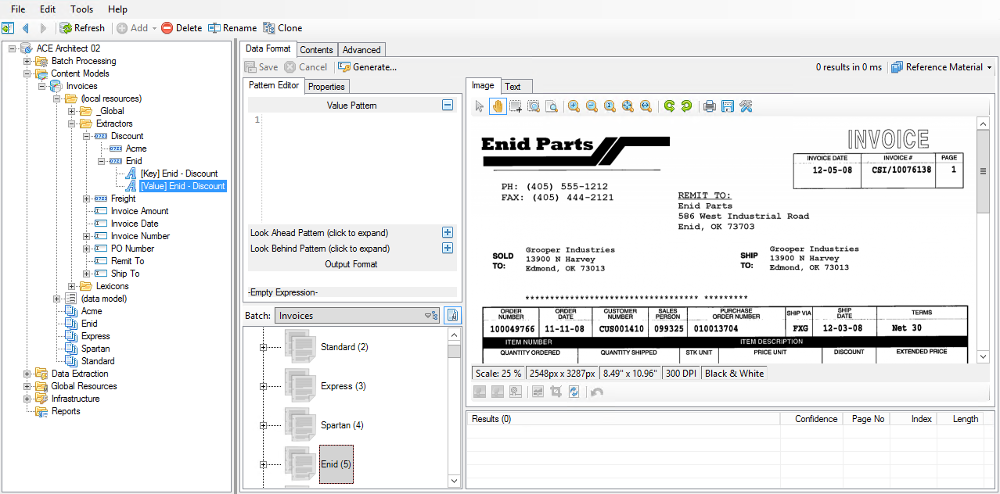


!!! abstract "Step"
    1. Select the Enid Data Type
    2. In the Output section, set the Collation property to ==Key-Value Pair==
    3. Expand Collation and set the Horizontal Layout property to ==Enabled==

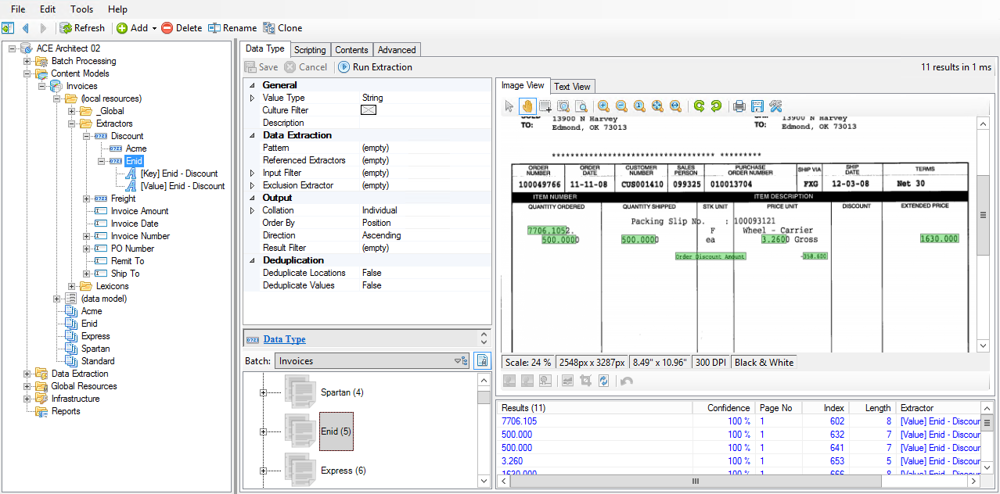

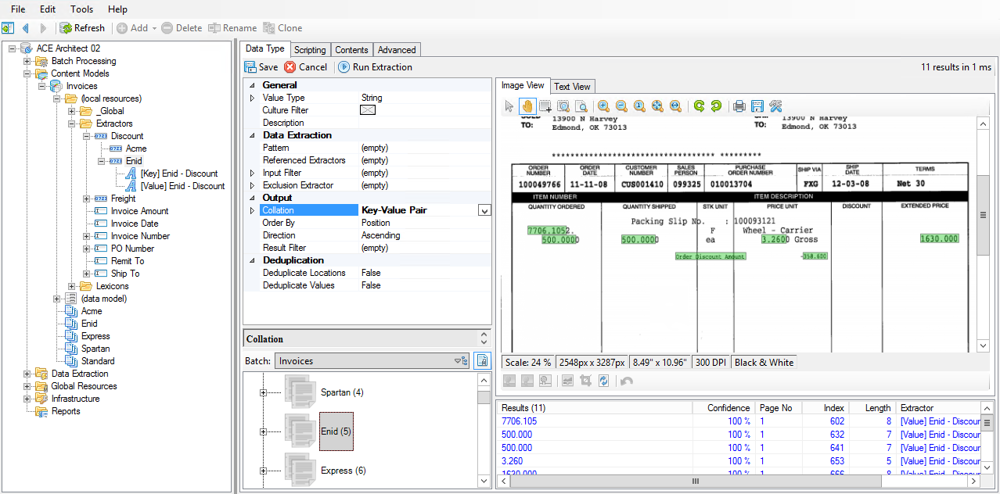


!!! abstract "Step"
    1. In the Data Model, select the Discount Data Field
    2. In the General section, set the Value Type to ==Decimal==
    3. Expand Value Type and set the Format Specifier property to ==c2==
    4. In the Expressions section, set the Default Value Expression property to ==0==

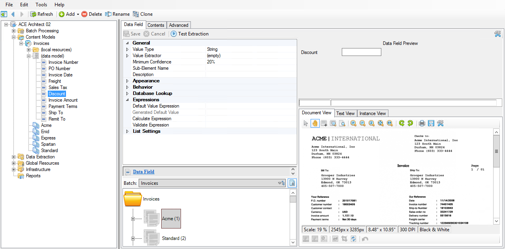


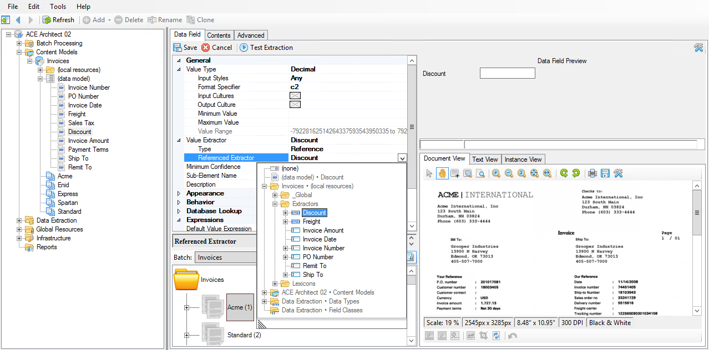

!!! abstract "Step"
    1. In the General section, set the Value Extractor > Type property to Reference
    2. Set the Referenced Extractor property to the Invoices • (local resources) > Extractors > ==Discount== Data Type.

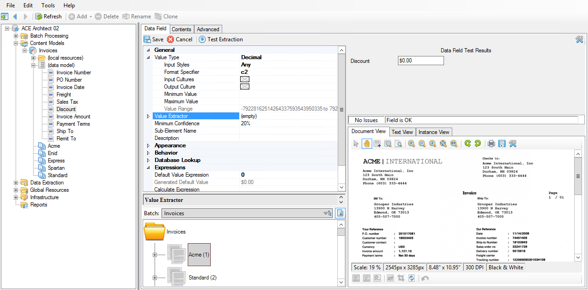


## Sales Tax

!!! abstract "Step"
    1. Right click on the Extractors folder and select Add > Data Type...
    2. Name it ==Sales Tax==
    3. Create two Data Formats as children of the Sales Tax Data Type
        - ==Express==
        - ==Standard==


    ---
    Edit the patterns for each of the Data Formats:
    - Express

        ```tab="Value Pattern"
        ([@Number.]{4,12})
        ```

        ```tab="Look Ahead Pattern"
        sales tax:((\r\n)|\s)
        ```

        ```tab="Output Format"
        {0:Number}
        ```

    - Standard

        ```tab="Value Pattern"
        ([@Number.]{3,12})
        ```

        ```tab="Look Ahead Pattern"
        tax\s
        ```

        ```tab="Output Format"
        {1:Number}
        ```


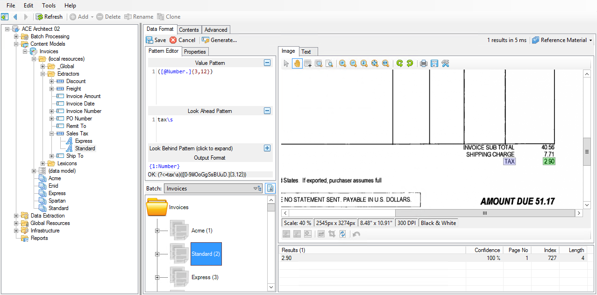

!!! abstract "Step"
    1. In the Data Model, select the Sales Tax Data Field
    2. In the General section, set the Value Type to ==Decimal==
    3. Expand Value Type and set the Format Specifier property to ==c2==
    4. In the Expressions section, set the Default Value Expression property to ==0==

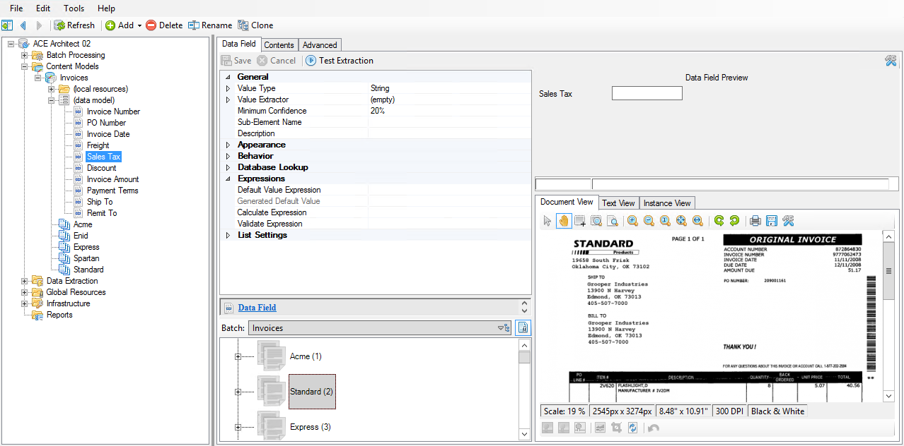


!!! abstract "Step"
    1. In the General section, set the Value Extractor > Type property to Reference
    2. Set the Referenced Extractor property to the Invoices • (local resources) > Extractors > ==Sales Tax== Data Type.


!!! abstract "Step"
    1. Add a new folder to (local resources)
    2. Name it ==Overrides==

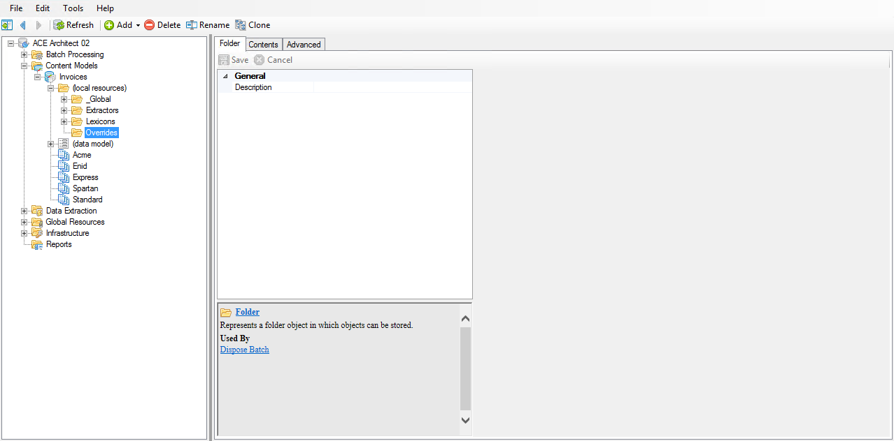

!!! abstract "Step"
    1. In the Overrides folder, add a Field Class
    2. Name it ==[Enid] Sales Tax==


!!! abstract "Step"
    1. Set the Value Extractor > Type property to ==Internal==
    2. Click to edit the pattern:

        ```tab="Value Pattern"
        ([@Number.]{2,12})
        ```

        ```tab="Output Format"
        {1:Number}
        ```

    3. Set the Feature Extractor > Type property to ==Reference==
    4. Set the Referenced Extractor property to the Data Extraction • Data Types > Training Materials > Features > ==Phrases== Data Type


!!! abstract "Step"
    1. Click to edit the Context Zones property
    2. In the Context Zones window, delete one of the zones
    3. Edit the dimensions of the remaining zone:

        |        | Zone   |
        |--------|--------|
        | Left   | `-2.4` |
        | Top    | `-0.2` |
        | Right  | `0.25` |
        | Bottom | `0.1`  |

    4. Press **OK** to close the Context Zones window
    5. In the Output section, set the Minimum Confidence property to ==90%==


!!! abstract "Step"
    1. Navigate to the (root) > Content Models > Invoices > Enid Document Type
    2. Click on the Data Element Profiles tab
    3. Click on the Sales Tax Data Field and click the **+** button in the toolbar

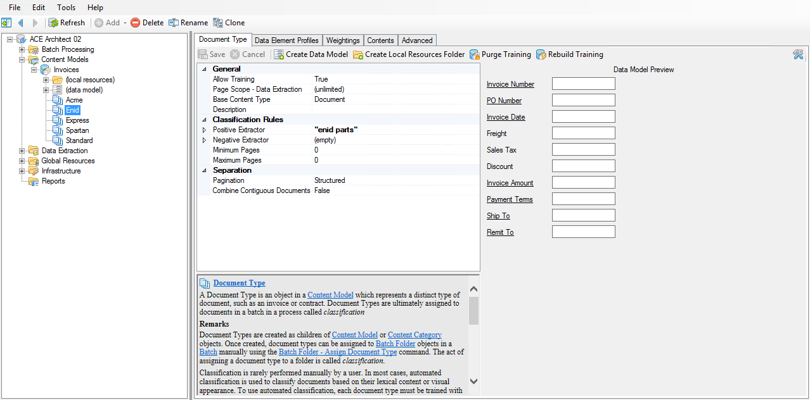


!!! abstract "Step"
    1. In the properties panel, set the ESP(tm) Extraction Overrides > Override Extractor property to ==True==
    2. Expand Extractor and set the Extractor > Type property to Reference
    3. Set the Referenced Extractor property to the Invoices • (local resources) > Overrides > ==[Enid] Sales Tax== Field Class


## Data Model Adjustments

!!! abstract "Step"
    1. Navigate to the Ship To Data Field
    2. In the Appearance section, set the Display Width property to ==110==
    3. In the Behavior section, set the Multi Line property to ==Enabled==
    4. Expand Multi Line and set the Multi Line Height property to ==45==
    5. Set the Word Wrap property to ==True==

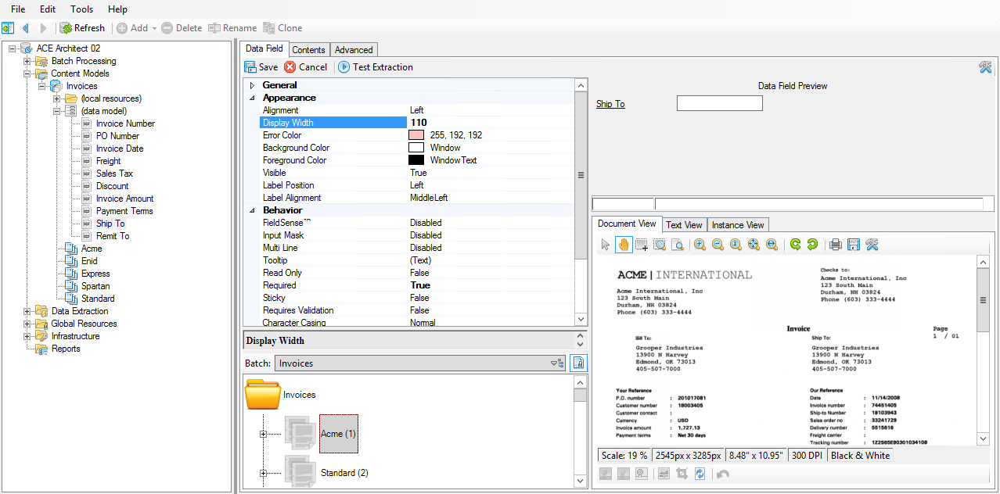


!!! abstract "Step"
    1. Right click on any of the property names and select Copy Properties > Selected Properties...
    2. In the Select Properties window, check the boxes next to the properties to copy:
        - [X] Display Width
        - [X] Multi Line


!!! abstract "Step"
    1. Navigate to the Remit To Data Field
    2. Right click on any of the property names and select Paste Properties

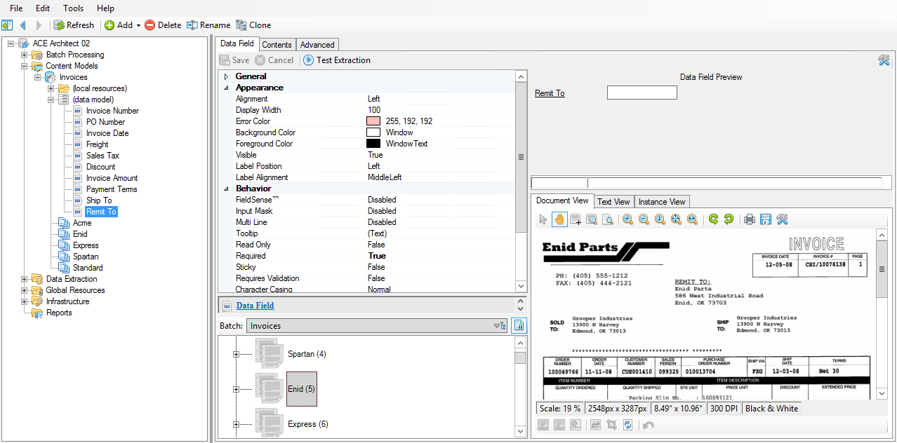

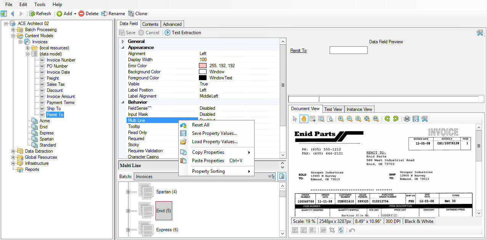


!!! abstract "Step"
    1. Navigate to the Data Model itself
    2. In the Child Element Options section, set the Show Fields In Grid property to ==True==
    3. In the toolbar, click the Test Extraction button to test all fields against a document


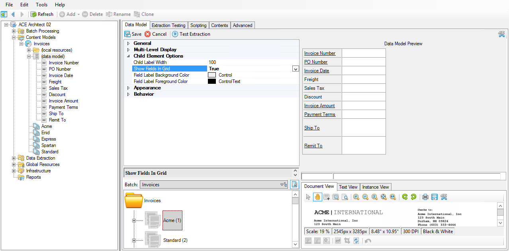

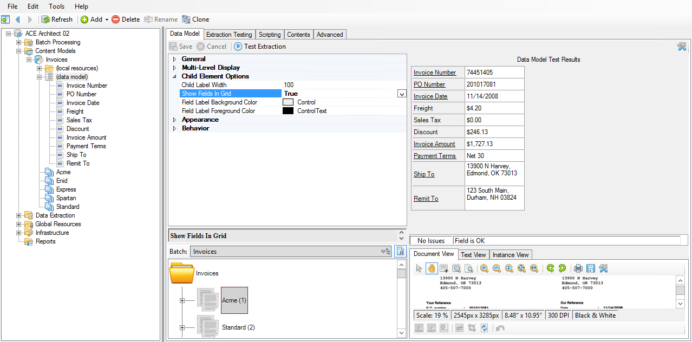
    