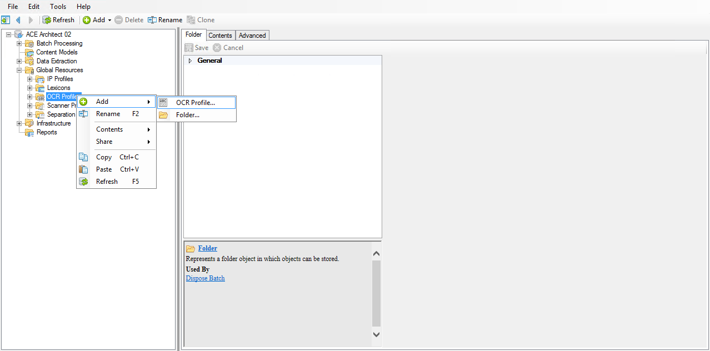
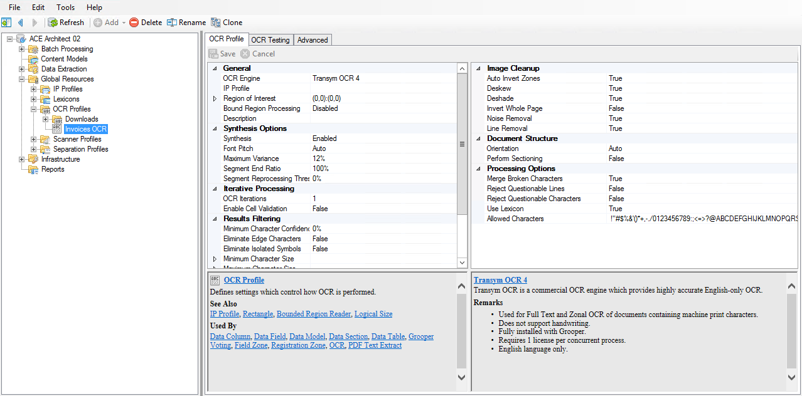
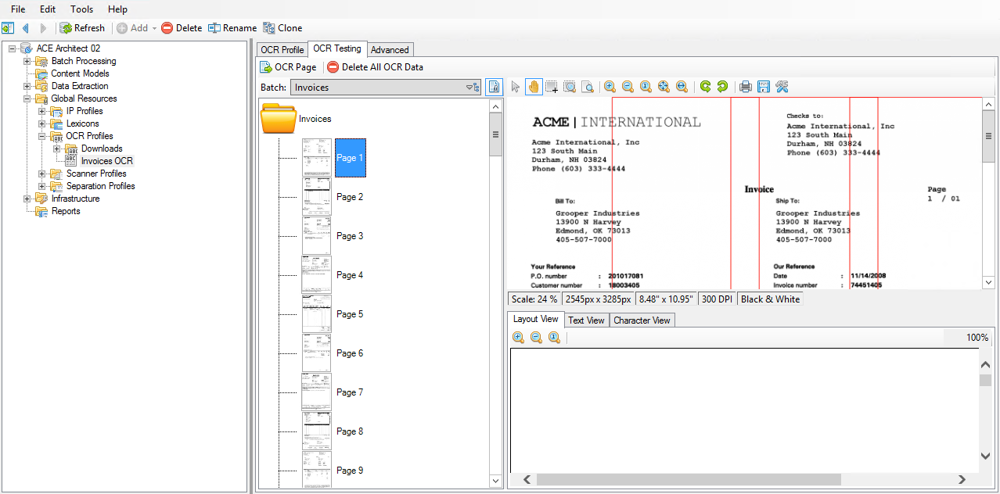
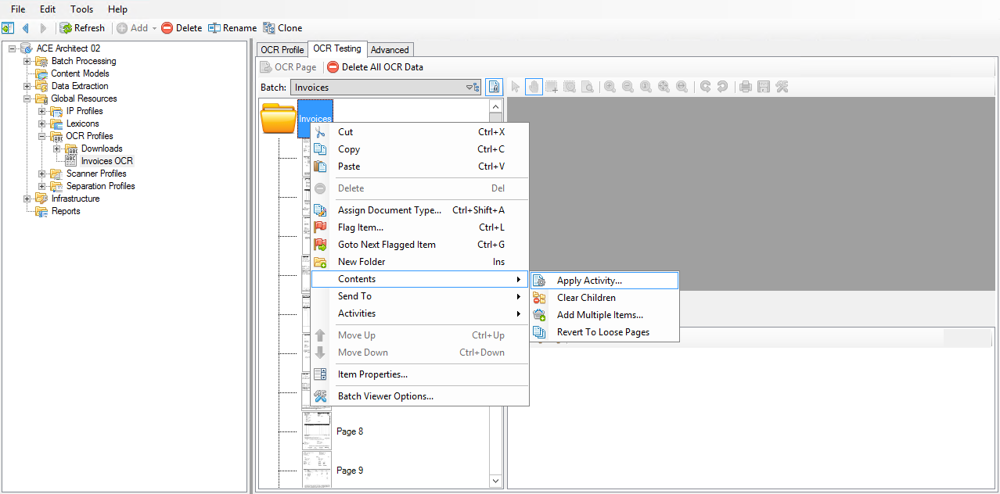
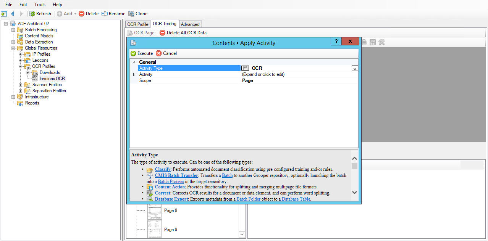
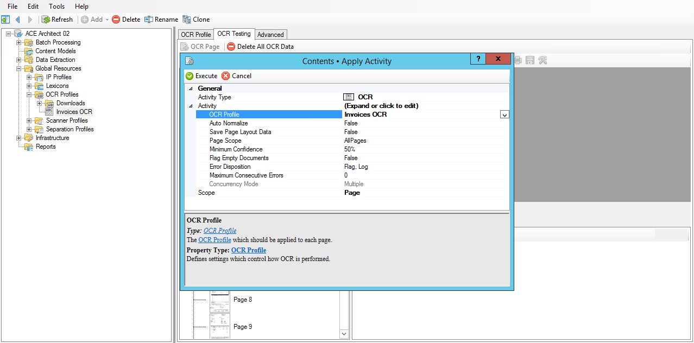
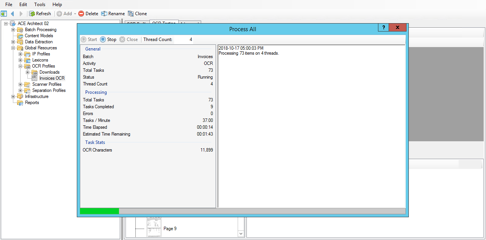

# Condition

## OCR

!!! abstract "Step "
    1. Navigate to **(root) > Global Resources > OCR Profiles**.
    2. Right click and select **Add > OCR Profile...**.
    3. Name it ==Invoices OCR==.

!!! abstract "Step "
    Change the following property values:

    | Section              | Property                           | Value           |
    |----------------------|------------------------------------|-----------------|
    | General              | **IP Profile**                     | `OCR Cleanup`     |
    | General              | **Bound Region Processing**        | `Enabled`         |
    | Synthesis Options    | **Segment End Ratio**              | `125%`            |
    | Synthesis Options    | **Segment Reprocessing Threshold** | `90%`             |
    | Iterative Processing | **OCR Iterations**                 | `2`               |
    | Iterative Processing | **Enable Cell Validation**         | `True`            |
    | Iterative Processing | **Rows**                           | `1`               |
    | Iterative Processing | **Columns**                        | `4`               |
    | Iterative Processing | **Skip First Column**              | `True`            |
    | Results Filtering    | **Minimum Character Confidence**   | `20%`             |
    | Results Filtering    | **Eliminate Isolated Symbols**     | `True`            |
    | Document Structure   | **Orientation**                    | `None`            |
    | Document Structure   | **Perform Sectioning**             | `True`            |
    | Processing Options   | **Reject Questionable Lines**      | `True`            |
    | Processing Options   | **Reject Questionable Characters** | `True`            |

!!! abstract "Step "
    1. Click on the **OCR Testing** tab.
    2. Select the **Invoices** batch.
    3. Right click on the root batch folder and select **Contents > Apply Activity...**.
    4. In the **Contents • Apply Activity** window, set the **Activity Type** property to ==OCR==.
    5. Expand the **Activity** property.
    6. Set the **Activity > OCR Profile** property to the ==Invoices OCR== profile.
    7. Click **Execute**.
    8. Click **Start**.
    9. Click **Close** when the activity has completed.

