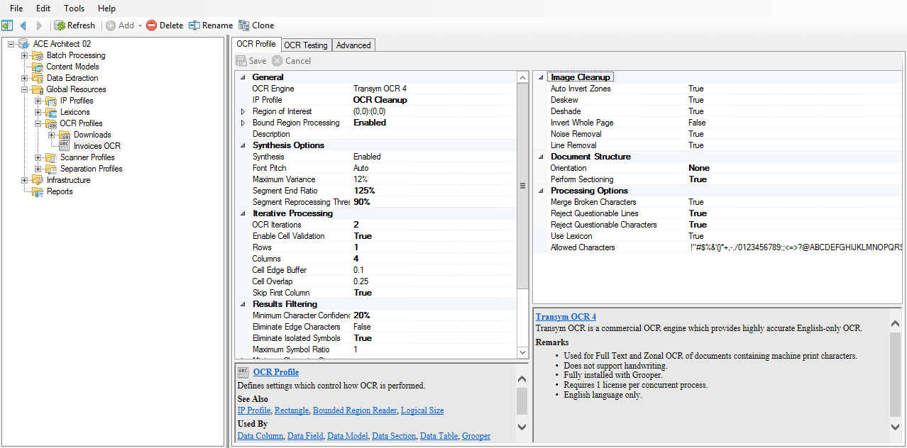
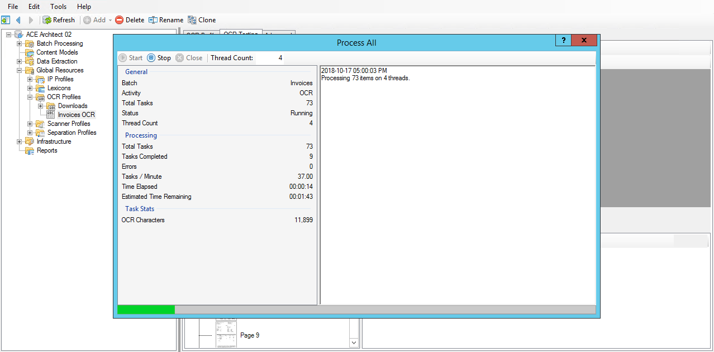

# Condition

## OCR

### Creating an OCR Profile

!!! abstract "Global Resources / **OCR Profiles**"
    1. Right click and select **Add > OCR Profile...**.
    2. Name it ==Invoices OCR==.

!!! abstract "Global Resources / OCR Profiles / **Invoices OCR**"
    Change the following property values:

    | Property                           | Default Value | New Value         |
    |------------------------------------|---------------|-------------------|
    | General                            |               |                   |
    | **IP Profile**                     | -             | ==`OCR Cleanup`== |
    | **Bound Region Processing**        | `Disabled`    | ==`Enabled`==     |
    | Synthesis Options                  |               |                   |
    | **Segment End Ratio**              | `100%`        | ==`125%`==        |
    | **Segment Reprocessing Threshold** | `0%`          | ==`90%`==         |
    | Iterative Processing               |               |                   |
    | **OCR Iterations**                 | `1`           | ==`2`==           |
    | **Enable Cell Validation**         | `False`       | ==`True`==        |
    | **Rows**                           | -             | ==`1`==           |
    | **Columns**                        | -             | ==`4`==           |
    | **Skip First Column**              | -             | ==`True`==        |
    | Results Filtering                  |               |                   |
    | **Minimum Character Confidence**   | `0%`          | ==`20%`==         |
    | **Eliminate Isolated Symbols**     | `False`       | ==`True`==        |
    | Document Structure                 |               |                   |
    | **Orientation**                    | `Auto`        | ==`None`==        |
    | **Perform Sectioning**             | `False`       | ==`True`==        |
    | Processing Options                 |               |                   |
    | **Reject Questionable Lines**      | `False`       | ==`True`==        |
    | **Reject Questionable Characters** | `False`       | ==`True`==        |

### Running OCR against the test batch

!!! abstract "Global Resources / OCR Profiles / **Invoices OCR**"
    1. Switch to the **OCR Testing** tab.
    2. From the **batch dropdown** select the **Invoices** batch.
    3. Right click on the root batch folder and select **Contents > Apply Activity...**.
    4. In the **Contents • Apply Activity** window, change the following property values:

        | Property            | Default Value | New Value          |
        |---------------------|---------------|--------------------|
        | General             |               |                    |
        | **Activity Type**   | `-`           | ==`OCR`==          |
        | **Activity**        |               |                    |
        | --> **OCR Profile** | `-`           | ==`Invoices OCR`== |

    5.  Press **Execute**.
    6.  Press **Start**.
    7.  When the activity has completed, press **Close**.

