# Deliver

## Batch Process

Let's put everything together in a Batch Process!

Incorporate everything we've learned into the following steps:

1. Scan
2. OCR
3. Separate
4. Classify
5. Classify Review
6. Extract
7. Data Review
8. Document Export
9. Dispose Batch

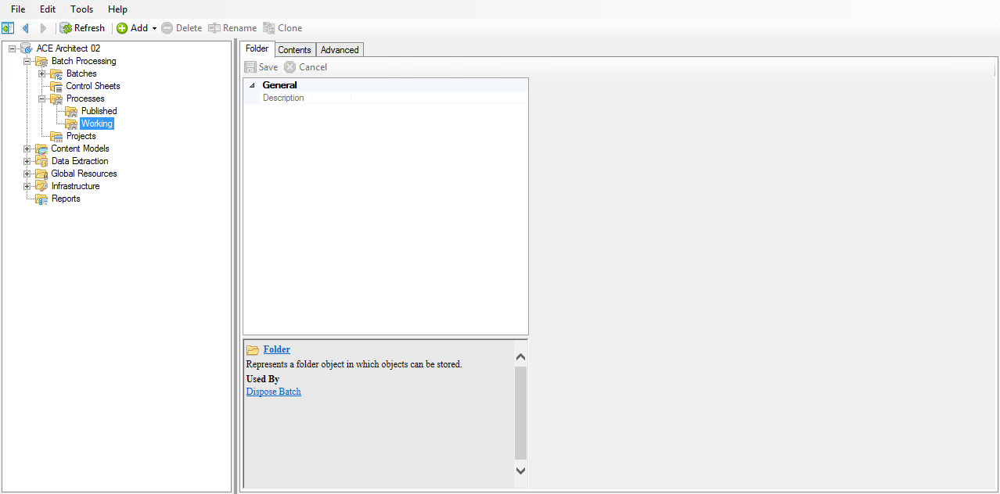

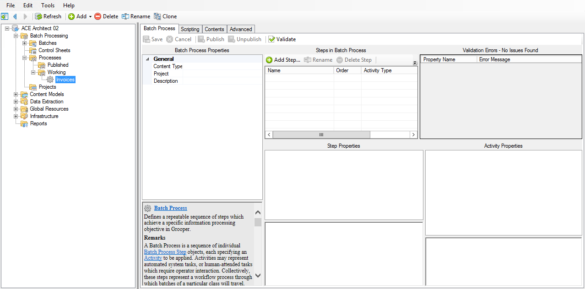

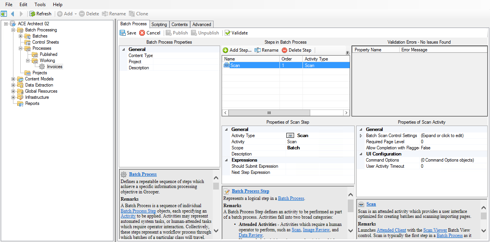

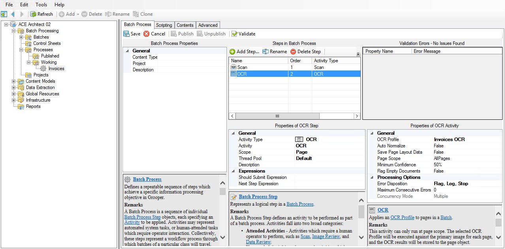

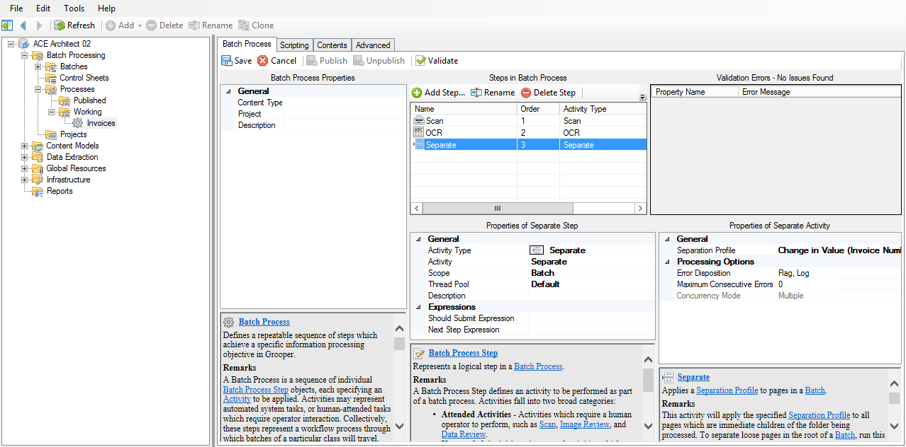

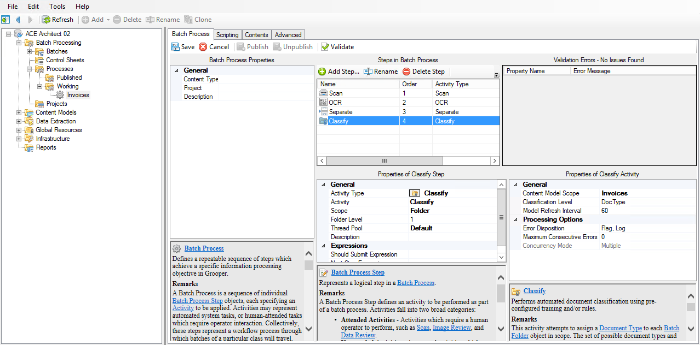

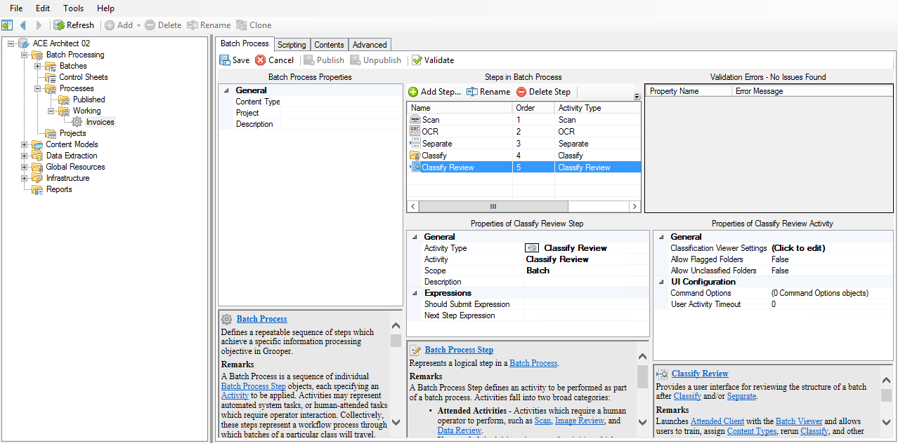

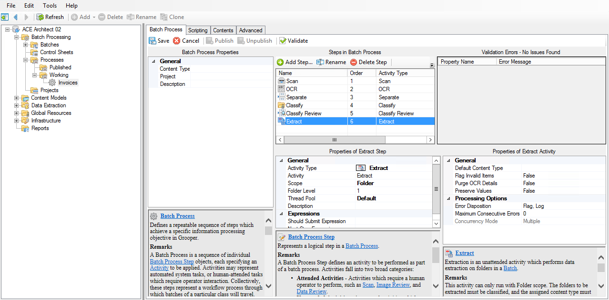

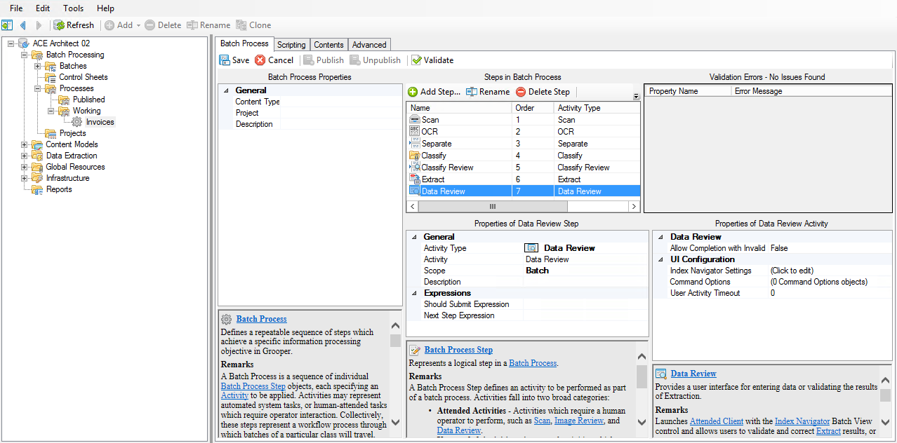

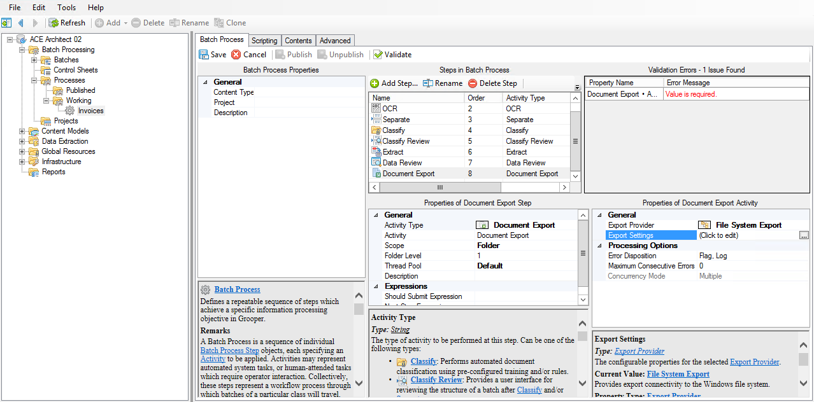

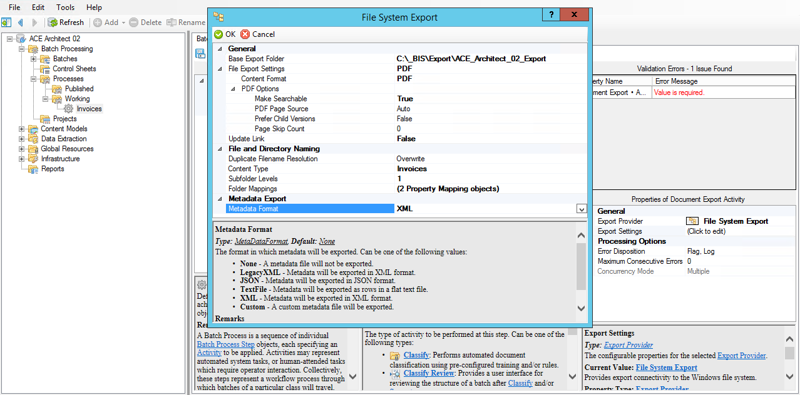

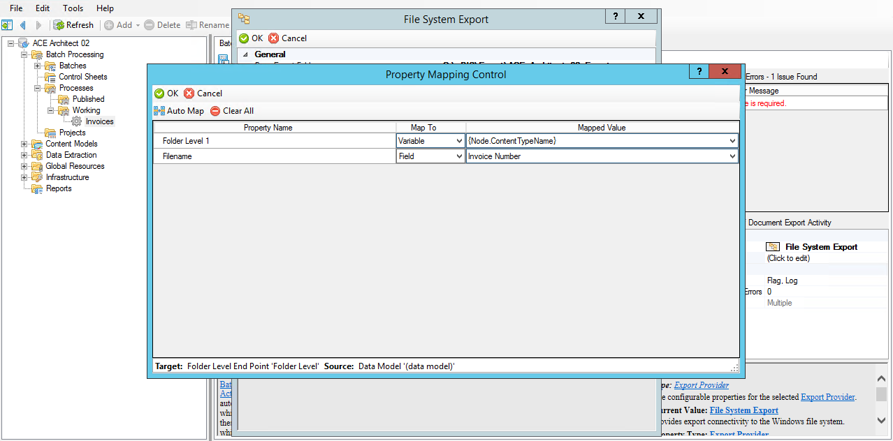

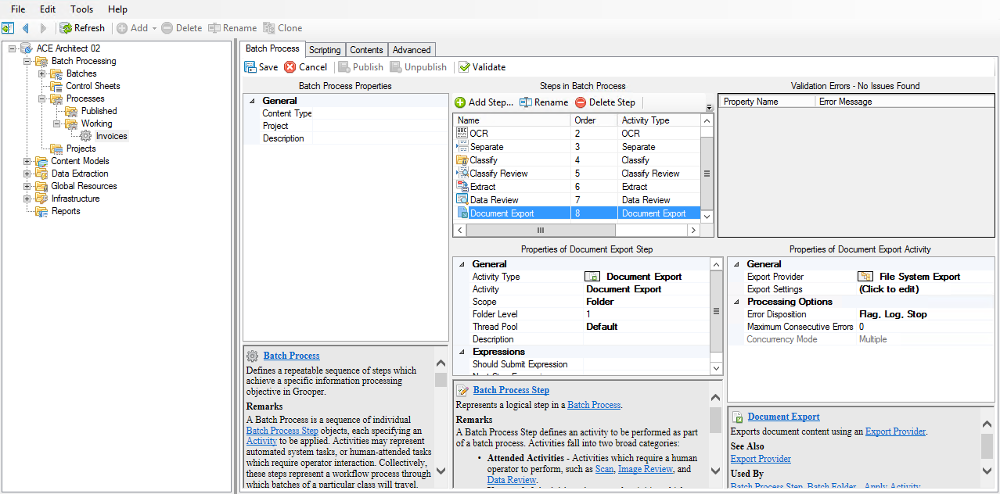

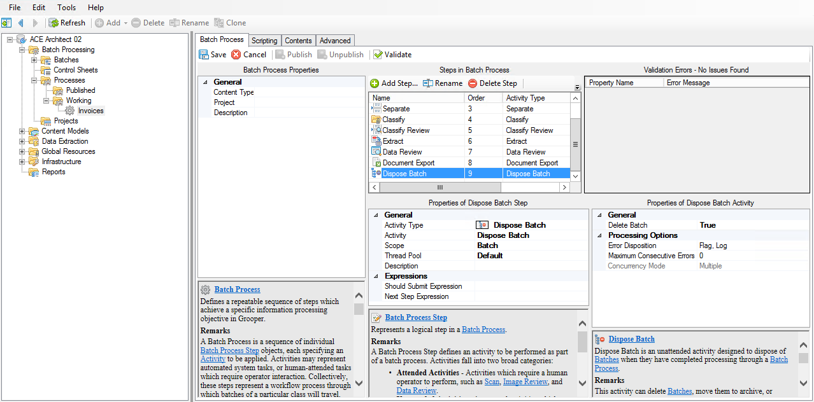

