# Organize

## Separation

### Creating a Separation Profile

!!! abstract "Global Resources > Separation Profiles"
    1. Right click and select **Add > Separation Profile...**.
    2. Name it something like ==Change in Value (Invoice Number)==.

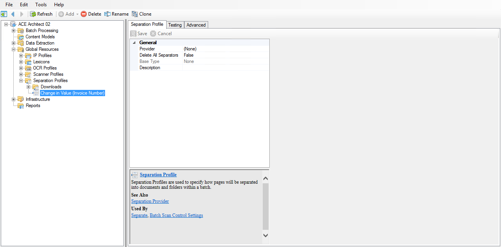

### Configuring "Change in Value" separation

!!! abstract ""
    1. Set the **Provider** property to ==Change in Value Separation==.
    2. Set the **Provider > Value Extractor > Type** property to ==Reference==.
    3. Set the **Referenced Extractor** property to the **Data Extraction • Data Types > Training Materials > ==Invoice Number==** Data Type.

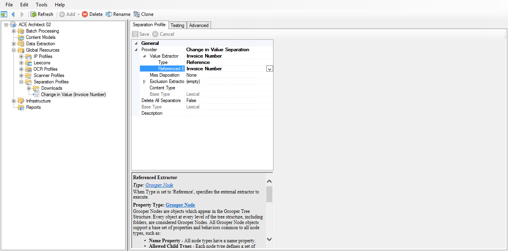

### Testing the Separation Profile

!!! abstract ""
    1. Click on the **Testing** tab.
    2. Click the **Separate Batch** button.

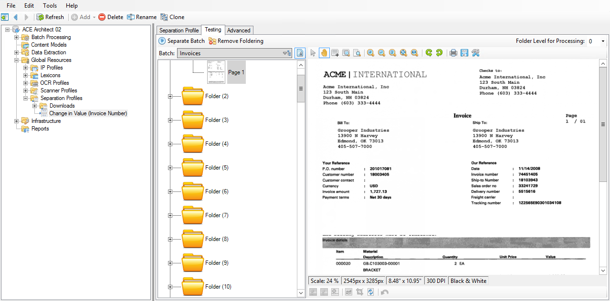

### Correcting issues

!!! abstract ""
    1. In the batch viewer, find **Page 38**.
    2. Right click and select **Add Selection to New Folder**.


## Classification

### Setting up the Content Model

!!! abstract ""
    1. Navigate to **(root) > Content Models**.
    2. Right click and select **Add > Content Model...**.
    3. Name it something like ==Invoices==.


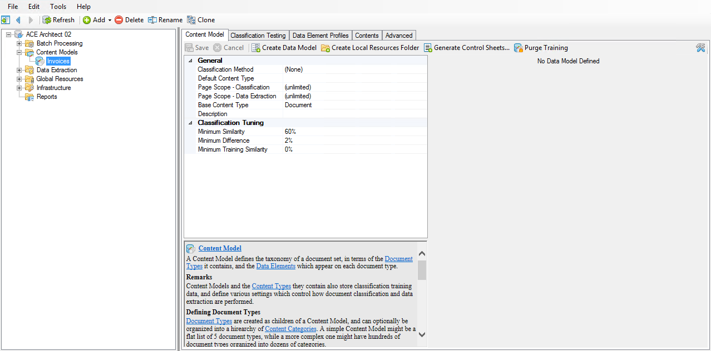

### Creating the Data Model and Local Resources folder

!!! abstract ""
    1. Right click on the **Invoices** Content Model and select **Create Data Model**.
    2. Right click on the **Invoices** Content Model and select **Create Local Resources Folder**.


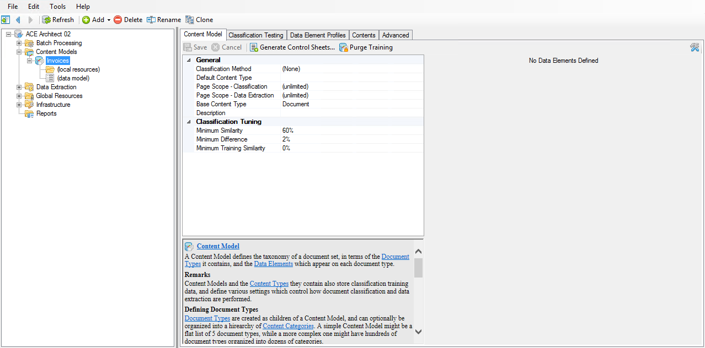

### Adding Document Types

!!! abstract ""
    1. Right click on the **Invoices** Content Model and select **Contents > Add Multiple Items...**.
    2. In the **Contents • Add Multiple Items** window, set the **Item Type** property to ==Document Type==.
    3. Edit the **Item Names** property and enter the names of each vendor:
        ```
        Acme
        Enid
        Express
        Spartan
        Standard
        ```
    4. Click **Execute** to complete.


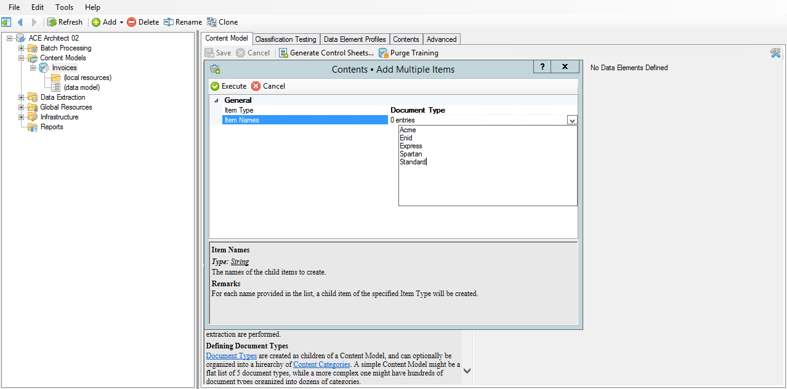

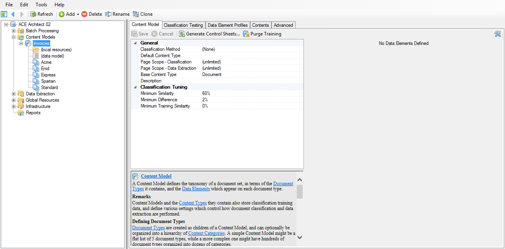

### Setting the Classification Method

!!! abstract "Content Models > Invoices"
    1. On the **Invoices** Content Model, set the **Classification Method** property to ==Lexical==.
    2. Set the **Classification Method > Text Feature Extractor > Type** property to ==Reference==.
    3. Set the **Referenced Extractor** property to the **Data Extraction > Downloads > Features > ==Words (Stemmed)==** Data Type.

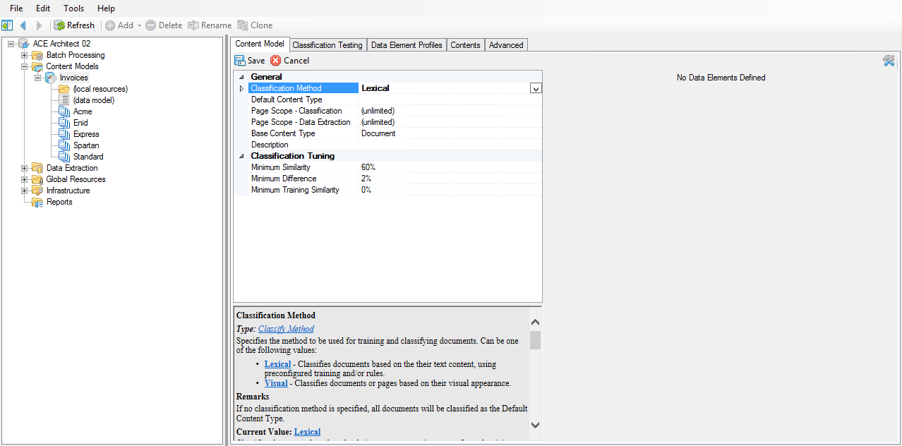


### Setting a positive extractor for classification

!!! abstract "Content Models > Invoices > Acme"
    1. Click on the **Acme** Document Type.
    2. Set the **Positive Extractor > Type** property to ==Internal==.
    3. Click to edit the pattern.

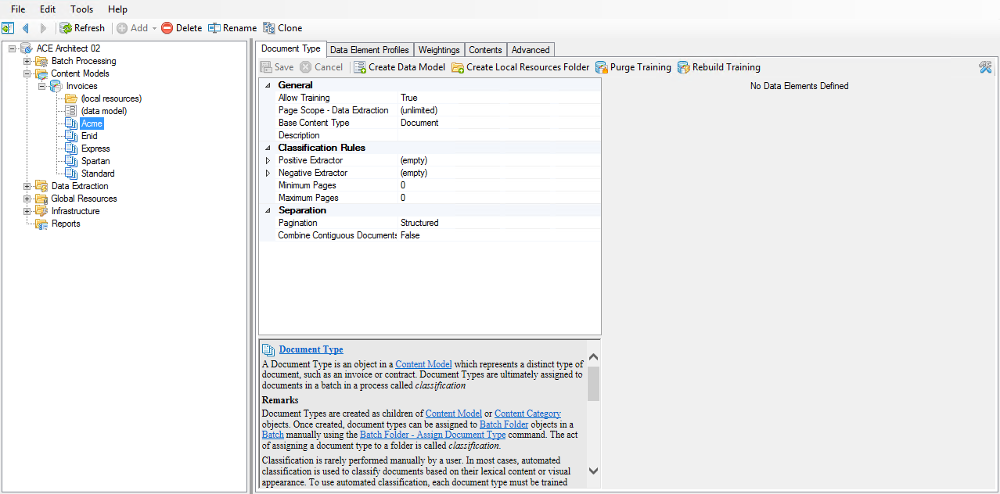

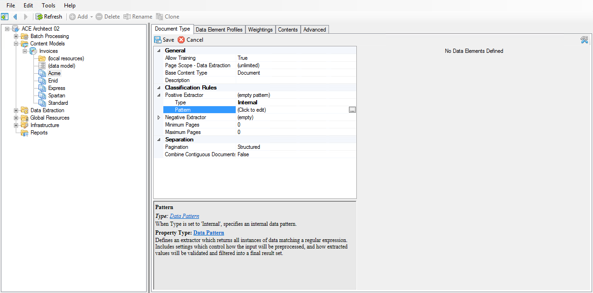

!!! abstract "Content Models > Invoices > Acme"
    1. Select **Folder (1)**.
    2. In the **Value Pattern** editor, type
        ```
        acme international
        ```
    3. Click **OK** to close.
    


!!! abstract "Content Models > Invoices"
    Repeat the previous two steps for each of the other four vendors, using the following patterns in their respective **Value Pattern** editors:

    ```tab="Enid"
    enid parts
    ```

    ```tab="Express"
    express manufacturing
    ```

    ```tab="Spartan"
    spartan manufacturing
    ```

    ```tab="Standard"
    standard products
    ```


### Testing classification

!!! abstract "Content Models > Invoices"
    1. Navigate to the **Invoices** Content Model.
    2. Click on the **Classification Testing** tab.
    3. Click the **Classify Batch** button.
    4. Click **Execute**.

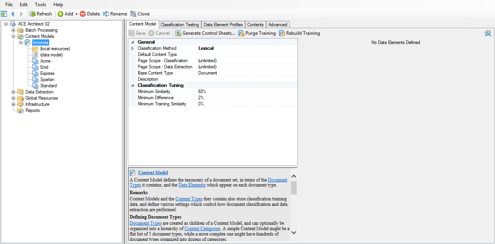

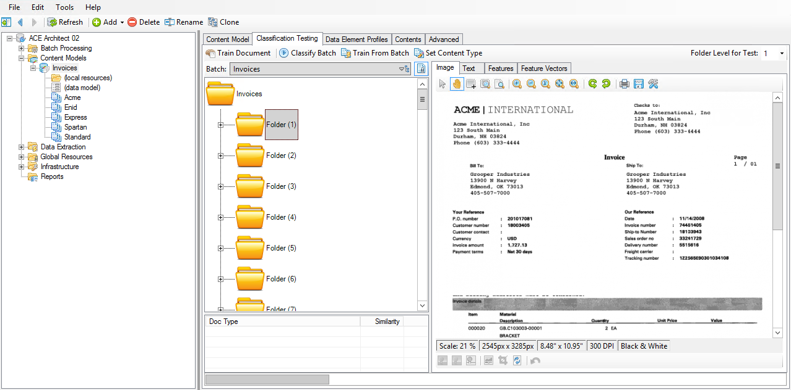

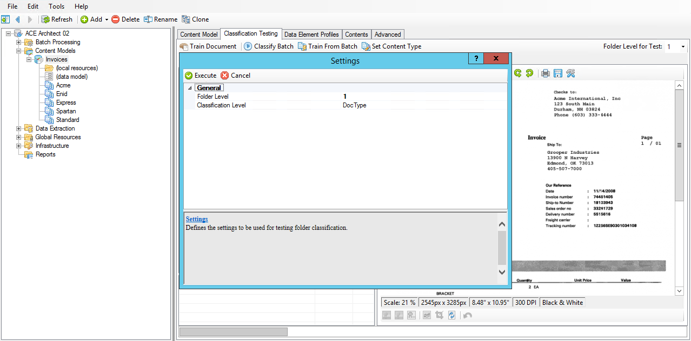
